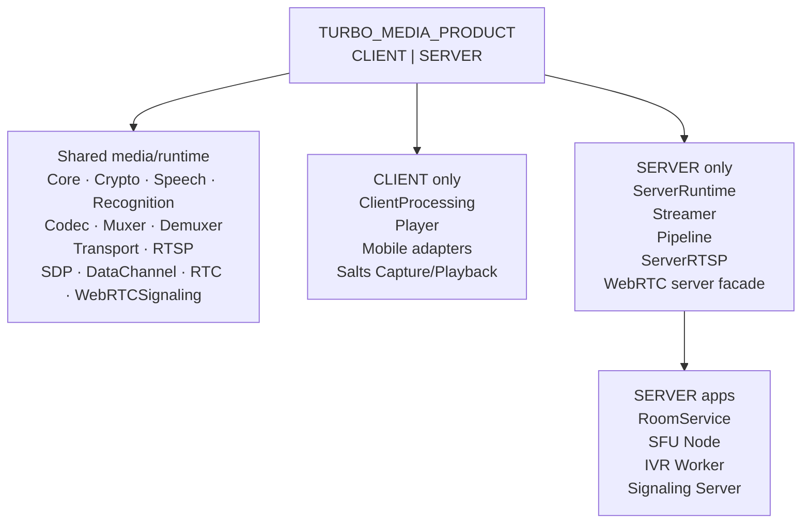
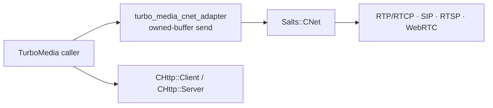
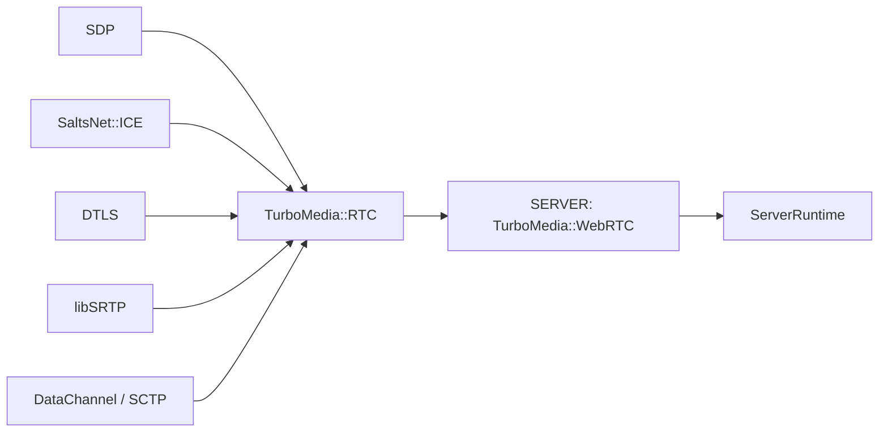
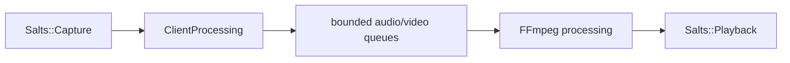
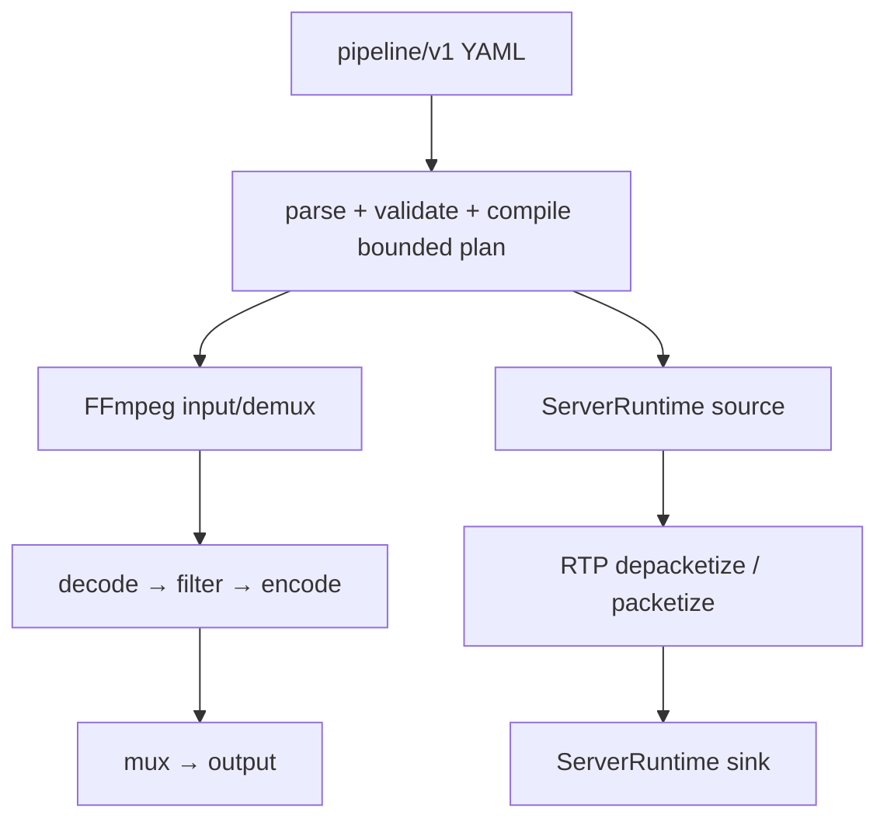
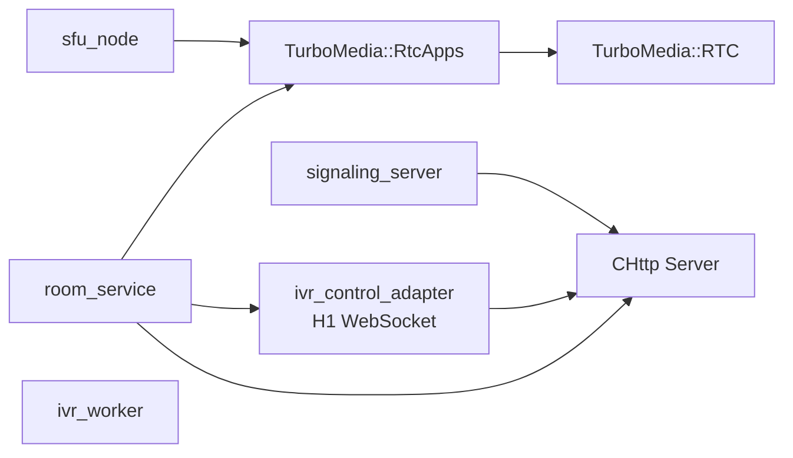
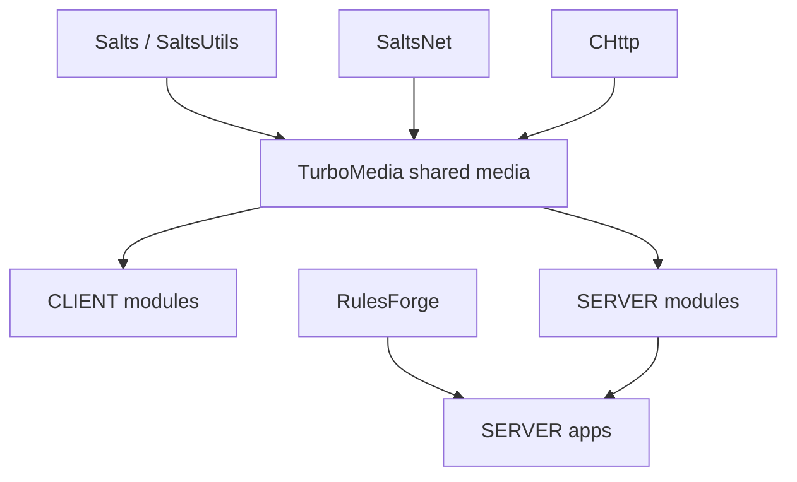

# TurboMedia 2.0 Architecture

TurboMedia 2.0 is a C11/C++17 multimedia runtime with explicit product profiles,
bounded ownership, fail-fast configuration, and separate client/server execution
boundaries.

This document describes the current repository structure. When documentation and
code disagree, the CMake graph, public headers, and runtime behavior are the
source of truth.

## 1. Architectural rules

TurboMedia 2.0 follows five rules:

1. **The product is explicit.** `TURBO_MEDIA_PRODUCT` must be `CLIENT` or
   `SERVER`. There is no `AUTO`, `FULL`, implicit profile detection, or
   runtime fallback between products.
2. **Ownership is explicit.** Network objects, queues, media buffers, runtime
   graphs, and server sessions have one owner. Cross-thread work is queued or
   copied into bounded storage instead of borrowing untracked pointers.
3. **Resources are bounded.** Queue items, bytes, packet sizes, retained audio
   duration, graph nodes, and transport capacities have hard limits.
4. **Unsupported paths fail immediately.** Missing packages, unsupported
   platforms/codecs, invalid configuration, queue overflow, and ABI mismatches
   are errors. TurboMedia does not silently downgrade to another backend.
5. **Deployment and qualification are separate.** The repository builds,
   tests, and installs the selected product. It does not maintain a second
   installed/package-consumer harness as another compatibility layer.

## 2. Product profiles

The product gate lives in `cmake/TurboMediaProduct.cmake` and runs both before
and after `project()`.

| Profile | Build/platform contract | Product-only modules |
| --- | --- | --- |
| `CLIENT` | Client-capable toolchains; repository profiles include desktop and mobile | `ClientProcessing`, `Player`, mobile adapters, device Capture/Playback integration |
| `SERVER` | Windows and Linux only; other target systems fail during configure | `Server`, `Streamer`, `Pipeline`, `ServerRTSP`, server WebRTC facade, RoomService/SFU/IVR apps |

Both profiles share codec/container/network/RTC foundations. The current native
SDK workflow exercises Linux/Windows CLIENT and SERVER builds. Other client
platforms are governed by their toolchain/preset and dependency support; they do
not change the product boundary.



## 3. Shared media core

The shared layer is built before product-specific modules.

### Codec and container layer

- `TurboMedia::Codec` owns codec-facing media conversion.
- `TurboMedia::Muxer` / `TurboMedia::Demuxer` own container boundaries.
- Existing `common/codec_helpers` remain internal to the classic
  muxer/demuxer/streamer path.
- FFmpeg types are not part of the public media ABI.

The shared codec/container APIs and Pipeline intentionally remain separate.
Pipeline uses native FFmpeg packet/frame timing internally instead of forcing
the classic packet contracts to model every FFmpeg concept.

### Transport layer

`TurboMedia::Transport` is implemented by `network/` plus `transport/`.



The internal `turbo_media_cnet_adapter` is the shared ownership adapter for
CNet-backed sends. Generic transport, RTSP/DataChannel paths must not grow
parallel ad-hoc ownership glue.

The public transport target links CNet and CHttp Client. Higher server layers
use CHttp Server explicitly where they own HTTP/WebSocket listeners.

## 4. RTC and WebRTC

WebRTC is a current capability, not a future item.

The shared WebRTC subtree provides:

- `TurboMedia::SDP`
- `TurboMedia::DataChannel`
- `TurboMedia::RTC`
- `TurboMedia::WebRTCSignaling`

The SERVER profile additionally builds `TurboMedia::WebRTC`, the facade that
owns `ServerRuntime` integration.



`TurboMedia::RTC` owns RTP/RTCP, NACK, TWCC, simulcast, jitter, SRTP, media
engine, and PeerConnection state. Owner-thread pumping advances ICE, DTLS,
SRTP, DataChannel transport, and media timers.

On CLIENT builds RTC may consume `Salts::Capture`. SERVER does not own local
capture devices; server media is supplied through explicit frame/track/runtime
paths.

The legacy transport RTP ABI and RTC RTP ABI intentionally have different packet
layouts. Linux shared objects bind internal calls locally so ELF symbol
preemption cannot route packets through the wrong implementation.

## 5. Client execution path

CLIENT-only modules are intentionally independent of ServerRuntime, Streamer,
Pipeline, RulesForge, and server applications.

### ClientProcessing

`TurboMedia::ClientProcessing` is split into:

- core lifecycle
- bounded queues
- Salts Capture/Playback adapters
- FFmpeg file-processing implementation

Its CMake target links Salts Capture/Playback publicly and FFmpeg internally.
It does not depend on the SERVER Pipeline.

### Player

`TurboMedia::Player` combines TurboMedia Codec/Demuxer with
`Salts::Playback`; FFmpeg remains an implementation dependency.

### Client data flow



Queue capacity and retained-duration limits are hard bounds. A producer cannot
turn a bounded queue into implicit buffering by varying frame duration.

## 6. Server execution path

SERVER adds the runtime and service-facing components:

- `TurboMedia::Server`
- `TurboMedia::Streamer`
- `TurboMedia::Pipeline`
- `TurboMedia::ServerRTSP`
- `TurboMedia::WebRTC`
- `TurboMedia::RtcApps`

The root build adds server modules only when `TURBO_MEDIA_PRODUCT=SERVER`.

### ServerRuntime

`TurboMedia::Server` owns source/track runtime state on top of
`TurboMedia::Core` and `TurboMedia::Transport`.

### Streamer

`TurboMedia::Streamer` provides HLS, DASH, RTMP, and HTTP-FLV on top of the
server/media/container/transport targets. CHttp Client and CNet remain private
runtime dependencies.

### ServerRTSP

`TurboMedia::ServerRTSP` adapts the shared RTSP implementation to the
SERVER runtime.

## 7. Pipeline

`TurboMedia::Pipeline` is SERVER-only.

There are two explicit execution families.



### FFmpeg path

File/network URL graphs use libavformat/libavcodec/libavfilter directly. FFmpeg
packet/frame ownership stays inside Pipeline.

### Runtime/RTP path

Runtime graphs borrow a `ServerRuntime`, copy complete RTP packets into a
preallocated bounded ring, and consume them from one execution thread.

Current v1 limits are intentional:

- best audio + best video track
- H.264 video and Opus audio for Runtime/RTP transcode
- single-input/single-output filter chains
- no runtime graph mutation
- Runtime/RTP has one sink
- FFmpeg path supports bounded multi-sink fan-out

The next capability expansion is tracked by #46–#49. Those issues must extend
the model explicitly rather than weakening v1 bounds.

## 8. RoomService, SFU, and IVR

SERVER builds the application/model layer under `webrtc/apps`:



RoomService owns room facts, SFU membership/routing, replay of room state to SFU
nodes, conference policy, and the internal IVR control listener.

The active IVR control transport is only CHttp Server / HTTP/1.1 WebSocket via
`ivr_control_adapter`. The retired Iris outbound provider transport,
persistence/outbox/ledger layer, provider façade, reconciler, and compatibility
configuration have been removed.

RoomService currently does not select or load a database runtime, so TurboDB/Orm
is not part of the TurboMedia SERVER dependency graph. A future application that
chooses a database must do so explicitly; it must not be introduced as an
implicit RoomService dependency or fallback.

## 9. Ownership and shutdown

### CNet owner model

CNet endpoints/listeners/datagrams are driven by their owning context. Cross-
thread work enters bounded command/event queues. Send adapters transfer owned
buffers according to the CNet contract instead of borrowing caller memory after
return.

### CHttp lifecycle

CHttp Client/Server objects have explicit init/start/stop/destroy ownership.
Shutdown must quiesce callbacks before their backing context is released. A
failed/busy close retains ownership for the caller; it is not treated as
successful destruction.

### RTC/IVR ownership

- PeerConnection and RTC state progress on the owner thread.
- IVR worker/session queues are bounded.
- WebSocket callback context outlives in-flight callbacks.
- Stop/drain order is explicit; destruction does not race active producers.

### Pipeline ownership

- Pipeline owns immutable config and FFmpeg contexts.
- Runtime/RTP Pipeline borrows ServerRuntime.
- Rings own copied RTP packets.
- `request_stop` is an atomic cooperative stop request.
- Error paths do not masquerade as EOF/success.

## 10. Bounded-resource model

TurboMedia treats bounds as part of correctness, not tuning hints.

| Resource | Example bound |
| --- | --- |
| Network commands/events | queue item capacity |
| HTTP | connection/request/event/body/header limits |
| RTP | max packet/access-unit bytes |
| Audio | queue items + retained PCM duration |
| Pipeline | node/edge/output/ring capacity |
| IVR | worker/dialog/request/event capacities |
| SFU/Room | configured node/session/room limits |

Overflow/backpressure is surfaced to the caller. There is no unbounded fallback
queue.

## 11. Build, install, and CMake export

Every public component is exported through `TurboMediaTargets.cmake` with the
`TurboMedia::` namespace.

`TurboMediaConfig.cmake` records the product used to build the install tree:

```cmake
find_package(TurboMedia CONFIG REQUIRED COMPONENTS RTC DataChannel)
# TurboMedia_PRODUCT is CLIENT or SERVER.
```

Requested components are validated after importing the target file. FFmpeg
lookup is conditional on requesting an FFmpeg-backed component such as Muxer,
Demuxer, Player, Pipeline, Streamer, or RtcApps.

The installed tree is product-specific. One install prefix must not be treated
as the other product.

TurboMedia intentionally does **not** maintain a second installed/package-
consumer harness. Native CI configures, builds, runs the repository tests, and
installs the selected profile; missing export/dependency/install contracts fail
at the point they are used.

## 12. CI and evidence boundary

The native SDK workflow currently covers Linux/Windows CLIENT and SERVER. It
uses released first-party SDKs plus cache-only vcpkg dependencies and follows the
normal configure/build/CTest/install path.

That CI proves repository and install behavior for those runner/platform
combinations. It does **not** prove production Internet/WebRTC readiness.

The following evidence remains separate:

- #17 — browser + TURN-only public acceptance
- #44 — capacity/backpressure/long-soak baseline
- #45 — multi-node failure, rolling upgrade, and reconciliation acceptance

Local CTest, loopback HTTP/WebSocket, fake peers, or synthetic RTC tests must not
be described as substitutes for those deployment tests.

## 13. Current product dependency direction



There is no runtime dependency edge from TurboMedia SERVER to TurboDB/Orm in the
current 2.0 tree.

## 14. Follow-up roadmap

Architecture changes after 2.0 are tracked explicitly rather than hidden behind
fallbacks:

- #46 — multi-track/extensible Runtime/RTP codec model
- #47 — structured multi-input/filter graphs
- #48 — per-output track/transcode policy
- #49 — bounded transactional runtime graph reconfiguration
- #50 — cross-platform client media-processing kernel
- #51 — production SIP/WebRTC live client
- #17/#44/#45 — external acceptance and production evidence

## 15. Related design documents

- `docs/design/client-server-product-profiles.md`
- `pipeline/README.md`
- `webrtc/docs/README.md`
- `README.md`

The root architecture document defines dependency direction and ownership.
Module-specific operational details belong in their module documentation.
