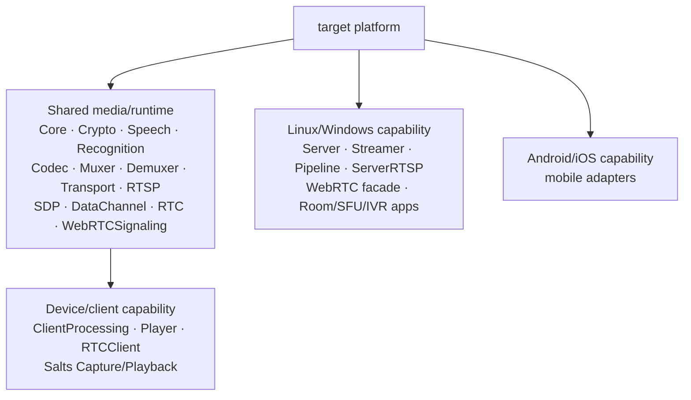
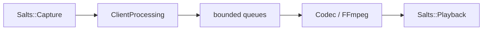
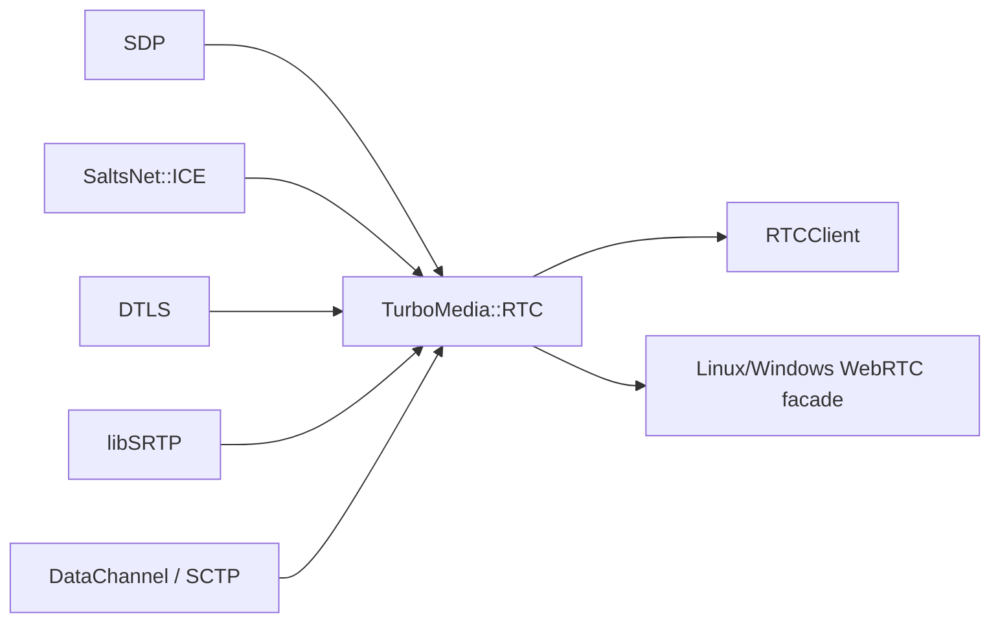
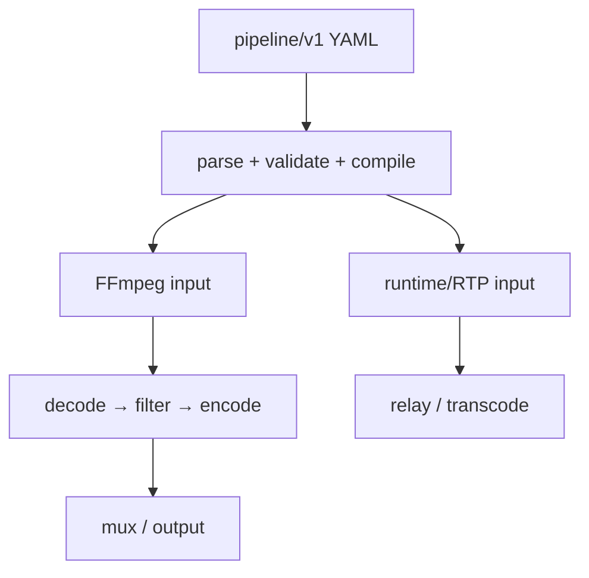
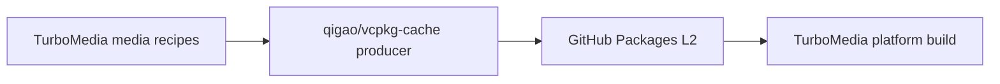
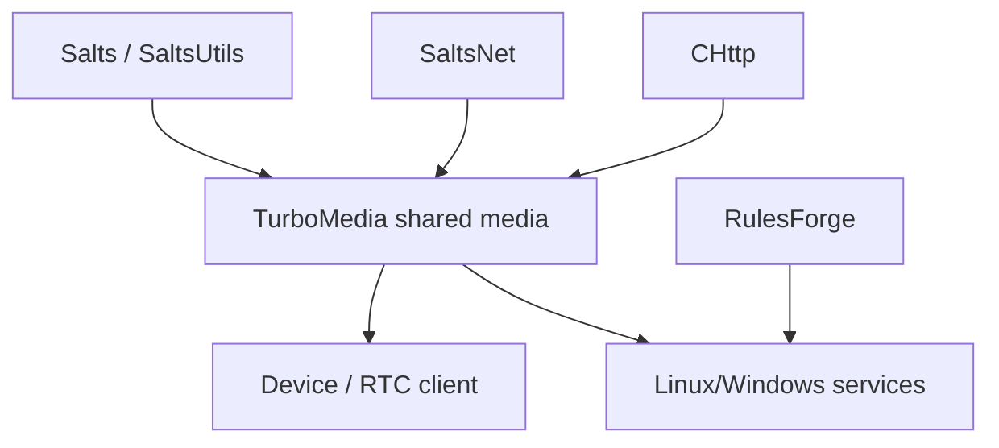

# TurboMedia 2.0 Architecture

TurboMedia 2.0 is a C11/C++17 multimedia runtime with one build graph, explicit
ownership, bounded resources, fail-fast configuration, and platform-selected
capabilities.

When documentation and code disagree, the CMake graph, public headers, and
runtime behavior are the source of truth.

## 1. Architectural rules

1. **One build graph.** Callers do not select a product profile. The target
   platform determines which capabilities exist.
2. **Ownership is explicit.** Network objects, queues, media buffers, runtime
   graphs, and sessions have one owner.
3. **Resources are bounded.** Queues, packet sizes, retained media duration,
   graph nodes, and transport capacities have hard limits.
4. **Unsupported paths fail immediately.** Missing SDKs, cache entries,
   toolchains, codecs, or platform capabilities are errors.
5. **No compatibility fallback.** TurboMedia does not silently switch backend,
   dependency source, transport, or platform behavior.

## 2. Platform capability model

| Platform | Capability set |
| --- | --- |
| Linux | shared media + device I/O + RTC client + desktop services/apps |
| Windows | shared media + device I/O + RTC client + desktop services/apps |
| Android | shared media + device I/O + RTC client + mobile adapter |
| macOS | shared media + device I/O + RTC client |
| iOS | shared media + device I/O + RTC client + mobile adapter |

Desktop services are enabled only when the target system is Linux or Windows.
This is an internal platform capability, not a user-selectable build mode.



## 3. Shared media core

The shared layer is always built.

- `TurboMedia::Core` owns common media/runtime primitives.
- `TurboMedia::Codec` owns codec-facing conversion.
- `TurboMedia::Muxer` / `TurboMedia::Demuxer` own container boundaries.
- `TurboMedia::Transport` owns shared network transport.
- `TurboMedia::RTSP` owns protocol parsing/session logic.
- FFmpeg types do not enter the public media ABI.

`common/codec_helpers` remains internal to the classic
muxer/demuxer/streamer path. Pipeline keeps native FFmpeg packet/frame timing
inside its own graph.

## 4. Device and local media path

Capture and playback are normal TurboMedia dependencies on every supported
platform.



`TurboMedia::ClientProcessing` owns processing lifecycle and bounded queues.
`TurboMedia::Player` combines container/codec logic with playback.
Platform adapters never replace Salts device ownership.

## 5. RTC and WebRTC

The shared WebRTC subtree provides:

- `TurboMedia::SDP`
- `TurboMedia::DataChannel`
- `TurboMedia::RTC`
- `TurboMedia::RTCClient`
- `TurboMedia::WebRTCSignaling`

RTC owns RTP/RTCP, NACK, TWCC, simulcast, jitter, SRTP, media engine, and
PeerConnection state. Owner-driven polling advances ICE, DTLS, SRTP,
DataChannel transport, and timers.



The Linux/Windows WebRTC facade additionally integrates desktop
`ServerRuntime`. Android/macOS/iOS do not create that target.

The legacy transport RTP ABI and RTC RTP ABI intentionally have different
packet layouts. Linux shared objects bind internal calls locally so ELF symbol
preemption cannot route packets through the wrong implementation.

## 6. Desktop services

Linux and Windows additionally build:

- `TurboMedia::Server`
- `TurboMedia::Streamer`
- `TurboMedia::Pipeline`
- `TurboMedia::ServerRTSP`
- `TurboMedia::WebRTC`
- RoomService / SFU / IVR / signaling applications

RulesForge is required only for this desktop capability.

### Streamer

`TurboMedia::Streamer` provides HLS, DASH, RTMP, and HTTP-FLV on top of the
shared codec/container/transport graph.

### Pipeline

`TurboMedia::Pipeline` executes bounded YAML graphs.



Pipeline does not become a hidden generic state machine. Orchestration/state
semantics remain separate from media graph execution.

## 7. Mobile adapters

`media/mobile` selects adapters only from target platform:

- Android → `media/mobile/android`
- iOS → `media/mobile/ios`

There is no mobile-only compatibility build. The normal platform build must
configure, compile, and install the same TurboMedia graph.

## 8. Build, install, and package export

Every public component is exported through `TurboMediaTargets.cmake` under
the `TurboMedia::` namespace.

```cmake
find_package(TurboMedia CONFIG REQUIRED COMPONENTS RTC DataChannel)
```

The installed package does not record or require a product identity. Requested
components are checked against targets that exist for the current platform.

FFmpeg lookup remains conditional on FFmpeg-backed components such as Muxer,
Demuxer, Player, Pipeline, Streamer, or RtcApps.

## 9. CI contract

The only native qualification dimension is platform:

```text
Linux
Windows
Android arm64-v8a
macOS arm64
iOS device/simulator   # tracked until native path is ready
```

Each platform follows:

```text
latest released SDKs
→ vcpkg --only-binarycaching
→ configure
→ build
→ test where executable
→ install
```

No source-build fallback is permitted in a consumer gate.

## 10. Media dependency cache

TurboMedia owns product-specific media recipes:

```text
vcpkg-overlays/ffmpeg
vcpkg-overlays/x265
vcpkg-overlays/libsrtp
```

Persistent multi-platform binary-cache production belongs to
`qigao/vcpkg-cache`. TurboMedia platform builds consume that L2 read-only.



## 11. Dependency direction



TurboDB/Orm is not a hidden runtime dependency of TurboMedia. If an application
uses a database driver, that choice remains explicit outside the media runtime.

## 12. Evidence boundary

Local CI proves repository build/install behavior for the named platform. It
does not substitute for deployment evidence such as browser/TURN interoperability,
capacity, soak, or multi-node failure testing.

Tracked external evidence includes:

- #17 — browser + TURN-only public acceptance
- #44 — capacity/backpressure/long-soak baseline
- #45 — multi-node failure, rolling upgrade, reconciliation

## 13. Follow-up roadmap

- #35 — unified cross-platform build matrix
- #46 — multi-track/extensible Runtime/RTP codec model
- #47 — structured multi-input/filter graphs
- #48 — per-output track/transcode policy
- #49 — bounded transactional runtime graph reconfiguration
- #50 — cross-platform media-processing kernel
- #51 — production SIP/WebRTC live client

## 14. Related documents

- `pipeline/README.md`
- `webrtc/docs/README.md`
- `README.md`
