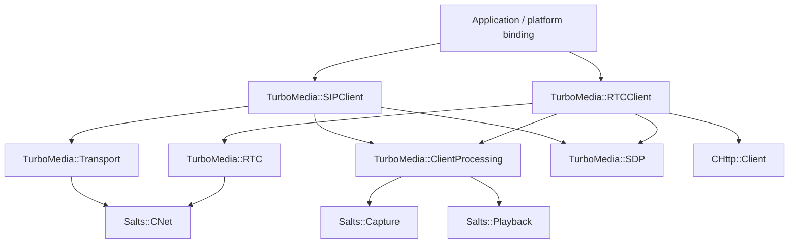
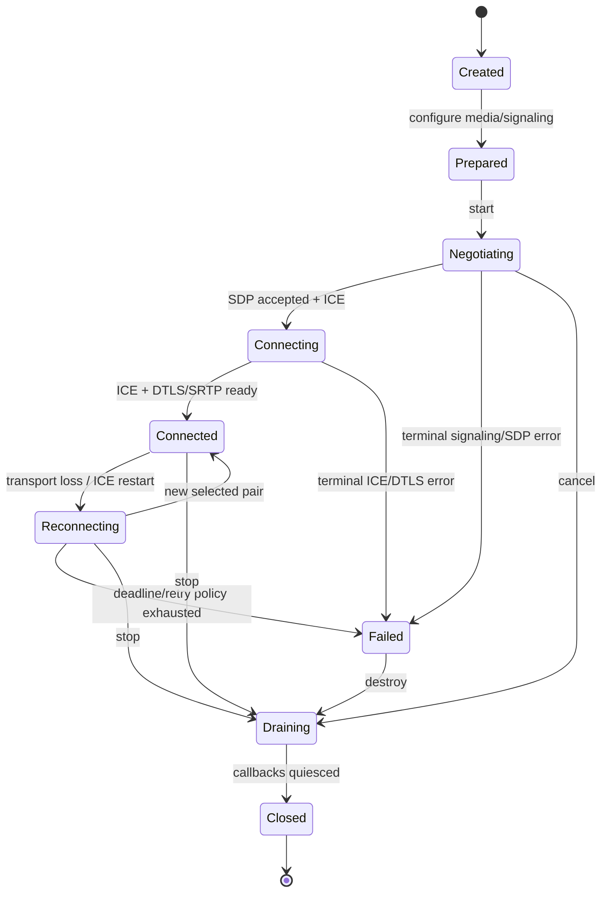
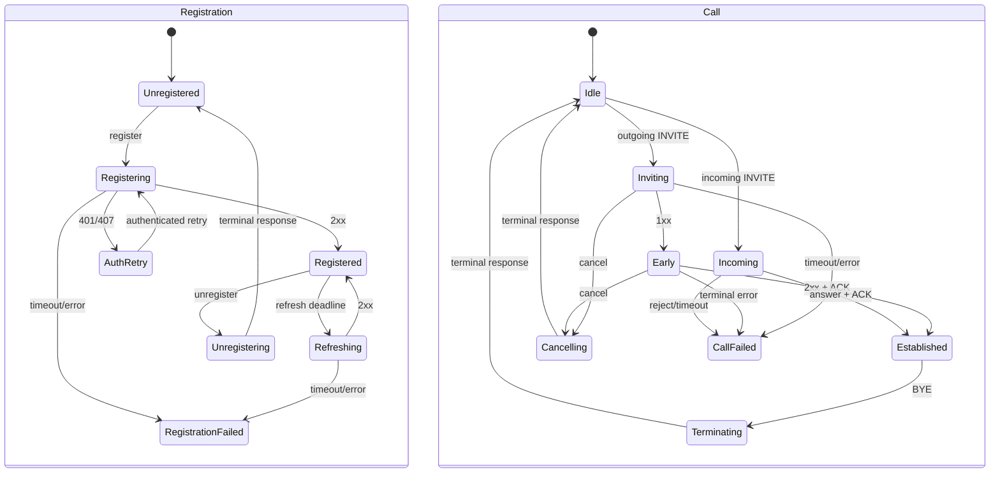
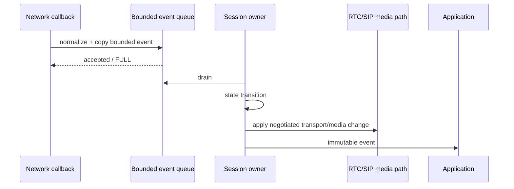
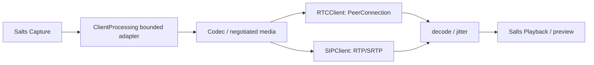

# TurboMedia Client Live Sessions

## Status

Architecture decision for #51.

TurboMedia already exposes the media/security pieces needed by a live client,
but it does not yet expose an install-level client session product. This ADR
defines that product boundary before new public APIs are added.

## Decision

Add **two independent CLIENT-only installed targets**:

```text
TurboMedia::RTCClient
TurboMedia::SIPClient
```

Do not create one universal "live client" state machine.

The two clients may share media processing, codec, RTP, SDP, network ownership,
and device adapters, but WebRTC and SIP keep separate control-plane state,
timeouts, authentication, reconnect behavior, and wire contracts.



Neither target may depend on `TurboMedia::Server`,
`TurboMedia::Pipeline`, `TurboMedia::Streamer`, RulesForge, TurboDB, or
server applications.

## Why two targets

WebRTC and SIP have materially different protocol state.

WebRTC owns:

- offer/answer state;
- trickle ICE generations;
- STUN/TURN;
- ICE restart;
- DTLS-SRTP;
- RTCP/NACK/TWCC;
- WHIP/WHEP resource lifecycle.

SIP owns:

- REGISTER refresh;
- INVITE client/server transactions;
- provisional/final responses;
- ACK/CANCEL/BYE;
- Digest authentication;
- dialog route-set and target refresh;
- SIP transaction retransmission timers;
- negotiated RTP/RTCP/SRTP endpoints.

A shared facade would either expose protocol-specific branches everywhere or
hide important transitions behind generic states. Both outcomes weaken
fail-fast behavior.

The shared abstraction is therefore the **media/data plane**, not the session
state machine.

## Existing implementation reused by RTCClient

`TurboMedia::RTC` already provides the current PeerConnection path:

- `turbo_peer_connection_create()`
- add track / explicit track config
- offer / answer
- remote description
- trickle candidate
- local/remote ICE SDP fragments
- ICE restart
- owner-driven `turbo_peer_connection_poll()`
- DataChannel
- RTP/RTCP, jitter, NACK, TWCC and SRTP

The first RTCClient signaling adapter is **WHIP/WHEP over CHttp Client**.

A versioned H1 WebSocket signaling adapter can be added later as a separate
adapter. RTCClient v1 must not silently switch signaling transports if the
configured one fails.

### RTCClient state



"Reconnect" is an explicit state transition. It is not an automatic backend or
server fallback.

## Existing implementation reused by SIPClient

The repository already contains a SIP implementation under
`transport/sip/`:

- UAC REGISTER, OPTIONS, INVITE, CANCEL, BYE, re-INVITE, PRACK, UPDATE;
- UAS request handling;
- transaction/dialog implementation;
- RFC transaction timers;
- transport callbacks.

Those headers remain **private implementation headers**. SIPClient wraps them
behind a stable TurboMedia C ABI. Installing `sip-agent.h`,
`sip-dialog.h`, `sip-uac.h`, or other internal SIP structures is not part
of the product contract.

### SIPClient state

Registration and call state are separate sub-state machines owned by one
SIPClient owner context.



A late/duplicate SIP message is routed through the SIP transaction/dialog
rules. It must not directly mutate application call state from a network
callback.

## Public API shape

Both products use stable C ABI + opaque handles.

Each client exposes four categories:

1. **commands** — caller-owned, serialized by the session owner;
2. **events** — immutable event records copied into a bounded queue;
3. **snapshot** — read-only bounded state/statistics;
4. **media adapters** — explicit borrowed/copy ownership contracts.

No FFmpeg, Salts internal handle, SIP private struct, Java, Objective-C, or
platform-native type crosses the public ABI.

Illustrative shape:

```c
typedef struct turbo_rtc_client_s turbo_rtc_client_t;
typedef struct turbo_sip_client_s turbo_sip_client_t;

int turbo_rtc_client_command(turbo_rtc_client_t *, const turbo_rtc_client_command_t *);
int turbo_rtc_client_poll(turbo_rtc_client_t *, turbo_rtc_client_event_t *);
int turbo_rtc_client_snapshot(const turbo_rtc_client_t *, turbo_rtc_client_snapshot_t *);

int turbo_sip_client_command(turbo_sip_client_t *, const turbo_sip_client_command_t *);
int turbo_sip_client_poll(turbo_sip_client_t *, turbo_sip_client_event_t *);
int turbo_sip_client_snapshot(const turbo_sip_client_t *, turbo_sip_client_snapshot_t *);
```

Exact structs are defined by implementation PRs after this ADR.

## Owner/thread model

Each session has exactly one owner context.



Network callbacks never mutate session state directly.

Any payload crossing callback/thread/queue boundaries must be copied, retained,
or moved into owned bounded storage before callback return.

## Queue limits

RTCClient and SIPClient configuration must provide hard bounds for at least:

- command items + bytes;
- network event items + bytes;
- signaling body size;
- candidate/header counts where applicable;
- media packet/frame item + byte + retained-time budgets;
- reconnect/auth retry count and deadline.

Queue full returns an explicit error. No queue defaults to DROP_OLDEST and no
path grows without a hard bound.

## Media ownership

Capture/Playback remain owned by Salts.



ClientProcessing handles application/device lifecycle events and bounded
borrowed-frame admission. Session clients do not implement camera/microphone or
speaker APIs.

## Codec and security negotiation

No silent fallback is allowed.

### RTCClient

The configured/negotiated codec must be accepted by the PeerConnection media
contract. Unsupported media sections fail negotiation.

Security is ICE + DTLS-SRTP. TURN/STUN behavior comes from explicit
PeerConnection configuration.

### SIPClient

SIP signaling transport is an explicit configuration value:

- UDP
- TCP
- TLS

Media security is also explicit:

- RTP/RTCP profile supported by the chosen v1 matrix;
- SRTP only when the negotiated profile is implemented.

Unsupported signaling/media/security combinations fail before entering
Established.

No automatic "TLS failed, retry UDP" or "SRTP failed, retry RTP" behavior is
allowed.

## WebRTC vertical slice

The first RTCClient vertical slice is:

```text
Salts Capture
  -> ClientProcessing bounded adapter
  -> negotiated Opus/H.264 track
  -> PeerConnection
  -> WHIP
  -> SFU
```

and the receive path:

```text
WHEP
  -> PeerConnection
  -> jitter/decode
  -> Salts Playback / explicit video preview binding
```

v1 signaling uses CHttp Client and explicit WHIP/WHEP endpoint URLs.

## SIP vertical slice

The first SIPClient vertical slice is audio-first:

```text
REGISTER
  -> authenticated registration
  -> INVITE / answer
  -> negotiated audio SDP
  -> RTP/RTCP (or explicitly configured supported SRTP profile)
  -> bidirectional audio
  -> BYE
```

Video is capability-gated and is not implied by audio completion.

## Lifecycle

Platform bindings translate native lifecycle events into ClientProcessing and
session commands.

```text
app pause
  -> stop new capture admission
  -> session policy decides hold/keepalive/drain explicitly

permission revoked / device lost
  -> ClientProcessing blocker
  -> no alternate device selection
  -> application decides terminate/recover

app resume
  -> explicit device revalidation
  -> explicit session resume/reconnect
```

RTCClient/SIPClient do not infer platform policy from thread suspension.

## Stop / drain / destroy

The required order is:

```text
reject new commands
  -> stop/disable capture admission
  -> cancel signaling/retransmission/reconnect timers
  -> stop network admission
  -> drain bounded event/media queues
  -> quiesce callbacks
  -> release PeerConnection or SIP transaction/dialog state
  -> release codecs/adapters
  -> destroy
```

Destroy does not convert BUSY/in-flight ownership into success.

## CMake boundary

Planned targets:

```text
TurboMedia::RTCClient
  PUBLIC  TurboMedia::RTC TurboMedia::ClientProcessing
  PRIVATE CHttp::Client

TurboMedia::SIPClient
  PUBLIC  TurboMedia::ClientProcessing
  PRIVATE TurboMedia::Transport
```

Both are built only when `TURBO_MEDIA_PRODUCT=CLIENT`.

SIPClient may include `transport/sip/include` privately while building, but
those headers do not become installed public headers.

## Delivery order

1. ADR + state/ownership contract — this document.
2. RTCClient target + WHIP publisher.
3. WHEP subscriber + playback/preview.
4. RTC reconnect/ICE restart policy.
5. SIPClient target wrapping private SIP stack.
6. REGISTER/auth/refresh.
7. INVITE/answer/ACK/CANCEL/BYE + audio RTP.
8. Explicit SIP TLS/SRTP matrix.
9. Server gateway integration remains SERVER-side work.

## Evidence boundary

Normal repository configure/build/CTest/install is fail-fast. TurboMedia does
not add a second installed-consumer qualification harness.

Public browser/TURN/NAT evidence remains #17. Capacity/soak remains #44.
Multi-node/rolling-upgrade evidence remains #45.

Those acceptance issues must not be collapsed into unit-test completion.

## Rollback

RTCClient and SIPClient are additive CLIENT-only targets.

Rollback removes the new target/API without changing existing
`TurboMedia::RTC`, `TurboMedia::Transport`, ClientProcessing, Player, or
SERVER behavior. No compatibility alias to `TurboMedia::WebRTC` or the
private SIP headers is created.
