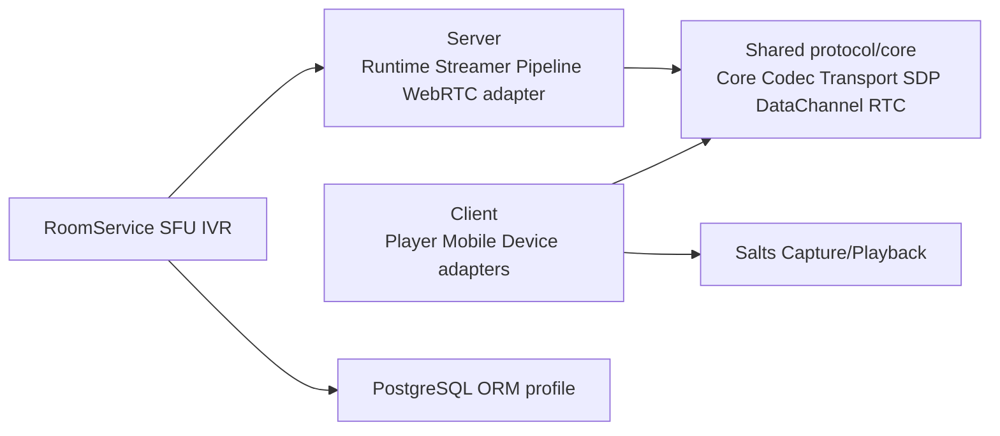

# TurboMedia Client/Server 产品拆分

## 背景

TurboMedia 过去只生成一套聚合安装：采集、播放、RTC、流媒体服务、
RoomService、SFU 和 IVR 共享同一个依赖闭包。这使移动端配置被桌面服务依赖
阻断，也让服务端二进制携带没有使用的设备 I/O 与 SQLite 运行时。

本决策把构建时产品作为唯一事实源。调用方必须显式选择 `CLIENT` 或
`SERVER`；不存在 `AUTO`、`FULL` 或失败后的降级路径。

## 候选方案

| 方案 | 优点 | 代价 | 结论 |
| --- | --- | --- | --- |
| 继续构建全集，以开关隐藏功能 | 迁移量小 | 依赖和公开目标仍然混杂，移动端继续承受服务依赖 | 不采用 |
| 一个构建同时导出 Client/Server 两套 target | 单次构建产物齐全 | 状态源变成多个布尔组合，容易生成非法组合 | 不采用 |
| 单一 `TURBO_MEDIA_PRODUCT` 产品 profile | 依赖、目标和安装内容都可验证；非法平台可 fail fast | Client/Server 需要分别构建和安装 | 采用 |

## 产品与平台契约

| 产品 | 支持平台 | 设备 I/O | 服务进程与持久化 |
| --- | --- | --- | --- |
| `CLIENT` | Windows、Linux、macOS、Android、iOS | 只通过 `Salts::Capture` 和 `Salts::Playback` | 不构建 |
| `SERVER` | Windows、Linux | 不查找、不链接 Capture/Playback；RTC 只接受外部 raw frame | RoomService、SFU、IVR、Streamer、Pipeline |

未知产品、空产品以及非 Windows/Linux 的 `SERVER` 配置都在 configure 阶段
失败。产品值同时写入导出的 CMake package，consumer 不得把一个 profile 当成
另一个 profile 使用。

## 模块边界

`turbo_media_track_t` 及 RTC 会话状态仍由 RTC owner context 推进。Client 的
Capture callback 只把 borrowed frame 同步送入 track；Server 的网络、总线和
应用 callback 只能向同一个 owner 投递或调用 raw-frame 接口，不拥有设备句柄。

当前名为 `TurboMedia::WebRTC` 的 facade 直接持有
`turbo_media_server_runtime_t`，因此归入 Server；通用 Client 传输能力由
`RTC`、`DataChannel`、`SDP` 和 `WebRTCSignaling` 提供。未来若需要同名的客户端
facade，应建立不含 ServerRuntime 的新接口，而不是在现有结构上增加 fallback。

## 错误与状态语义

- 配置错误在 CMake configure 阶段返回明确错误，不延迟到链接阶段。
- Client 的设备创建、启动、停止和销毁仍由 SaltsUtils 定义；TurboMedia 只做
  frame adapter。
- Server 的 RTC send track 必须由调用方通过 `turbo_media_track_send_frame()`
  提供数据，不存在自动探测设备或静默启用本机采集。
- 服务持久化只接受 PostgreSQL ORM profile。SQLite 配置、测试 fixture 和运行时
  DLL 不属于 TurboMedia Server 安装。

## 迁移路径

1. 引入强制产品选择和平台矩阵，按产品裁剪依赖、目标、测试和安装导出。
2. 从 Speech/Recognition 的 provider-neutral ABI 移除设备头文件耦合；adapter
   参数使用 opaque 前置声明。
3. 将 RTC 设备入口限定到 Client 编译契约；Server 只保留 raw-frame 路径。
4. 将 RoomService 固定到 PostgreSQL，并删除 SQLite 配置、测试与安装文件。
5. Server 配置统一安装到 `etc/turbomedia`，不再生成旧品牌目录。
6. 分别执行 Windows Client/Server 全量测试、干净安装和 package-consumer；在
   依赖 profile 可用后执行 Linux、macOS、Android 26 和 iOS 矩阵。

迁移期间每个提交只改变一个可验证边界。若回滚，回滚对应提交和安装 prefix；
不在运行时切换产品，也不自动加载另一产品的库。

## 验证契约

- `CLIENT` 导出 Client/shared target，不导出 Server、Streamer、Pipeline、
  ServerRTSP、WebRTC server facade 或 RtcApps。
- `SERVER` 导出 Server/shared target，不导出 Player 或 Mobile，且目标依赖图与
  安装目录均不出现 `Salts::Capture`、`Salts::Playback` 或 `sqlite3`。
- Android 的 `SERVER` configure 必须失败；Android API 固定为 26。
- 两个 profile 都必须通过各自 CTest、install 和按组件消费测试。
- PostgreSQL 多进程用例属于显式 live gate：配置
  `TURBO_MEDIA_POSTGRES_LIVE_TESTS=ON` 时必须同时提供
  `TURBO_MEDIA_TEST_POSTGRES_SERVICE`；缺少服务配置会在 configure 阶段失败。
