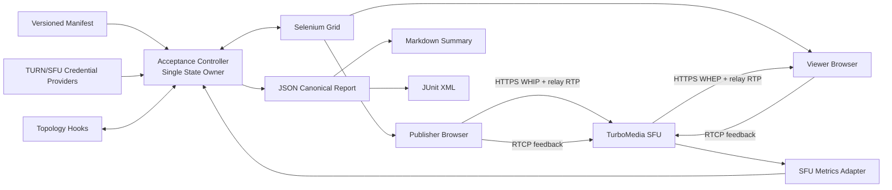
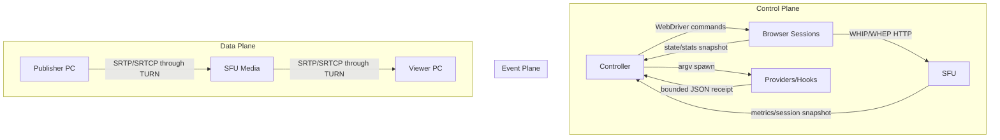
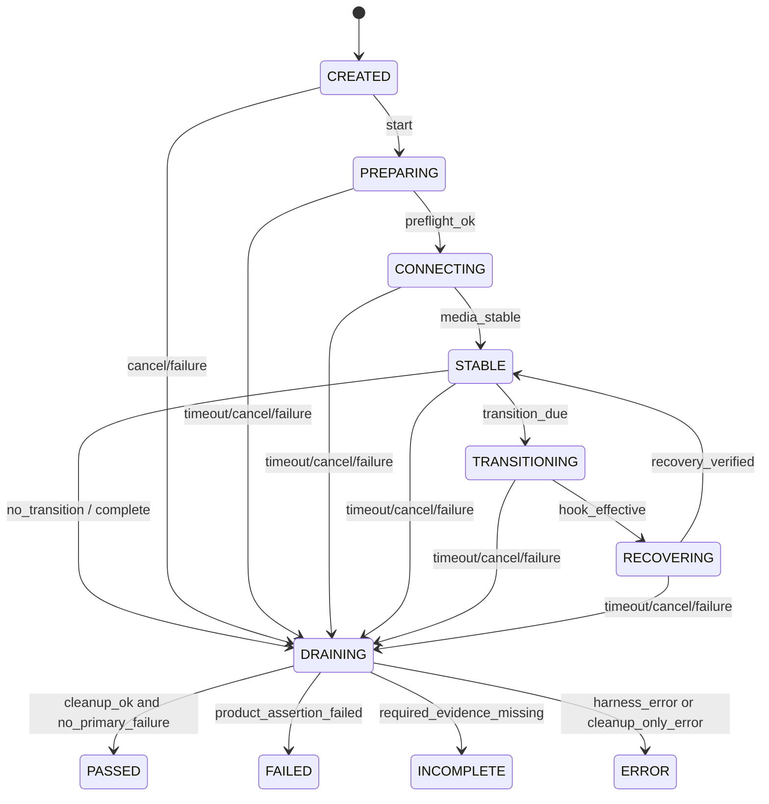
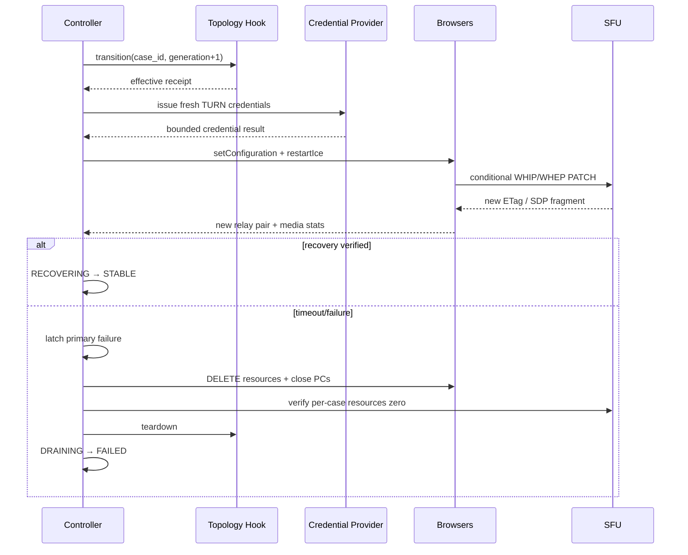

# WebRTC 公网浏览器与 TURN-only 验收设计

- 日期：2026-08-25
- 状态：已批准，待实施计划
- 跟踪：[GitHub #17](https://github.com/qigao/turbomedia/issues/17)

## 1. 决策摘要

TurboMedia 将在 `webrtc/acceptance/` 新增独立的、测试专用的公网验收子系统。它以 Node.js controller 作为每个 case 的唯一状态 owner，通过 Selenium Remote WebDriver 驱动真实 Chrome、Edge、Firefox 和 Safari，通过外部 provider 获取短期 TURN/SFU 凭据，通过外部 hooks 控制 NAT、IPv4/IPv6、弱网和网络迁移，并对完整 Browser Publisher → WHIP → SFU → WHEP → Browser Viewer 路径生成版本化、脱敏、可校验的 JSON、Markdown 和 JUnit 报告。

仓库负责统一执行语义、断言、采样、统计和报告；外部实验室负责浏览器节点、coturn、公网拓扑、受控故障和 artifact 保存。默认 CMake/CTest 不安装 Node 依赖，也不运行公网验收。仅提交 harness 不会改变 `development preview` 状态，也不会关闭 #17；只有完整 release manifest 的全部 case 通过并保存报告后，才满足关闭条件。

## 2. 背景与证据

### 2.1 仓库事实

- `webrtc/docs/PRODUCTION_READY_SUMMARY.md` 明确记录当前没有 TURN-only、限制型 NAT、IPv6、浏览器网络迁移或 relay credential expiry 的可复验结果。
- `webrtc/docs/README.md` 将现有浏览器示例定义为手工互通示例，而非发布验收矩阵。
- `webrtc/examples/browser_media_interop_smoke.js` 只通过 Chrome DevTools Protocol 驱动 Chrome/Edge 风格浏览器。
- `webrtc/examples/browser_media_interop.html` 固定使用公共 STUN，未设置 `iceTransportPolicy: "relay"`。
- `webrtc/examples/browser_media_interop.c` 只支持默认 STUN 或 `--no-stun`，没有可注入 TURN 凭据。
- 2026-08-25 在 commit `1f9bce216c949241f0f21e7e413cdab61d74a0d2` 上运行既有 Chrome/VP8 loopback smoke，native-send 和 browser-send 均通过；该结果只证明本地 host-candidate 路径。
- SFU 已暴露 `/health`、`/ready`、`/metrics`、node stats 和 WebRTC session 查询，可用于资源 baseline 与 drain 验证；浏览器媒体质量仍主要来自 `RTCPeerConnection.getStats()`。

### 2.2 标准与依赖证据

- W3C WebRTC 将 `iceTransportPolicy: "relay"` 定义为 ICE agent 只使用 relay candidates。配置 TURN 地址但未验证 selected candidate 为 relay，不构成 TURN-only 证据：<https://www.w3.org/TR/webrtc/>。
- coturn 支持 WebRTC long-term credentials 和基于共享 secret 的短期凭据，凭据过期时间编码在 username 中：<https://github.com/coturn/coturn/wiki/turnserver>。
- Selenium Grid 支持跨主机、跨平台和不同浏览器版本的 Remote WebDriver；官方列出 Chrome、Edge、Firefox 和 Safari：<https://www.selenium.dev/documentation/grid/>、<https://www.selenium.dev/documentation/webdriver/browsers/>。
- 设计时 `selenium-webdriver` 当前版本为 `4.47.0`，Apache-2.0，要求 Node.js `>=22.0.0`；npm unpacked size 约 18.5 MB，依赖 `ws`、`tmp`、`jszip` 和 `@bazel/runfiles`。依赖只存在于测试子系统，不进入 TurboMedia 二进制或安装包。
- JSON Schema draft 2020-12 验证使用 `ajv@8.20.0`，MIT，npm unpacked size 约 1.03 MB。它只存在于测试子系统，避免仓库自行实现不完整的 schema validator。

## 3. 目标与非目标

### 3.1 目标

1. 对固定 commit、浏览器/coturn 版本、IP family 和拓扑执行可重复的真实浏览器验收。
2. 强制验证 publisher 与 viewer 浏览器的 selected local candidate 都是 `relay`。
3. 覆盖 WHIP/WHEP resource lifecycle、双向产品媒体路径、RTCP/NACK、ICE restart、限制型 NAT、IPv4/IPv6、弱网、网络迁移和 TURN credential expiry。
4. 使用同一 schema、采样规则、percentile 算法和错误语义生成证据。
5. 对所有进程、输出、采样、case 数量、持续时间和 artifact 大小设置上限。
6. 在成功、失败、超时和取消路径上完成资源 drain，并证明本次运行的资源归零、共享节点计数返回 baseline。

### 3.2 非目标

- 不在仓库内创建或管理公网账户、DNS、证书、TURN 主机、Selenium Grid 或云资源。
- 不把 Docker、WSL、Linux 路由、`tc/netem` 或管理员命令硬编码进 controller。
- 不把本地 Chrome smoke、WebKit 替代实现或只配置 TURN 服务器当作 Safari/TURN-only 验收。
- 不为所有部署硬编码统一性能阈值；阈值由版本化实验室 manifest 提供。
- 不修改 TurboMedia 运行时公开 API、WHIP/WHEP 协议语义或默认 CTest 行为。
- 不在当前工作中解决容量、长稳、多节点滚动升级或 Internet abuse-control 等其他 production blocker。

## 4. 候选方案

| 方案 | 优点 | 缺点 | 决策 |
|---|---|---|---|
| Selenium Remote WebDriver + Node controller | 驱动真实四类浏览器；支持远程多平台；统一脚本、断言和采样 | 新增 test-only npm 依赖；需要受保护的外部 Grid | 采用 |
| 扩展现有 CDP smoke | 复用最多；Chrome/Edge 接入快 | Firefox/Safari 需要不同控制面；形成多套语义 | 不采用 |
| 浏览器完全由外部 hooks 执行 | 仓库代码最少 | 无法证明各实验室使用相同页面、断言和采样规则 | 不采用 |

选择 Selenium 是因为跨浏览器自动化属于成熟通用能力。自行实现 WebDriver client 会重复制造高风险基础设施；Playwright 的 WebKit 运行结果也不能替代真实 Safari 发布结果。

## 5. 总体架构



### 5.1 状态归属

| 状态/资源 | 唯一 owner | 生命周期和可变性 |
|---|---|---|
| run/case 状态、generation、首个错误 | Node controller | 单 event loop 可变；其他组件只返回不可变 result/event |
| `RTCPeerConnection` 与浏览器 stats | 各 WebDriver browser session | browser page owner；controller 只请求快照和命令 |
| WHIP/WHEP resource | SFU | SFU 是事实源；controller 保存只读 `Location`、ETag 和查询结果 |
| TURN credential | credential provider 签发，browser 消费 | controller 短期持有；不持久化；expiry 后销毁 |
| 网络拓扑 | 外部实验室 hook | hook 是副作用 owner；controller 只保存 versioned receipt |
| 报告 | controller | case 完成后追加不可变结果；最终原子写入 canonical JSON |

controller 不复制 SFU、TURN 或浏览器内部业务事实。它只保存验收所需的版本化快照、计数 delta、receipt 和关联 ID。

### 5.2 控制面、事件面和数据面



控制命令和 JSON receipts 不与音视频数据共享队列、重试或 retained-memory budget。controller 只轮询有界快照，不代理媒体帧。

## 6. 组件边界

### 6.1 Acceptance Controller

建议入口：`webrtc/acceptance/src/cli.js`。

职责：

- 加载和验证 manifest；按固定顺序展开 case；计算配置 hash。
- 执行 preflight、状态机、deadline、cancel、drain 和报告写入。
- 通过注入接口调用 browser driver、provider、hook、SFU metrics 和 writer。
- 只在错误能被消费和转换的 controller 边界记录一次日志。

controller 不解析私有浏览器日志格式，不执行 shell 字符串，不直接修改实验室路由，也不生成 TURN/SFU 密钥。

### 6.2 Browser Client

建议静态资产：`webrtc/acceptance/web/`。

- 由实验室通过 HTTPS 托管固定 commit 的静态页面；报告记录页面资产 SHA-256。
- 页面公开一个窄的 automation API：configure、startPublisher、startViewer、restartIce、snapshot、close。
- publisher 与 viewer 使用不同 WebDriver session 和不同 participant ID。
- synthetic audio/video 是默认输入，避免设备权限成为公网协议验收变量；真实设备测试属于独立 profile。
- TURN 与 SFU token 只保存在 closure/PeerConnection 配置中，不写 URL、DOM、localStorage、console 或下载文件。
- 页面必须执行完整 WHIP/WHEP `POST`、trickle/ICE restart `PATCH` 和 `DELETE`，保存并校验 `Location` 与强 ETag。

### 6.3 Selenium Adapter

- browser adapter 直接依赖 `selenium-webdriver@4.47.0`，schema adapter 直接依赖 `ajv@8.20.0`；所有传递依赖由 lockfile 固定。
- 连接 manifest 指定的受保护 Remote WebDriver endpoint。
- 从实际 session capabilities 读取 browser name/version/platform，精确匹配 manifest。
- publisher/viewer session 必须独立；默认串行 case，Safari 节点不假定可并行。
- WebDriver/Grid 命令输出必须关闭敏感 payload 日志或经过 controller redactor。
- Grid endpoint 必须使用实验室批准的 TLS/网络隔离；preflight 拒绝公开、未认证且非 loopback 的明文 endpoint。

### 6.4 Credential Providers

TURN provider stdout schema：

```json
{
  "schema_version": 1,
  "provider_id": "turn-lab-v1",
  "credential_id": "redacted-stable-id",
  "urls": ["turns:turn.example.test:5349?transport=tcp"],
  "username": "expiry:user",
  "credential": "[redacted-example]",
  "issued_at": "2026-08-25T08:00:00Z",
  "expires_at": "2026-08-25T08:02:00Z",
  "coturn_version": "4.x.y"
}
```

SFU token provider 使用独立 schema，返回 token、audience、scope、room/participant binding、issued/expiry 和脱敏 token ID。provider 命令是 argv 数组，secret 不得出现在 argv。controller 对 stdout/stderr、运行时间和返回大小设上限，解析前不记录原文。

### 6.5 Topology Hooks

每个 topology 提供 setup、transition、teardown 和 probe 命令。命令接收不含 secret 的临时 JSON context 文件路径，返回：

```json
{
  "schema_version": 1,
  "topology_id": "restricted-nat-ipv4",
  "generation": 2,
  "action": "transition",
  "effective": true,
  "observed_at": "2026-08-25T08:01:00Z",
  "evidence_id": "lab-receipt-123"
}
```

hook 缺失、超时、退出失败、receipt 不合法或 `effective != true` 时 fail fast。controller 不自动退回 loopback。

### 6.6 SFU Metrics Adapter

- 使用现有 `/ready`、`/metrics`、node stats 和 WebRTC session 查询。
- 运行前记录共享节点 baseline，运行中按 `run_id/case_id` 查询本 case resource，运行后要求本 case 资源为零且全局计数回到 baseline。
- 当前 SFU 未公开的媒体字段不被伪造；browser `getStats()` 是浏览器侧媒体质量事实源。
- 若 manifest 将某个 SFU 字段标记为必需而部署未提供，case 为 `INCOMPLETE`。

### 6.7 Report Writers

canonical JSON 是唯一报告事实源。Markdown 与 JUnit 只能从 JSON 生成，不可各自计算状态。writer 先写临时文件，校验 schema 和 hash 后原子 rename；中途失败不得留下看似完整的正式报告。

## 7. Case 状态机

- 名称：WebRTC Acceptance Case Machine
- 职责：推进一个 manifest case，从环境准备到资源 drain
- owner：Node controller 单 event loop
- 生命周期：case 展开后创建；进入 PASSED/FAILED/INCOMPLETE/ERROR 后销毁
- 初始状态：CREATED
- 终止状态：PASSED、FAILED、INCOMPLETE、ERROR



### 7.1 转换表

| State | Event | Guard | Action/Command | Next |
|---|---|---|---|---|
| CREATED | start | manifest 已验证 | 记录 baseline，生成 correlation IDs | PREPARING |
| PREPARING | preflight_ok | Grid/SFU/providers/hooks/version/阈值全部满足 | 获取短期凭据，执行 topology setup | CONNECTING |
| CONNECTING | media_stable | 两 browser connected；local selected candidate 均为 relay；媒体 delta 连续满足 | 开始稳定采样 | STABLE |
| STABLE | transition_due | 当前 scenario 还有未执行 transition | 递增 generation，发出 topology transition | TRANSITIONING |
| STABLE | complete | 采样数与持续时间满足且无 transition | 停止采样 | DRAINING |
| TRANSITIONING | hook_effective | receipt IDs 与 generation 匹配 | 更新凭据/网络配置，发出 ICE restart | RECOVERING |
| RECOVERING | recovery_verified | 新 ICE credentials、新 selected pair、relay-only、媒体恢复 | 记录 recovery latency | STABLE |
| 任意非终止 | timeout/cancel/failure | 首次 terminal event | latch primary failure 及其 FAIL/INCOMPLETE/ERROR 分类，停止新副作用 | DRAINING |
| DRAINING | cleanup_complete | 无 primary/cleanup failure | 原子写报告 | PASSED |
| DRAINING | cleanup_complete | primary 是产品断言/阈值失败 | 保留 primary，追加 cleanup failures，原子写报告 | FAILED |
| DRAINING | cleanup_complete | primary 是实验室能力/证据缺失 | 保留 primary，追加 cleanup failures，原子写报告 | INCOMPLETE |
| DRAINING | cleanup_complete | primary 是 harness 错误，或仅有 cleanup failure | 保留 primary，追加 cleanup failures，原子写报告 | ERROR |

### 7.2 非法、重复与迟到事件

- 所有事件携带 `run_id`、`case_id`、`generation` 和单调 sequence。
- generation 旧于当前值的 browser/hook/provider event 计为 stale，不推进状态。
- 同 generation 重复 receipt 必须拥有同一 evidence ID 和内容 hash；否则作为冲突失败。
- 未列入转换表的事件返回明确的 `INVALID_TRANSITION`，不得静默忽略。
- cancel/shutdown 使用 terminal latch，从任意非终止状态抢占到 DRAINING。
- transition、guard 和 browser callback 内不执行阻塞 I/O；外部命令由有 deadline 的 async adapter 执行，结果作为 event 返回 owner。

### 7.3 Failure 与恢复时序



## 8. 配置契约

manifest 使用 JSON Schema draft 2020-12，顶层 `schema_version` 初始为 1。未知字段默认拒绝，避免拼写错误被忽略。

```json
{
  "schema_version": 1,
  "profile": "release",
  "source": {
    "commit": "full-40-char-sha",
    "require_clean_tree": true,
    "test_page_url": "https://acceptance.example.test/client.html",
    "test_page_sha256": "64-hex-chars"
  },
  "grid": {
    "endpoint_env": "TURBO_MEDIA_ACCEPTANCE_GRID_URL",
    "browsers": [
      {"name": "chrome", "version": "exact", "platform": "Windows 11"},
      {"name": "MicrosoftEdge", "version": "exact", "platform": "Windows 11"},
      {"name": "firefox", "version": "exact", "platform": "Linux"},
      {"name": "safari", "version": "exact", "platform": "macOS"}
    ]
  },
  "sfu": {
    "base_url": "https://sfu.example.test",
    "token_provider": {"command": ["sfu-token-provider", "--json"]}
  },
  "turn": {
    "credential_provider": {"command": ["turn-credential-provider", "--json"]}
  },
  "topologies": [],
  "scenarios": [],
  "thresholds": {},
  "limits": {}
}
```

配置优先级：CLI → 环境变量 → manifest → 非敏感默认值。secret 不允许作为 CLI argument、manifest 字段或默认值。release profile 要求 full commit SHA、clean tree、精确版本、完整阈值和 artifact destination；缺失任一项时 run 为 INCOMPLETE 并以非零状态退出。

### 8.1 有界资源

实现时使用命名常量和可收紧的 manifest limits，至少包含：

- `MAX_CASES`
- `MAX_BROWSER_SESSIONS_PER_CASE`
- `MAX_PROVIDER_OUTPUT_BYTES`
- `MAX_HOOK_OUTPUT_BYTES`
- `MAX_LOG_BYTES_PER_CASE`
- `MAX_SAMPLES_PER_CASE`
- `MAX_CASE_DURATION_MS`
- `MIN_SAMPLE_INTERVAL_MS`
- `MAX_ARTIFACT_BYTES_PER_CASE`
- provider、hook、WebDriver command、connect、stable、transition、recovery、drain 的独立 deadline

到达上限返回明确错误，不使用 `DROP_OLDEST`，不截断后继续判定成功。

## 9. 运行流程

### 9.1 Preflight

1. 验证 schema、case 数量、阈值、deadline 和输出路径。
2. 验证 commit、工作树、Node 和锁定依赖版本。
3. 查询 Grid `/status` 与实际 browser capabilities；缺失或版本不匹配直接 INCOMPLETE。
4. 调用 provider/hook probe；验证 coturn version、IP family 和 topology evidence。
5. 查询 SFU `/ready`、认证和 CORS；release profile 禁止 HTTPS 降级。
6. 验证 test page hash 与 manifest 一致。
7. 记录共享 SFU/TURN baseline。

### 9.2 建立完整媒体路径

1. controller 创建独立 publisher/viewer session。
2. 通过 WebDriver 内存注入 case config、短期 TURN 凭据和资源绑定 token。
3. publisher 生成 sendonly offer，通过 WHIP POST 建立资源并 trickle candidates。
4. viewer 生成 recvonly offer，通过 WHEP POST 建立资源并 trickle candidates。
5. SFU 订阅 publisher tracks 并向 viewer relay。
6. controller 验证两 browser selected local candidate type 均为 relay。
7. publisher outbound 与 viewer inbound audio/video 连续增长；RTCP RTT/feedback 可观测。

“双向产品媒体路径”定义为 browser-origin RTP 经 WHIP 进入 SFU，以及 SFU-origin RTP 经 WHEP 到达 browser；各 PeerConnection 的 RTCP 反馈沿相反方向返回。WHEP viewer 不被错误建模为 RTP publisher。

### 9.3 TURN credential expiry

测试不假设过期 credential 会终止已存在的 coturn allocation。流程是：

1. 使用短 TTL credential 建立稳定 relay path。
2. 等待 provider 声明的 expiry，并由实验室 receipt 证明时间条件生效。
3. 使用旧 credential 尝试建立新的 relay allocation，必须失败。
4. 获取新 credential，更新 browser RTCConfiguration 并触发 ICE restart。
5. 验证新 ICE generation、新 selected relay pair 和媒体恢复。

### 9.4 网络迁移与限制网络

- topology hook 负责切换接口、NAT 行为、IP family、loss、delay、jitter、reordering 和 MTU。
- controller 只在收到 matching effective receipt 后触发 restart/recovery。
- selected pair 未变化、恢复使用 host/srflx、媒体未恢复或超阈值均失败。
- loss 场景必须观察 packets lost 与 NACK delta；NACK 后恢复由后续 RTP/frames delta 证明。

### 9.5 Drain

清理顺序固定：停止采样 → WHIP/WHEP DELETE → close PeerConnection → quit WebDriver sessions → 等待本 case SFU resources 为零 → 等待共享计数回 baseline → 验证 TURN allocation 回 baseline → topology teardown → 写报告。每步有独立 deadline，后一步尽量执行，但不会覆盖首个失败。

## 10. 指标与判定

### 10.1 必需浏览器指标

- browser name/version/platform
- connection、ICE、signaling state
- selected candidate pair ID
- selected local candidate type、protocol、relay protocol/address family
- outbound audio/video packets、bytes、frames encoded
- inbound audio/video packets、bytes、frames decoded
- packets lost、jitter、RTT
- NACK/PLI 等实现支持的 RTCP feedback 计数
- ICE generation 与 credential fingerprint/hash（不保存原 credential）

不同浏览器未实现的 stats 字段不得当成 0。schema 将指标区分为 common-required、scenario-required 和 optional；缺失 required 字段时 case 为 INCOMPLETE。

### 10.2 SFU/TURN 指标

- room、participant、WHIP/WHEP resource、WebRTC session、published/relay track 数量
- `/ready` 与 node draining 状态
- 本 case resource 数与共享 baseline delta
- TURN allocation、permission/channel 和流量计数；由实验室 metrics adapter 或 hook receipt 提供
- cleanup/drain duration 和失败计数

### 10.3 采样与 percentile

- controller 使用单调时钟计算阶段 duration，不用跨主机 wall clock 相减。
- browser stats 保留原 timestamp，同时记录 controller receive timestamp。
- percentile 采用 nearest-rank：对升序样本 `x`，`P(p) = x[ceil(p*n)-1]`。
- 每个 percentile 记录样本数、缺失数、采样间隔和有效时长。
- manifest 为每个 topology/scenario 声明 connect、recovery、RTT、jitter、loss、NACK/media delta、drain 阈值和最小样本数。
- 阈值缺失或样本不足时为 INCOMPLETE，不允许仅输出数字后判 PASS。

### 10.4 状态聚合

| 状态 | 含义 |
|---|---|
| PASS | 所有必需事实、阈值、恢复和清理满足 |
| FAIL | 产品/协议行为与明确断言或阈值不符 |
| INCOMPLETE | 实验室能力、版本、阈值、样本或必需指标缺失 |
| ERROR | harness/provider/hook/Grid/report 自身失败 |

run 只有在 manifest 展开的每个 case 都是 PASS 时才 PASS。FAIL、INCOMPLETE、ERROR 都返回非零退出码，但使用不同稳定码方便 CI 分类。

## 11. 报告与 artifact

默认输出：`artifacts/webrtc-acceptance/<run-id>/`，该目录加入 `.gitignore`。

```text
run.json                 canonical versioned report
summary.md               generated human summary
junit.xml                generated CI result
cases/<case-id>.json     bounded case evidence
receipts/                redacted provider/topology/metrics receipts
logs/                    bounded and redacted diagnostic logs
checksums.sha256         artifact integrity list
```

仓库只提交 schema、示例 manifest 和完全脱敏的 golden report。正式 release report 由 CI/GitHub Release 或实验室 artifact store 保存，并在 release evidence 中记录 URL、SHA-256、commit、manifest hash、browser/coturn versions 和 topology IDs。

canonical JSON 是唯一事实源。Markdown/JUnit 生成后重新解析或与 golden semantic fixture 比较，确保状态、case 数、失败原因和 percentile 没有漂移。

## 12. 安全设计

- Grid 必须受网络 ACL 和认证保护；不得把 Grid 直接公开到 Internet。Selenium 官方同样警告未保护的 Grid 可被用于访问内部应用或运行任意 binary。
- Grid controller channel 使用 TLS 或实验室私网；Grid 访问凭据从环境/secret store 注入并统一脱敏。
- TURN/SFU secret 不进入 manifest、argv、URL、DOM、localStorage、console、SDP artifact 或报告。
- provider stdout 先做 byte limit，再解析；原文不记录。stderr 经过 redactor 和大小限制。
- WebDriver command 可能承载内存凭据，因此 Grid command payload logging 必须关闭或脱敏，credential TTL 必须短，session 结束后 browser profile 必须销毁。
- test page 只允许 manifest 中的 SFU origin，拒绝任意 URL；SFU CORS 必须显式允许固定 test page origin。
- 外部 URL、browser capabilities、hook/provider JSON、metrics 与 SDP 都按长度、类型、schema、字符集和数量校验。
- 报告对 IP、username、token、credential、Authorization、SDP ice-pwd/ufrag 和候选地址使用字段级 redaction；保留稳定脱敏 ID 供关联。
- hook/provider 不经过 shell；controller 不使用服务定位器或全局 mutable singleton 传递依赖。

## 13. 错误与重试语义

- 默认 fail fast；没有自动 STUN、host candidate、loopback、浏览器版本或协议 fallback。
- WebDriver/provider/hook/SFU 请求只在 manifest 明确定义且操作可幂等时重试。
- mutation command 使用稳定 `command_id`；hook receipt 必须证明重复调用是同一结果，或明确拒绝重复。
- WHIP/WHEP POST 是否可重试由 resource 查询/幂等边界决定；不盲目重复创建资源。
- PATCH 使用最新强 ETag；412 等前置条件失败不猜测版本，case 失败并 drain。
- cleanup 采用 best-effort 全路径执行，但所有失败可见；首个 product/lab/harness failure 是 primary，cleanup failures 追加。已有 primary 时保持其 FAIL/INCOMPLETE/ERROR 分类；只有 cleanup 自身失败时分类为 ERROR。
- 敏感值 redaction 发生在错误对象构造边界，避免先形成含 secret 的日志字符串。

## 14. 测试策略

### 14.1 Controller 单元测试

使用 Node 内置 `node:test` 覆盖：

- manifest/schema、未知字段、数量/长度/时间上限
- deterministic matrix expansion 与 config hash
- 全部公开状态和转换、guard 成败、非法/重复/乱序/迟到事件
- timeout、cancel、terminal latch、primary/cleanup error precedence
- percentile、阈值、缺失样本和跨浏览器 required/optional 字段
- provider/hook 超时、异常退出、错误 JSON、超限输出和 redaction
- writer 原子性、JSON → Markdown/JUnit semantic consistency

### 14.2 Contract 测试

仓库内 fake SFU、provider、metrics 和 topology hooks 覆盖：

- WHIP/WHEP POST、Location、ETag、PATCH、DELETE
- credential expiry 的旧 allocation 失败与新 credential 恢复
- ICE restart generation、duplicate/stale receipt
- relay-only 失败、媒体停滞、NACK/loss 恢复、资源 baseline 回归
- 所有 cleanup 失败组合和 artifact 写入失败

fake 只验证 controller contract，不作为公网互通证据。

### 14.3 本地诊断 smoke

- 真实 Chrome + 本地 SFU 验证 Selenium adapter、test page 和 WHIP/WHEP flow。
- 明确标记 `diagnostic-only`；不得生成 release PASS。
- 保留既有 `browser_media_interop_smoke.js`，不改变现有用户行为。

### 14.4 外部 release acceptance

release manifest 至少覆盖真实 Chrome、Edge、Firefox、Safari，以及 IPv4/IPv6、TURN-only、限制型 NAT、弱网、network migration、credential expiry。浏览器或 case 缺失为 INCOMPLETE。报告必须包含固定版本、P50/P95/P99、失败原因、关联 ID、资源 baseline delta 和 drain 证据。

## 15. 构建、依赖与兼容性

- 新增 `webrtc/acceptance/package.json`、lockfile 和 `engines.node >=22.0.0`。
- Selenium 是 test-only Apache-2.0 依赖，Ajv 是 test-only MIT 依赖；二者都不链接 C/C++ target，不进入安装导出和发布 binary。
- 默认 configure/build/CTest 不执行 npm install，也不要求 Grid、coturn 或浏览器。
- 新增显式 acceptance target/preset 或文档化 npm 命令，只有实验室主动启用。
- 现有 C API、ABI、配置文件、WHIP/WHEP route、默认安全策略和本地 browser smoke 行为保持不变。
- 若实现发现现有 SFU 缺少验收必需的只读 metrics，应另立接口设计/issue；本设计不授权在未确认时扩展公开 SFU API。

## 16. 迁移与发布路径

1. 建立 schema、状态机、fake adapters、redactor、metrics math 和 golden reports。
2. 接入 Selenium adapter 与本地 Chrome diagnostic profile。
3. 接入完整 WHIP/WHEP browser page、现有 SFU metrics 和 drain contract。
4. 在外部 Grid/coturn 实验室运行单浏览器 TURN-only IPv4 case，验证 harness 与真实环境边界。
5. 扩展到四浏览器、IPv6、限制 NAT、弱网、迁移和 expiry，固定 release manifest 与阈值。
6. 保存完整 release report；只有全部 case PASS 后更新 production-readiness 文档并关闭 #17。

每一步保持前一步可运行；不完整功能不进入默认 CTest，也不改变 production-ready 声明。

## 17. 回滚方案

- acceptance 子系统与运行时隔离，可通过移除显式 acceptance target/package 恢复原构建；TurboMedia binary 不需要回滚。
- 若 Selenium 版本回归，回滚 lockfile 到上一已验证版本；报告必须记录实际依赖版本，不允许静默自动升级。
- 若实验室 topology/provider contract 变更，旧 schema manifest 明确拒绝或通过版本化 adapter 迁移；不得猜测字段。
- 若外部 release run 失败，保留 development preview 和 #17，修复后生成新的 run ID/report；不得覆盖失败证据。

## 18. 完成标准

### Harness 完成

- 所有 controller/unit/contract/local diagnostic 测试通过。
- manifest、provider/hook/report schema、状态机与操作文档齐全。
- secret scanning 与 redaction negative tests 通过。
- 默认 CMake/CTest、安装导出和 binary 体积不受影响。

### #17 完成

- 固定 commit、Selenium/controller、四类真实浏览器、coturn、IPv4/IPv6 和 topology 版本。
- release manifest 每个声明 case 都是 PASS，无 INCOMPLETE/ERROR。
- TURN-only selected relay、完整 WHIP→SFU→WHEP 媒体、RTCP/NACK、弱网恢复、ICE restart、网络迁移、credential expiry 和 drain 均有可复验证据。
- 报告含 P50/P95/P99、样本数、阈值、失败分类、关联 ID、配置/artifact SHA-256。
- `PRODUCTION_READY_SUMMARY.md` 仅根据实际报告更新；其他未关闭 blocker 继续保留。
