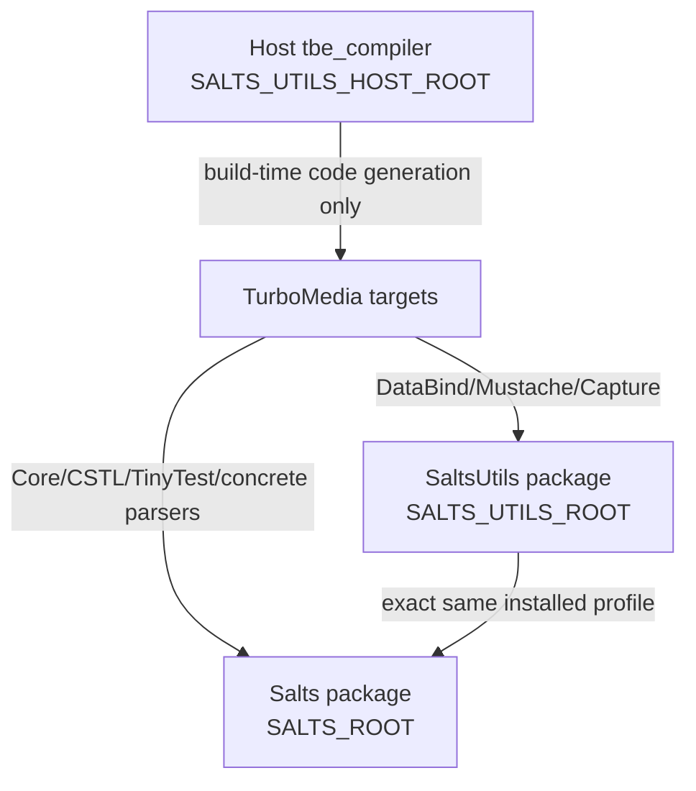
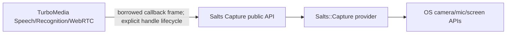

# TurboMedia Salts 依赖重构设计

- 日期：2026-09-05
- 状态：待确认
- 目标仓库：`qigao/turbomedia`
- 跟踪：[GitHub #24](https://github.com/qigao/turbomedia/issues/24)

## 1. 决策摘要

TurboMedia 将删除对 `TurboUtils::*`、`TurboParser::*`、`TURBOUTILS_ROOT`、`TURBOPARSER_ROOT` 和 `TURBOPARSER_HOST_ROOT` 的依赖，改为从精确安装根加载 `Salts` 与 `SaltsUtils`：

- `SALTS_ROOT` 是基础能力唯一来源：`Salts::Core`、`Salts::CSTL`、`Salts::TinyTest` 和具体 parser targets。
- `SALTS_UTILS_ROOT` 是高层能力唯一来源：`Salts::DataBind`、`Salts::Mustache` 和 `Salts::Capture`。
- 交叉编译所需的 host `tbe_compiler` 由 `SALTS_UTILS_HOST_ROOT` 定位；target 库仍来自 `SALTS_UTILS_ROOT`。
- 不创建 `Salts::Parser` 或 Turbo 兼容 alias。每个 target 只声明实际使用的 parser 能力。
- TurboMedia 自有 `turbo_media_*` API 保持不变；由旧依赖泄漏到公开头文件的类型改为 Salts 类型，并作为显式 source-compatibility break 记录。
- 迁移默认 fail fast，不搜索系统路径，不回退到旧 SDK，不允许同一个 build tree 混用 Turbo 与 Salts 运行库。

实施按三条有依赖关系的 PR/issue 推进：Foundation → Parser/SaltsUtils → Capture。每一步必须在干净 build tree 上通过 configure、build、focused tests 和 install-consumer 验证；最终 issue 再执行全量与跨平台验收。

## 2. 证据与问题分级

### HIGH：不存在 `Salts::Parser` 聚合替代

- **事实**：当前仓库有 32 处 `TurboParser::Parser` target 引用，25 个源文件或公开头文件包含 `turbo_parser.h`。
- **事实**：当前 Salts 安装导出具体 targets，例如 `Salts::JsonParser`、`Salts::CYaml`、`Salts::TomlParser`、`Salts::XmlParser`、`Salts::UriParser`、`Salts::LtvParser` 和 `Salts::DateTimeParser`，没有 `Salts::Parser`。
- **影响**：直接做 target 字符串替换会导致 configure 失败；创建本地聚合 alias 会继续掩盖依赖边界，使安装导出和下游链接携带不必要组件。
- **决策**：按源文件实际使用的格式拆分 target。依赖只在 public header 暴露 parser 类型时为 `PUBLIC`，其余均为 `PRIVATE`。

### HIGH：Capture 迁移会改变公开依赖类型

- **事实**：当前 `media/include/turbo_capture.h` 与本地 `media/capture/` 提供 `turbo_capture_*`；Speech、Recognition 和 WebRTC media engine 使用该类型，部分公开头文件前置声明 `struct turbo_capture_s`。
- **事实**：SaltsUtils 导出 `<salts_capture.h>`、`salts_capture_t`、`salts_capture_*`、`SALTS_CAPTURE_*` 和 `Salts::Capture`，不是旧 Turbo 名称。
- **影响**：Capture 消费者需要源码重编译；不能宣称旧 DLL/静态库的 ABI 可直接替换。若同时保留两套 provider，将出现设备枚举、callback 生命周期和平台 backend 的双事实源。
- **决策**：只保留 `Salts::Capture`。当前 SaltsUtils 已覆盖 Windows、Linux、macOS、Android 和 iOS，因此删除 TurboMedia 本地桌面与移动 Capture provider，不保留第二套 adapter 或 provider 状态。

### HIGH：基础 API 也发生了命名和头文件变化

- **事实**：仓库除了 59 处 `TurboUtils::Core`、10 处 `TurboUtils::STL`、25 处 `TurboUtils::TinyTest` 外，还使用 `<turbo_error.h>`、`<turbo_fs.h>`、`<turbo_uuid.h>`、`<turbo_str.h>` 和 `<turbostl/...>`。
- **事实**：Salts 对应为 `<salts_error.h>`、`<salts_fs.h>`、`<salts_uuid.h>`、`<salts_str.h>` 和 `<cstl/...>`；错误码、fs、uuid 前缀变为 `SALTS_*`/`salts_*`，而 `tstr_*` 和大部分 CSTL 容器 API 名保持不变。
- **影响**：只修改 CMake targets 不能通过编译；公开头文件中的旧 include 会让安装消费者继续依赖已经移除的包。
- **决策**：Foundation issue 同时迁移 target、include、符号、preset 和 package config，并用负向扫描阻止旧标识残留。

### MED：DataBind 和构建期 compiler 有 host/target 双根

- **事实**：IVR schema 使用 `tbe_compiler` 生成 typed bindings；本机构建可从 `SALTS_UTILS_ROOT/bin` 运行，交叉编译不能运行 target binary。
- **影响**：Android 若从 target root 解析 compiler，会在 configure/build 阶段失败或误用旧 TurboParser 工具。
- **决策**：native 使用 `SALTS_UTILS_ROOT`，cross build 必须设置 `SALTS_UTILS_HOST_ROOT`；两个根都使用 `NO_DEFAULT_PATH` 和明确文件存在检查。

### MED：安装包必须传递精确依赖根

- **事实**：`TurboMediaConfig.cmake.in` 当前查找 TurboUtils/TurboParser；`tests/package_consumer` 验证安装后的 `TurboMedia::Pipeline`。
- **影响**：源码树 build 成功不代表安装消费者成功；错误的 `PUBLIC`/`PRIVATE` 边界会在导入 targets 时才暴露。
- **决策**：package config 先从环境解析 `SALTS_ROOT`/`SALTS_UTILS_ROOT`，再用 `find_dependency(... PATHS ... NO_DEFAULT_PATH)` 导入依赖；package-consumer 是每阶段必过门槛。

## 3. 范围与非目标

### 3.1 范围

1. CMake package discovery、target link、install export、preset 环境和运行时搜索路径。
2. TurboUtils 基础 headers/symbols 到 Salts 的迁移。
3. parser facade 到具体 Salts parser API/target 的迁移。
4. DataBind、Mustache 和 TBE compiler 到 SaltsUtils 的迁移。
5. 本地 Capture provider 到 `Salts::Capture` 的迁移与公开类型更新。
6. Windows、Linux、Android 的 configure/build/test/install-consumer 验收；Apple 平台至少做配置和代码路径审查，具备 runner 时执行编译。

### 3.2 非目标

- 不改变 TurboMedia 自有业务协议、JSON/TOML/YAML/XML/BIN schema 或 wire format。
- 不重写 parser、DataBind、Mustache 或 Capture 实现。
- 不创建兼容 shim、旧 target alias、自动 SDK 搜索或运行时 fallback。
- 不顺带重构 Room Service、IVR、SFU 状态机或业务模型。
- 不在本设计中升级 Salts/SaltsUtils 的公开 ABI；TurboMedia 只消费已安装包。

## 4. 目标依赖架构



唯一依赖来源是当前 preset 指定的安装 profile。SaltsUtils 自己依赖 Salts，但 TurboMedia 仍直接 `find_package(Salts)`，因为多个 TurboMedia targets 直接使用基础 API 和具体 parser targets。

## 5. Target 映射与可见性

| 旧 target | 新 target | 可见性原则 |
|---|---|---|
| `TurboUtils::Core` | `Salts::Core` | 依赖类型/宏出现在公开头时 `PUBLIC`，否则 `PRIVATE` |
| `TurboUtils::STL` | `Salts::CSTL` | 同上；不存在 `Salts::STL` |
| `TurboUtils::TinyTest` | `Salts::TinyTest` | 测试 target `PRIVATE` |
| `TurboParser::DataBind` | `Salts::DataBind` | generated/public binding 需要时 `PUBLIC` |
| `TurboParser::Mustache` | `Salts::Mustache` | 默认 `PRIVATE` |
| `TurboUtils::Capture` 或本地 Capture | `Salts::Capture` | `TurboMedia::Device` 为 `PUBLIC`，因为公开 API 暴露 Capture 类型 |
| `TurboParser::Parser` | 无聚合映射 | 按下表拆分 |

Parser 能力映射：

| 使用能力 | header/API | target |
|---|---|---|
| JSON | `<json_parser.h>` / `json_*` | `Salts::JsonParser` |
| YAML | `<cyaml.h>` / `cyaml_*` | `Salts::CYaml` |
| TOML | `<toml.h>` / `toml_*` | `Salts::TomlParser` |
| XML | `<xml_parser/xml_parser.h>` / XML parser API | `Salts::XmlParser` |
| URI | `<uri_parser.h>` / `uri_t`, `uri_parse` | `Salts::UriParser` |
| LTV | `<ltv_parser.h>` / `ltv_*` | `Salts::LtvParser` |
| Date/time | `<datetime_parser.h>` / datetime API | `Salts::DateTimeParser` |

对 URI 不做盲目符号替换。`network/transport_coronet.c` 目前依赖 facade convenience getters；迁移时应在该 `.c` 内用 `uri_t` 的公开字段/flags 完成归一化，所有输入长度、scheme、host、port 和 path/query 边界保持原错误语义。若相同归一化逻辑达到三处，再提取 TurboMedia 内部 helper。

`webrtc/include/turbo_dc_msg.h` 是安装头。它若继续暴露 LTV 类型，则 `TurboMedia::DataChannel` 必须 `PUBLIC` 链接 `Salts::LtvParser`；更优先的边界是让公开 accessor 返回 TurboMedia 自有枚举/整数并把 `<ltv_parser.h>` 留在 `.c`。实现 issue 先用现有调用点证明哪种方案能保持 TurboMedia API，再选择较少破坏的一侧。

## 6. Source API 迁移

Foundation 迁移遵循以下一对一规则：

| Turbo 标识 | Salts 标识 |
|---|---|
| `<turbo_error.h>` / `TURBO_E*` | `<salts_error.h>` / `SALTS_E*` |
| `<turbo_fs.h>` / `turbo_fs_*` / `TURBO_FS_*` | `<salts_fs.h>` / `salts_fs_*` / `SALTS_FS_*` |
| `<turbo_uuid.h>` / `turbo_uuid_*` / `TURBO_UUID_*` | `<salts_uuid.h>` / `salts_uuid_*` / `SALTS_UUID_*` |
| `<turbo_str.h>` | `<salts_str.h>`；保留 `tstr_*` API |
| `<turbostl/...>` | `<cstl/...>`；保留现有 `vec_*`、`hash_map_*` 等 API |

迁移必须先让相关测试对错误码、路径边界、UUID 格式和容器 ownership 建立行为断言，再改实现。不得通过 `#define TURBO_* SALTS_*` 保留隐式兼容层。

Parser 迁移逐 capability 完成，每个批次都包含：调用点分类、API 转换、target 最小化、focused tests、旧 facade 负向扫描。DataBind 的 schema、generated `.h/.c`、JSON/XML/BIN semantic round trip 和 BIN golden vector必须保持不变。

## 7. Capture 所有权与生命周期



- `salts_capture_t` 是 capture handle 的唯一状态 owner。
- frame callback payload 默认 borrowed，只在 callback 期间有效；跨线程、队列或协程挂起前由消费者显式 copy/retain。
- start/stop/destroy 的成功、失败和重复调用语义以 Salts Capture 契约为准，TurboMedia 不另建镜像状态。
- Windows、Linux、macOS、Android 和 iOS provider 均由 SaltsUtils 提供；TurboMedia 删除对应本地实现，只保留非 Capture 的 playback、codec、JNI 和 mobile utilities。
- 删除顺序为：消费者先迁移并通过测试 → CMake 切换 provider → 删除本地 header/source → 安装树和源码树执行旧 header 负向扫描。

## 8. 错误、兼容性与回滚

### 8.1 错误语义

- 缺少 `SALTS_ROOT`、`SALTS_UTILS_ROOT`，或目录/package/target 不存在时 configure 立即失败。
- cross build 缺少 `SALTS_UTILS_HOST_ROOT/bin/tbe_compiler` 时 configure 立即失败。
- parser 输入非法、未知格式、超限、schema 不匹配时返回对应 Salts/TurboMedia 错误，不猜测 codec，不自动切回 TurboParser。
- 错误只在被消费或转换的边界记录一次；迁移不增加热路径 INFO 日志。

### 8.2 兼容性

| 维度 | 预期 | 验证 |
|---|---|---|
| TurboMedia 函数命名 | `turbo_media_*` 保持 | public header diff + package consumer |
| 错误数值/语义 | 对用户可见路径保持 | focused negative tests + full CTest |
| JSON/YAML/TOML/XML/LTV | semantic result 保持 | parser tests、signaling/config/DC tests |
| DataBind JSON/XML/BIN | schema 与 wire 保持 | semantic round trip + BIN golden vector |
| Capture source API | 旧依赖类型改为 Salts，明确 breaking | compile tests + release notes |
| Binary ABI | 不承诺与旧依赖构建产物混用 | clean rebuild + install consumer |
| 构建配置 | 根变量改名，明确 breaking | configure negative/positive tests |

### 8.3 回滚

每个实施 issue 使用独立 commit/PR，回滚单位也是该 PR。禁止在同一个 build tree 中通过恢复 alias 混装旧包；回滚后删除对应 build directory 并从旧 preset 全新 configure。Capture PR 删除本地 provider 前，前一 commit 必须已经证明所有消费者只使用 Salts API，因此可通过 revert 整个 Capture PR 恢复。

## 9. 实施顺序与合并门槛

1. **Foundation**：迁移 Core/CSTL/TinyTest、基础 include/symbol、`SALTS_ROOT` 和 package export。该 PR 可暂时保留 parser/capture 旧依赖，但同一最终 target 不得链接两套 Core runtime；若旧 TurboParser 安装包仍传递 TurboUtils，则此 PR 与 Parser PR 组成不可拆分的 stacked PR，在 Parser PR 合并前不得进入 master。
2. **Parser/SaltsUtils**：引入 `SALTS_UTILS_ROOT`/`SALTS_UTILS_HOST_ROOT`，迁移 DataBind/Mustache，按 capability 删除 `TurboParser::Parser`，移除 TurboParser package/root/alias。
3. **Capture**：迁移公开类型与消费者，切换 `Salts::Capture`，删除桌面/移动本地 provider 和 `turbo_capture.h`。
4. **Umbrella gate**：执行全量 Windows/Linux、Android configure/build、install-consumer、旧标识负向扫描和文档更新。

任一中间 PR 若不能形成单一依赖事实源，就必须作为 stacked PR 保持未合并，不能用 compatibility alias 暂时掩盖。

## 10. 验证矩阵

### 10.1 静态负向扫描

最终以下命令必须无输出：

```powershell
rg.exe -n "Turbo(Utils|Parser)::|TURBOUTILS_ROOT|TURBOPARSER_(ROOT|HOST_ROOT)|turbo_parser\.h|turbo_capture\.h|<turbostl/|<turbo_(error|fs|uuid|str)\.h>" .
```

允许的历史文档必须显式列入排除目录，不得让生产 CMake、源码、公开头、测试、示例或 preset 命中。

### 10.2 Windows

```powershell
cmake --preset win-dev-user
cmake --build --preset win-dev-user
ctest --preset win-dev-user --output-on-failure
cmake --build --preset install-win-dev-user
```

### 10.3 Focused tests

```powershell
ctest --preset win-dev-user -R "(containers|crypto|pipeline|signaling_json|signaling_config|dc_msg|ivr_schema|room_service|capture|speech|recognition|package)" --output-on-failure
```

实现者应以 `ctest --test-dir build/Msvc -N` 的实际名称为准修正正则，但不得用正则无匹配当作成功。

### 10.4 Linux 与 Android

```bash
cmake --preset linux-dev-user
cmake --build --preset linux-dev-user
ctest --preset linux-dev-user --output-on-failure
cmake --build --preset install-linux-dev-user
```

```powershell
cmake --preset android-arm64-v8a-debug-win
cmake --build --preset android-arm64-v8a-debug-win
cmake --build --preset install-android-arm64-v8a-debug-win
```

Android 验收必须从 host root 执行 `tbe_compiler`，并从 Android target roots 链接 Salts/SaltsUtils；configure 日志应能区分两者。

### 10.5 Install consumer

安装完成后用 `tests/package_consumer/CMakeLists.txt` 从全新目录 configure/build，环境只提供新根变量。移除任一必需根时应得到明确 configure error，证明不存在系统路径 fallback。

## 11. GitHub issue 跟踪设计

当前仓库没有 milestone，issue 通常使用 `[HIGH][Area]` 标题及 `## 事实`、`## 影响`、`## 验收` 正文。本重构沿用该形式，不先创建新 label 或 milestone。

已创建三个实施 issue 和一个 umbrella issue：

1. [#21 `[HIGH][Foundation] 将 TurboUtils Core/STL/TinyTest 迁移到 Salts`](https://github.com/qigao/turbomedia/issues/21)
2. [#22 `[HIGH][Parser] 移除 TurboParser::Parser 并迁移到具体 Salts parser/SaltsUtils`](https://github.com/qigao/turbomedia/issues/22)
3. [#23 `[HIGH][Capture] 将 TurboMedia 本地 Capture 迁移到 Salts::Capture`](https://github.com/qigao/turbomedia/issues/23)
4. [#24 `[HIGH][Build/API] 完成 TurboMedia 的 Salts/SaltsUtils 依赖重构`](https://github.com/qigao/turbomedia/issues/24)（umbrella）

每个 child issue 正文必须包含：仓库事实、明确不做事项、前置 issue、受影响路径、公开 API/ownership/error 语义、验收命令、回滚条件。Umbrella 只汇总决策、子 issue checklist、跨平台矩阵和最终负向扫描，不重复维护实现细节。

issue 与实施计划一一对应：

| Issue | 实施计划 |
|---|---|
| Foundation | `docs/superpowers/plans/2026-09-05-salts-foundation-migration.md` |
| Parser/SaltsUtils | `docs/superpowers/plans/2026-09-05-salts-parser-migration.md` |
| Capture | `docs/superpowers/plans/2026-09-05-salts-capture-migration.md` |

## 12. 完成标准

- 三个 child issue 的验收全部通过，umbrella checklist 全部关闭。
- 生产代码、公开头、测试、示例、preset、package config 不再引用旧 targets、roots、headers 或 symbols。
- 每个 target 只链接实际使用的具体 Salts parser；不存在本地 parser aggregate alias。
- DataBind semantic round trip 与 BIN golden vector 保持一致。
- Capture 只有 `Salts::Capture` 一个 provider/状态 owner，本地旧实现和 header 已删除。
- Windows、Linux、Android 和 install-consumer 结果可复验；未执行的平台明确记录为未验证，不能被写成通过。
- 迁移说明记录 build-root breaking change、Capture source break 和 clean rebuild 要求。
