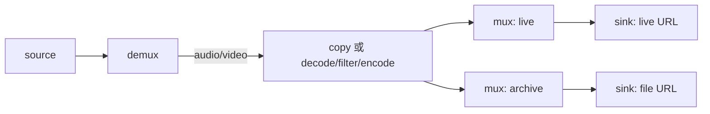

# FFmpeg 流水线多输出扇出设计

## 背景与目标

`turbo.media.pipeline/v1` 已能用同一图定义 RTSP、HLS 和文件输入，并支持流复制或解码、过滤、编码后写入一个输出。直播、会议和批处理的共同需求是：同一份已编码媒体需要同时送往多个目的地，例如直播推送与本地录制。

本设计在不改变 C API、配置版本和现有单输出行为的前提下，使 FFmpeg 执行路径支持一个共享音频/视频处理分支同步扇出到多个 `mux -> sink` 输出对。

## 范围

首个里程碑包含：

- 一个 `source` 和一个 `demux`；
- 零或一条音频处理分支、零或一条视频处理分支，至少存在一条；
- 每条已配置分支的终点连接到所有 mux 的同名 pad；
- 每个 mux 只连接一个 sink，每个 sink 只由一个 mux 驱动；
- 1 到 8 个 FFmpeg 输出；
- 同步、有界、共同失败域的包扇出；
- 现有单输出 YAML、C API、状态机和 stop/drain 语义保持兼容。

首个里程碑不包含：

- Runtime/RTP 多输出；
- 每个输出选择不同轨道、编码器或过滤器；
- 每个输出独立队列、线程、丢包、重试或断线恢复；
- 运行时动态增删输出；
- 多输入混流或合成。

## 图契约

验证规则：

1. `source`、`demux` 必须各有且仅有一个。
2. FFmpeg 模式允许 1 到 8 个 `ffmpeg.mux`，并要求相同数量的 `ffmpeg.output`。
3. 每个 mux 的 `out` 必须连接一个且仅一个 sink 的 `in`；sink 不可共享。
4. 每条已配置媒体分支必须连接每一个 mux 的同名 `audio` 或 `video` pad。部分输出缺轨直接返回 `TURBO_PIPELINE_EGRAPH`，不隐式补全。
5. 处理链在到达 mux 前仍保持唯一；中间 decoder、filter、encoder 不允许分叉。
6. Runtime/RTP 模式仍要求恰好一个 `rtp.packetize -> media.runtime_sink` 输出。
7. 所有节点和边必须被上述支持路径消费；游离或额外连接继续 fail fast。

## 运行与所有权

`turbo_pipeline_t` 仍是唯一 owner，并在调用 `turbo_pipeline_run()` 的线程顺序推进输入、编解码和全部输出。每个输出上下文拥有自己的：

- mux/sink 节点索引；
- `AVFormatContext`；
- mux/open 选项字典；
- 音频和视频 `AVStream`；
- header 写入状态。

输入流、decoder、filter graph 和 encoder 仍由媒体分支拥有且只创建一次。编码包和复制包是共享事实；写入某个输出前，通过预分配的 scratch `AVPacket` 获取引用、按该输出 stream time base 重标时间戳，然后写入。不得在第一次输出时原地修改唯一输入包，也不得为每个包创建永久对象或无界缓存。

## 背压与失败语义

多输出采用同步串行写入：

1. 对配置顺序中的每个输出依次执行 `av_interleaved_write_frame()`；
2. 单次写受现有 `io_timeout_ms` 限制；
3. 慢输出直接对整条流水线施加背压；
4. 任一 header、packet 或 trailer 写失败，流水线进入 `FAILED`，错误的 `node_id` 指向对应 mux 或 sink；
5. 不丢包、不跳过失败输出、不自动降级到剩余输出。

一个包可能已成功写入前面的输出、随后在后面的输出失败。外部输出不可事务回滚，因此可接受最终状态是“各输出可能包含一致前缀，但流水线明确失败”。调用方负责按业务策略重启、清理临时文件或重新建立直播连接。

正常结束时尝试为所有已写 header 的输出写 trailer，并返回第一个错误；这样一个输出的 trailer 失败不会阻止其他已打开容器完成收尾。

## 统计语义

`packets_read`、`bytes_read` 继续统计源输入。

`packets_written`、`bytes_written` 统计成功交付到 sink 的总和，而不是唯一媒体包数。因此相同单轨内容写入两个输出时，成功完成后写包/字节计数通常是单输出的两倍。该语义保持单输出兼容，并能反映真实输出负载。

## 兼容性、迁移与回滚

- 配置版本仍为 `turbo.media.pipeline/v1`；单 mux/sink 图无需修改。
- C 头文件和导出符号不变；内部结构不是公开 ABI。
- 新图只使用既有 node kind、factory、pad 和 edge 形式，无新增 YAML 字段。
- 兼容性风险集中在图验证从“恰好一个 mux/sink”扩展到受限 fan-out，以及统计值按成功 sink delivery 累加。
- 回滚只需恢复单输出验证和内部单 output context；单输出配置与公开 API 不需要迁移。

## 验证范围

- 既有单输出复制、转码、Runtime/RTP 测试全部保持通过；
- 两个文件输出的 stream-copy 集成测试验证两个容器均可打开且非空；
- 多输出转码测试验证 decoder/filter/encoder 只产生一条共享分支并成功写两个容器；
- 图验证覆盖 mux/sink 数量不匹配、mux 未绑定 sink、媒体分支遗漏某个 mux、Runtime/RTP 多输出；
- 统计测试验证两个输出按两次成功交付计数；
- `git diff --check`、Release 定向构建和完整 `turbo_media_test_pipeline` 必须通过。
