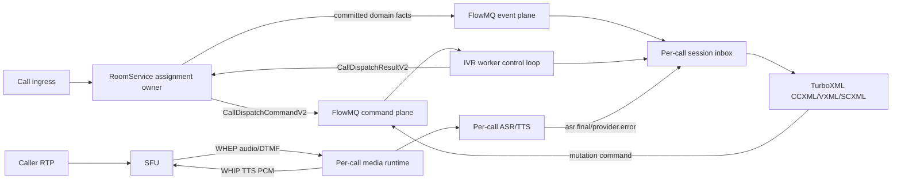
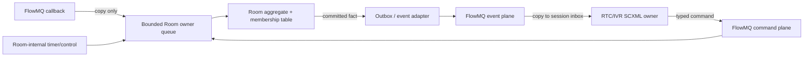
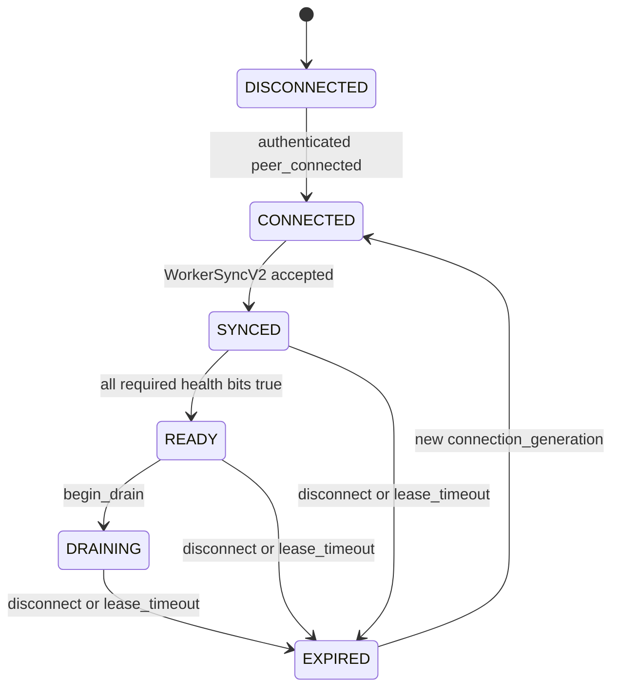
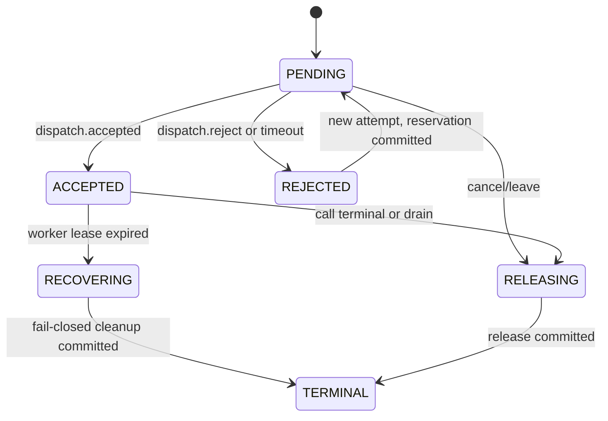
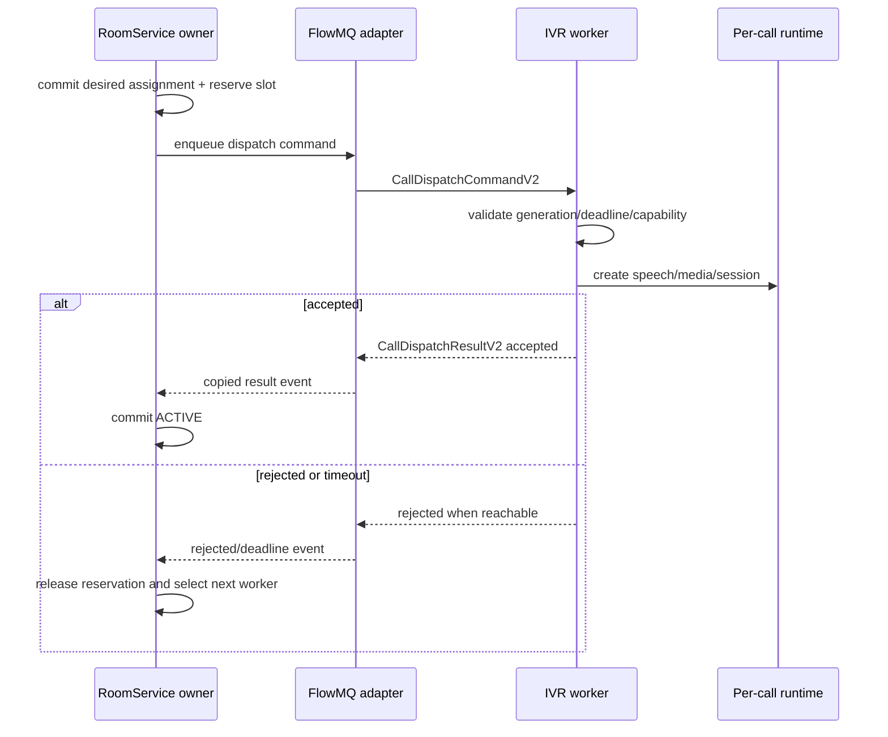

# IVR 生产化缺口解决方案

## 文档状态

- 状态：设计契约；P0-01、P0-02、P0-03 已有独立测试验收证据；P0-04.1 至 P0-04.8
  已完成（P0-04.4 至 P0-04.6 于 2026-08-11 补齐 scope/capability ACL、
  deadline/generation fence 与 replay retention 证据），真实部署证据仍缺
- 范围：`webrtc/ivr`、`webrtc/apps/ivr_worker`、RoomService IVR adapter、SFU
- 优先级：P0/P1 发布阻塞项
- 执行清单：[IVR 生产化 TODO](./ivr-production-readiness-checklist-zh.md)
- 基线架构：[独立 IVR Worker 架构](./ivr-worker-architecture-zh.md)

本文档不把本地 CTest 通过等同于生产可用。每个结论标明证据类型：

- `事实`：来自当前代码、测试或配置。
- `推论`：由事实推导出的风险，需要故障测试或负载测试确认。
- `常用做法`：只用于辅助选择，不替代仓库证据。

## 1. 当前基线与问题

已经实现并验证的基线包括：per-call TurboXML session、per-call media bot、per-call
TTS/ASR provider、真实 WHIP/WHEP 双向 PCM、精确 caller audio track 订阅、command
result 回灌、domain sequence gap 检测、snapshot 恢复、有界 inbox 和安全 drain。

`GAP-01` 已关闭：speech factory 为每个 call 创建独立 TTS/ASR wrapper，factory 深拷贝并
持有不可变 config；双 TTS、双 ASR、cancel 隔离、部分创建回滚、输入/响应上限和 100 轮
双 call 销毁已在 Release 与 ASan preset 验证。

当前实现证据与剩余发布缺口如下；已关闭的代码缺口仍保留在表中，避免把“实现完成”误写成
“生产验收完成”：

| ID | 等级 | 证据类型 | 当前问题 | 用户可见影响 |
|---|---|---|---|---|
| GAP-02 | P0 | 事实 | V2 registry、lease、capacity reservation、dispatch ACK/attempt 和故障矩阵已覆盖 | worker-loss 采用 fail-closed 清理；无 snapshot 的 mid-dialog 自动恢复仍明确禁止 |
| GAP-03 | P0 | 事实 | health snapshot、dependency/capacity readiness、双 FlowMQ channel 和 sync ACK 已接入 | 缺依赖、断链或满容量的 worker 会立即撤销 readiness |
| GAP-04 | P0 | 事实 | FlowMQ/IVR adapter、RoomService 与 worker 已接入对象级 mTLS、bounded fingerprint identity、双通道认证、有界身份轮换、tenant/room/call scope、content capability ACL、deadline/generation fence 与 replay retention；真实部署证据仍缺 | transport 与 worker 身份闭环、授权粒度和 replay gate 已完成，仅剩真实部署验证 |
| GAP-05 | P1 | 事实 | WHIP/WHEP 离散状态、reconnect supervisor、input stall、per-call SCXML 与真实 SFU publish/subscribe 单侧断链 E2E 已覆盖 | 媒体故障代码缺口已关闭；公网/TURN/滚动发布仍属于 P1-04 发布矩阵 |
| GAP-06 | P1 | 事实 | RTP `telephone-event` 到 input window、真实 SFU DTMF 和同 window DTMF/ASR 竞争 E2E 已覆盖 | DTMF 代码缺口已关闭；发布仍受其余 P0/P1 gate 约束 |
| GAP-07 | P1 | 事实 | worker/RoomService 已提供固定 gauge/counter/histogram；六组 latency 因果链、queue/peer high-water、timeout/lease counter 和 120% burst 已覆盖，真实容量/soak 与完整发布矩阵仍缺 | 可观察控制延迟和资源压力并确定性拒绝超额 call，但不能证明目标并发和生产错误预算 |

咨询转接、录音/CDR、转写留存、多租户 content rollout 和 typed BIN 迁移属于 P2，
不应混入本次 P0/P1 主路径。

## 2. 目标架构与不变量

### 2.1 核心不变量

1. 一个 call 的 speech、媒体、input window 和 TurboXML session 只由该 call runtime
   拥有；其他 call 不共享可取消的 provider 状态。
2. RoomService 是 worker lease、call assignment 和 desired media subscription 的唯一
   权威事实源；route、缓存和指标均为派生数据。
3. dispatch 被 worker 明确 ACK 后才进入 `ACTIVE`；本地 send 成功不等于 assignment
   成功。
4. 网络、FlowMQ、媒体和 provider callback 只复制并投递事件，不直接修改 assignment
   或 TurboXML 内部状态。
5. 命令使用 at-least-once delivery、稳定 `message_id` 和幂等执行；不宣称
   exactly-once。
6. 未满足必需 capability 时 fail fast；不得以 logging transport、NULL provider 或
   shadow mode 伪装 ready。
7. 所有 registry、pending dispatch、dedup、inbox、音频缓冲和重试窗口都有 item、
   byte 和 time 上限。

### 2.2 分面数据流



control plane、event plane 和 media data plane 使用不同队列与容量预算。音频帧不进入
FlowMQ command/event queue；DTMF 已归一化为低频 input event 后才进入 session inbox。
当前 live worker 的 DEALER reply callback 只复制 TIVR frame 到固定容量 mailbox，frame
解码、dispatch 建 session 和 command result 回灌均由 worker main loop 执行；mailbox 满或
frame 超限时明确拒绝。该 mailbox 是 callback 与 owner context 的线程边界，不是绕过
FlowMQ 的第二条 transport。

`CallDispatchResultV2` 是 worker owner loop 在 session/media 创建成功或明确拒绝后发送的
独立 result frame。Room bridge 只接受仍匹配最新 ROUTER route 的 ACK，并在自己的 owner
thread 调用 adapter observer；adapter 以有界 assignment 表记录
`PENDING/ACCEPTED/REJECTED/RELEASING/RECOVERING`。
表满时只复用 terminal observation，pending dispatch 不会被覆盖。
为避免 dispatch 与 PUB event 乱序，`conference.join` 的 `participant.joined` event 在
accepted ACK 之后发布；ACK rejected 时当前兼容阶段保留已经 immediate-success 返回的
participant，但不发布 worker-facing joined event。RoomService worker registry 已维护
instance/generation、lease、active/reserved/max，并在同一锁域完成 selection/reservation；
只有 accepted dispatch result 才进入 ACTIVE。

`conference.leave` 先通过当前 authenticated worker route 发送独立
`CallReleaseCommandV1`，本地 delivery 成功后 assignment 进入 RELEASING；worker owner loop
幂等销毁真实 session 并回送 `CallReleaseResultV1`。只有 accepted result 才清除 assignment
并释放 RoomService active slot；send failure 回滚为 ACTIVE，rejected result 保留 ACTIVE 和
结构化错误。当前 leave command response 仍表示本地 release command 已交付且 Room mutation
已提交，并不等待远端 release ACK。bridge owner tick 已按配置 deadline 将无 ACK 的 PENDING
变为结构化 `dispatch_timeout` 并释放 reservation；PENDING leave 使用
`dispatch_cancelled`，两者之后的迟到 accepted ACK 都会恢复 active 所有权并立即发送幂等
release，避免无 assignment 的 worker session；release result 超时使用同一稳定 message ID
重发，由 worker 的幂等 release 收敛。V2 attempt identity、自动选择下一 worker、
stale generation fencing、worker-loss fail-closed 和 fresh-registry restart rejection
已落地；没有 assignment snapshot 的 mid-dialog 自动恢复仍被显式拒绝。

### 2.3 Participant、Room 与状态机归属

participant 需要显式状态，但不能把 membership、RTC transport、dialog 和 routing 塞进
同一台状态机。采用以下正交模型：

| Aggregate / workflow | 唯一 owner | 实现 | 权威状态 | 是否经过 FlowMQ |
|---|---|---|---|---|
| Room participant membership | Room owner context | 纯 C 原生转换表 | invited/joining/active/leaving/left | participant/worker 发出的 mutation command、result 和提交后的 event 始终经过 FlowMQ |
| Participant RTC session | session owner context，key=`session_id + generation` | TurboXML SCXML C API | allocated/negotiating/connecting/connected/reconnecting/closing/closed | Room-facing fact/command 经过 FlowMQ；本地媒体 callback 只投递 session inbox |
| IVR call/dialog | per-call worker control slot | CCXML/VXML/SCXML | call control、prompt、input window、业务编排 | Room-facing fact/command 经过 FlowMQ，PCM/RTP 不经过 |
| Agent availability/lease | RoomService routing owner | 纯 C 原生转换表 | offline/syncing/ready/draining/expired | worker heartbeat/lease 始终经过 FlowMQ |

membership 是 Room aggregate 的组成部分，不为每个 participant 再创建一台拥有相同事实的
SCXML。RTC session 满足异步事件、超时、重连、恢复和可视化要求，才使用 TurboXML；SCXML
不得直接写 Room participant 字段，只能输出不可变 command，由 Room owner 校验 version、
generation 和不变量后提交。一个 participant 可以没有 RTC session，也可以在 ICE restart 时
更换 session generation，因此两者不能合并为一个枚举。



FlowMQ 是 participant/worker 与 RoomService 之间不依赖部署拓扑的 Adapter；即使二者部署在
同一主机或同一进程，也不切换成直接调用。FlowMQ 不是 aggregate 内部总线：Room owner
自身的 timer/control event 直接进入 owner queue，已进入同一 owner 的 membership 转换不再
绕 broker 一圈。broker callback 不执行 aggregate mutation、TurboXML step、网络 I/O 或用户
callback；它只校验 framing 上限、复制 payload 并投递到唯一 owner。这里的 owner queue 是
线程所有权边界，不是 FlowMQ 的替代 transport。queue 满、generation stale、sequence gap 和
shutdown 都返回明确错误或进入已定义的恢复路径，不能默认 `DROP_OLDEST`。FlowMQ peer
disconnect 同时失效 ROUTER route；worker selection 只选择仍有 live route 的注册项，
失效 worker/route slot 可由 replacement worker 重新 `worker.sync` 后复用。

### 2.4 纯 C workflow 与 TXT/BIN 协议

`RtcSessionWorkflow` 只保留公开 C header 与 `.c` 实现，删除 `.hpp/.cpp`。opaque handle
拥有 TurboXML C interpreter；`receive/step/drain/state/destroy` 只能由 session owner context
调用，外部 callback 先 copy/enqueue。SCXML `<send>` 通过 execution plugin 转成 Command，
callback 参数只在 callback 期间 borrowed。C++ wrapper 不再作为第二套行为实现或 API。

实现边界：TurboXML `step()` 的第一次调用只建立解释器，后续调用才建立初始
configuration 或消费外部 event；C wrapper 必须在固定上限内驱动这些宏步，不能把引擎微步
暴露给 `step/drain` 的调用者。2026-08-10 的 Release 验证已确认这一点，并修复了 workflow
target 的 Windows C ABI 导出。当前安装的 `uscxml-static` runtime 与源码头不一致：其
`<send>` execution point 缺少 `target/event/param.*` 属性，因此 adapter 无法安全猜测命令，
只能 fail fast，待 TurboXML package 重建后再验收 command trace。

协议只发布两个 representation：

```text
TIVR frame v1
  format=1  BIN   DataBind binary
  format=2  TEXT  compact UTF-8 JSON
```

两者绑定 `turbomedia_ivr_v1.schema` 的同一个 `DataBindObject`。`ivr_protocol` 是薄 Adapter：
先校验 magic/frame version/format/kind/type/schema version，再选择唯一 parser，并校验
`schema_type_id -> type name -> kind` 一致性。未知格式、短帧、类型不匹配、解析失败或短输出
buffer 立即失败；禁止格式探测、BIN 失败后尝试 TEXT，亦不在 wire 层支持 XML。XML 仍可作为
TurboXML 文档和离线工具格式，但不属于 TIVR message representation。

不为该协议引入 re2c/Lemon：JSON/BIN 的 grammar、schema 校验、64-bit 数值和 ownership 已由
DataBind 2.1.0 ABI 8 提供，再维护 lexer/parser 会产生第二事实源。re2c 继续用于现有 SDP 等
稳定 token grammar；只有未来出现 DataBind 无法表达、且有明确 AST/错误恢复需求的自定义 DSL
时，才评估 re2c lexer + Lemon parser。模式使用保持最小：State（转换表/SCXML）、Adapter
（TurboXML/DataBind/FlowMQ）、Command（SCXML 输出）和 Factory（复杂 per-call runtime 创建）；
不引入 singleton、service locator 或多层 protocol factory。

## 3. P0-1：per-call speech runtime

### 3.1 选择

在现有 `ivr_media_port_factory_ops_t` 之下增加一个 app-internal speech factory。每次
`media_factory_create(call)` 创建一对独立的 TTS/ASR provider，并由
`ivr_worker_media_instance_t` 持有。先采用 per-call 实例，不引入共享 provider pool；
当前 `max_sessions_per_worker` 已提供线程和实例数量上限。只有 profiling 证明线程成本
不可接受时，才设计有 call-key 隔离和取消 fencing 的有界 pool。

实际 app-internal 接口：

```c
typedef struct ivr_speech_session_s ivr_speech_session_t;

typedef struct {
    void *context; /* borrowed factory; immutable for worker lifetime */
    ivr_status_t (*create)(void *context, const ivr_call_ref_t *call,
                           ivr_speech_session_t **out_session);
    void (*destroy)(void *context, ivr_speech_session_t *session);
    ivr_status_t (*probe)(void *context, char *reason, size_t reason_cap);
} ivr_speech_session_factory_ops_t;
```

接口保持小而明确：factory 只负责 provider 创建、探测和销毁，不负责媒体、XML、重试
或路由。`ivr_openai_speech_factory_init()` 将所有 config 字符串复制进 factory-owned 连续
存储；provider 只借用该不可变副本。`deinit` 在 active session 非零时返回 `IVR_ESTATE`，
因此 factory 必须晚于全部 session 销毁。provider callback payload 仅在 callback 期间
borrowed；需要跨 callback 保存时由 media/session owner 复制。

### 3.2 生命周期

```text
allocate media instance
  -> speech_factory.create(call)
  -> media_bot_create(per-call providers)
  -> WHIP/WHEP create
  -> publish ops to worker

destroy
  -> terminal latch
  -> media_bot cancel/quiesce
  -> WHEP/WHIP stop + callback barrier
  -> media_bot destroy
  -> speech_factory.destroy
  -> free media instance
```

创建失败走单一 cleanup 路径并返回明确错误。任何已发布给 media bot 的 provider 都必须
先 quiesce media bot，再 destroy provider。一个 call 的 cancel token、ASR buffer、
callback user data 和 worker thread 不得存在于其他 call instance。

### 3.3 兼容性和成本

- 现有公开 `ivr_worker_create(..., media_factory, ...)` 不变。
- 新 speech factory 可放在 `webrtc/apps/ivr_worker` 内部，避免扩大稳定 IVR ABI。
- 每 call 固定增加两个 provider wrapper 和两个 persistent worker thread；每个 wrapper
  同时最多执行一个 HTTP request，因此每 call 最多两个 provider HTTP client/连接。
- 默认上限为 TTS input `T=64 KiB`、ASR PCM `A=4 MiB`、单 provider HTTP response
  `R=16 MiB`。TTS/ASR 可并发，因此每 call retained payload 的保守上界为
  `T + A + 2R = 36.0625 MiB`；四个 call 的该项上界为 `144.25 MiB`。此计算不包含
  HTTP request body、WAV/multipart 和 resample 的短时工作集，最终容量仍须以峰值测试校准。
- admission 配置必须满足：

  ```text
  C_target <= max_sessions
  2 * C_target <= provider_thread_budget
  2 * C_target <= provider_connection_budget
  C_target * (T + A + 2R) <= retained_payload_budget
  ```

  所有乘法在部署配置校验中使用 checked arithmetic；任一预算不满足即拒绝 active 启动。
- 测试必须同时启动至少两个 call，交错 TTS/ASR/cancel，证明没有 `BUSY` 串扰和跨 call
  callback。
- `ivr_openai_get_resource_snapshot()` 通过 C11 atomics 报告 active TTS/ASR、live provider
  thread、retained input/response bytes；factory snapshot 另报告 active session。销毁完成后
  这些计数必须归零。

## 4. P0-2：worker lease 与可靠 dispatch

### 4.1 权威状态

在 RoomService owner context 中建立 `ivr_worker_registry_t` 和
`ivr_call_assignment_t`。它们属于 RoomService 领域状态；FlowMQ route 只是按
`worker_id + connection_generation` 派生的 transport view。

worker lease 至少包含：

| 字段 | 语义 |
|---|---|
| `worker_id` | 证书身份映射后的稳定逻辑 ID |
| `instance_id` | 每次进程启动生成的新 ID |
| `connection_generation` | 每次重新认证连接递增，隔离旧 route/callback |
| `state` | `CONNECTED/SYNCED/READY/DRAINING/EXPIRED` |
| `max_sessions` | worker 声明并由服务端限制的容量 |
| `active_sessions` / `reserved_sessions` | 已 ACK 与等待 ACK 的 slot |
| `capabilities` | TTS、ASR、WHIP、WHEP、DTMF、schema/content 版本 |
| `lease_expires_at` | owner clock 上的绝对失效时间 |

heartbeat 间隔 `H`、lease `L` 和 dispatch deadline `D` 必须来自配置，且启动时验证
`L >= 3H`、`D < L`。不在代码中写死部署数值。

### 4.2 Worker 状态机



只有 `READY` 且 `active + reserved < max_sessions` 的 worker 可被选择。selection 在同一
owner context 中完成 reservation，不能读取一个无版本的 worker ID 数组后异步修改。

### 4.3 Assignment 状态机



第一版生产策略在 worker 丢失后必须 **fail closed**：提交
`ivr.worker_lost` terminal fact、清理 desired media、释放 reservation/active slot。
没有 TurboXML workflow snapshot/restore 的可复验证据前，不自动把 mid-dialog call
迁移到新 worker。后续若实现恢复，必须增加 definition version、最后消费 sequence、
input window、assignment generation 和外部事实校验，不得从头重播造成重复命令。

### 4.4 协议

不修改已发布 V1 type ID；新增 schema message：

| Message | Kind | 必需字段 |
|---|---|---|
| `WorkerSyncCommandV2` | command | message/worker/instance ID、generation、capacity、capabilities（含 `health.ready`）、lease |
| `WorkerHeartbeatV1` | command | message/worker/instance ID、generation、active/reserved、draining、capabilities（含 `health.ready`） |
| `CallDispatchCommandV2` | command | message/assignment/attempt ID、call ref、target worker instance/generation、content version、deadline |
| `CallDispatchResultV2` | result | message/assignment/attempt ID、accepted/rejected、reason、worker generation、active/capacity |
| `CallReleaseCommandV1` | command | message/assignment ID、call ref、reason、deadline |
| `CallReleaseResultV1` | result | message/assignment ID、status、worker generation |

每个 mutation command 使用 stable `message_id`。同一 attempt 重试保持 message ID；选择
新 worker 时创建新的 `attempt_id`，但保持 `assignment_id` 和 `correlation_id`。worker
只有在 content 已加载、per-call media instance 已创建、session slot 已提交后回复
accepted。RoomService 收到 accepted 后才把 assignment 置为 `ACTIVE`。

### 4.5 提交与补偿顺序



FlowMQ callback 不直接推进 registry/assignment。它复制 result 到 RoomService owner queue；
queue 满返回可观察错误，不能静默丢弃。dispatch send 成功只表示 transport 接受消息，
不能更新 assignment 为 `ACTIVE`。

## 5. P0-3：readiness 与 fail-fast admission

### 5.1 Health model

worker 维护只读 health snapshot：

```text
CONFIG_VALID
CONTENT_READY
SCHEMA_READY
COMMAND_CHANNEL_AUTHENTICATED
EVENT_CHANNEL_AUTHENTICATED
WORKER_SYNC_ACKED
SPEECH_READY
SFU_MEDIA_READY
NOT_DRAINING
CAPACITY_AVAILABLE
```

`ready=true` 要求 content package 声明的全部 capability 为真。例如 conference package
需要 TTS、ASR、WHIP 和 WHEP；缺 `IVR_OPENAI_BASE_URL`、provider 创建失败或 SFU 配置
无效都必须使 active mode 启动失败或保持 not-ready，不能进入 logging transport。
dry-run 和 shadow mode 可以显式允许 mock/logging transport，但必须报告 mode，且
RoomService 不得把它们加入 active worker pool。

### 5.2 接口和线程

- `webrtc/apps/ivr_worker/ivr_worker_health.[ch]` 提供线程安全的 opaque snapshot；
  `ivr_worker_health_snapshot()` 返回值是调用方拥有的值类型快照，容量不变量在 update
  边界 fail-fast 校验。
- worker 配置读取顺序固定为 `CLI > env > TOML > default`；TOML 仅承载非 secret
  worker/FlowMQ 数值和地址，speech/SFU secret 不进入示例文件。
- app 暴露 `/live`、`/ready`、`/health` 只读端点，复用 Iris/CoroNet server facade；
  `/metrics` 属于 P1-03，不与 P0 health JSON 混成同一契约。
- `live` 只表示进程事件循环可运行；`ready` 表示可接收新 assignment。
- 管理 listener 有独立 owner thread，默认仅绑定 `127.0.0.1:18081`；地址只允许
  `127.0.0.1`/`::1`，dry-run 不监听。stop 先停止 CoroNet context，再 join owner thread，
  最后销毁 Iris app 和 borrowed health owner。
- FlowMQ transport callback 只把 command/event peer 状态复制到原子标志；worker owner loop
  统一推进 health。任一 channel 断开都会撤销 readiness；若 command channel尚连通，先发送
  not-ready heartbeat，再进入重新 sync。恢复时两条 channel 均 connected 且 sync ACK 后才
  重新 ready。
- health generation 由 health owner 在有效 readiness 翻转时递增；update 使用当前 generation
  作为 optimistic token，旧 snapshot 明确拒绝。dependency、draining 和 capacity readiness
  只在此边界派生，capability 字符串不再复制 generation。
- provider/SFU 探测在 app control loop 中异步执行，不在状态机 transition 或锁内做 I/O。
- health 变化通过 heartbeat/status 更新 RoomService registry；readiness false 立即停止新
  reservation，但不直接终止已接纳 call。
- `WorkerSyncCommandV2` 和 `WorkerHeartbeatV1` 除 capabilities 外显式携带
  `health_generation`、`health_ready`、active/reserved/max capacity；旧 V1 type ID
  保持不变，RoomService 对旧 V2 payload 仍按 capabilities 兼容读取。

## 6. P0-4：FlowMQ mTLS/WSS 与授权

实现状态：FlowMQ facade 已提供对象级 TLS client/server config（字符串复制、rotation
generation、无 TCP fallback），gateway/subscriber/bridge 通过薄 adapter 注入。RoomService
创建 default-deny security owner 与 certificate identity owner；worker 的 DEALER 和 SUB
使用同一显式 `worker_id`、client security binding 和 TLS 配置。transport、证书身份与
bounded identity rotation 已有真实 TLS fixture 证据；scope/ACL、deadline/replay retention
和真实部署验证仍未完成。

### 6.1 Transport adapter

扩展 gateway/subscriber/Room bridge 的 adapter config，提供：transport、CA bundle、
client cert、private key、server name、peer verification、证书轮换 generation。领域层只
看到 authenticated peer identity，不依赖 TLS 库类型。

生产 active mode 要求 `TLS` 或 `WSS` 且必须验证 peer 和 hostname。当前 worker 只允许
显式 shadow mode 在 loopback 使用 plaintext；RoomService 也要求 loopback 且显式设置
`allow_insecure_loopback`。配置验证不自动降级 transport。

### 6.2 身份与授权

- 服务端从 CoroNet 输出的 canonical verified fingerprint
  `sha256:<64 lowercase hex>` 映射 `worker_id`；wire payload 中的 `worker_id` 必须与
  claimed identity 精确相等。FlowMQ BIND-side verifier 在 token authentication 前执行，
  不把 OpenSSL/X509 类型带入 IVR 核心。
- `ivr_certificate_identity` 是唯一的身份策略 owner：创建时复制 bounded mapping，拒绝
  重复 worker/fingerprint、非法 fingerprint 和零 generation；callback 只读匹配，不执行
  网络 I/O、Room mutation 或外部 callback。
- `ivr_fmq_security` 复制 shared secret，创建 default-deny realm，并为每个已配置 worker
  授予连接资源和精确 PUB topic 的最小规则。RoomService owner 在 bridge 停止后销毁它；
  FlowMQ facade 只借用 binding。client owner 同样复制 secret 并提供 bounded key lease。
- gateway DEALER 与 subscriber SUB 都把同一个 `worker_id` 设置为 CONNECT identity；缺少
  secure subscriber identity 在 facade 创建前 fail fast。bridge 仍校验 payload worker ID
  与 live ROUTER peer identity 精确一致。
- 已完成：worker identity 绑定 tenant/room/call scope（`<tenant>/` room_id 前缀约定）、
  content package capability 和 per-worker PUB/SUB topic ACL；连接成功不代表有权
  mutation，未配置 ACL 时保持 legacy allow-all，配置后未列名 worker fail closed。
- command handler 继续校验 room version、call generation 和 command allowlist；被拒绝的
  command 不改变 Room version，并计入 `acl_rejects`。
- 已完成：dispatch 的 deadline（worker 收包时按相对 TTL 求值）、V2 worker instance/
  connection generation fence、stable message_id 幂等，以及过 retention window 的
  replay 以 `IVR_ESTALE` 显式拒绝（dedup cache 有 item/time 上限）。
- active/previous CA 或证书映射支持有界轮换窗口；`previous_expires_at_ms` 到期后旧
  fingerprint fail fast，时钟可注入以便 deterministic negative tests。
- 日志不得输出 token、私钥、证书正文、完整 ASR 文本或音频 payload。

## 7. P1-1：媒体失败与重连

### 7.1 Transport state sink

WHIP/WHEP 增加小型 state callback：

```c
typedef enum {
    IVR_MEDIA_CONNECTING,
    IVR_MEDIA_CONNECTED,
    IVR_MEDIA_DISCONNECTED,
    IVR_MEDIA_FAILED,
    IVR_MEDIA_STOPPED
} ivr_media_link_state_t;

typedef void (*ivr_media_state_fn)(void *context,
                                   const ivr_call_ref_t *call,
                                   uint64_t attempt_generation,
                                   ivr_media_link_state_t state,
                                   int error_code);
```

callback payload 是 borrowed，只能在 callback 内读取。app adapter 立即复制成 per-call
control event；callback 不调用 TurboXML、不销毁 transport、不执行 HTTP retry。

### 7.2 重连语义

WHIP publish 和 WHEP receive 各有独立 link state，但 session 只消费归一化 RTC 事实：

- 任一必需 link 断开：`rtc.disconnected`，进入 `RECONNECTING`。
- control loop 按配置的 max attempts、指数退避和总 deadline 创建新 attempt generation。
- 两条 link 都恢复：`rtc.reconnected`。
- deadline/attempts 耗尽：`rtc.retry_exhausted`，terminal latch 抢占 input。
- 旧 generation 的 connected/audio/state callback 一律计数后丢弃。
- WHEP 增加 RTP inactivity deadline；只有 peer state connected 但持续无 caller media 时，
  产生可区分的 `media.input_stalled`，不伪装成网络断线。

### 7.3 受控单侧断链

SFU control adapter 提供 `disconnect_media_participant`，输入为精确的 `room_id` 与
`participant_id`。该命令要求 `sfu.control.dangerous`，并在 WebRTC owner thread 中只删除
该 participant 唯一且 `owns_node_session=true` 的 WHIP/WHEP media session；普通 control
session、另一 participant 和另一媒体方向均不受影响。随机 WHIP/WHEP resource session ID
仍封装在 transport/SFU adapter 内，不向 IVR domain 或测试泄露。

`test_ivr_whip_transport` 先删除 `call-42-rx` 验证 WHEP 终止、WHIP 存活，再停止旧 attempt
并以更高 generation 恢复 WHEP；随后删除 `call-42` 验证 WHIP 终止、WHEP 存活。测试的
单侧等待上限为 40 秒，覆盖 TurboNet::Ice 30 秒 consent expiry；Release 实测约 80 秒。
`test_sfu_node_app` 另验证 write token 被拒绝，只有绑定 room/participant 的 dangerous token
能通过鉴权到达命令执行边界。

## 8. P1-2：真实 DTMF ingress

在 WebRTC/RTP adapter 解析标准 `telephone-event`，归一化为 per-call input event。不得
让 XML 解析 RTP payload，也不得用无约束字符串直接进入 content。

流程如下：

```text
RTP telephone-event
  -> media adapter validates payload/duration/end bit
  -> dedup by call + RTP event generation
  -> copy to per-call input sink
  -> bind current input_id
  -> ivr_session_submit_event_copy(dtmf.final)
```

允许 digit 为 `0-9`、`*`、`#`、`A-D`。没有活动 input window、重复 end packet、迟到
generation 或非法 digit 必须拒绝并计数。DTMF 是 input plane event，不推进 Room domain
sequence。若需要从 SIP gateway 或外部 telephony ingress 接收 DTMF，所有来源必须先转成
同一个 canonical event，再进入相同 input sink。

现有 `ivr_media_port_ops_t` 没有 input-window hook。应新增版本化 v2 interface 或独立的
`ivr_input_port_ops_t`，由 session control thread 在 begin/end input 时通知 media；不得
无版本地扩展公开 struct。该改动需要 ABI 兼容测试和旧实现拒绝测试。

## 9. P1-3：可观测性、容量与发布验收

### 9.1 指标

至少提供以下有界、低基数指标：

- worker state、active/reserved/max sessions、lease age、dispatch accepted/rejected/timeout；
- command/result/event queue item/byte high-water、ENOSPC、decode/schema error、dedup hit；
- per-link connect/reconnect/failure、WHEP frame received/rejected、input stall；
- TTS/ASR request、busy、cancel、error、latency histogram、buffer rejected bytes；
- sequence gap、snapshot recovery、terminal reason、drain duration/timeout；
- P50/P95/P99 control latency 和 provider latency。

指标 label 只允许 worker、result class、event type 等低基数字段；room/call/message ID 只
进入采样日志或 trace context，不进入 metrics label。热路径使用 atomic counter 或批量
聚合，不在 media callback 内格式化日志。

当前 worker baseline 通过 loopback-only 管理端的 `GET /metrics` 暴露 Prometheus text。
counter/gauge 不使用 label，histogram 只使用 Prometheus 要求的固定 `le`；因此 metric family
和 time-series 数量固定，不随 worker、room、call、message 或 provider 返回文本增长：

| 分面 | 固定 metric family | 计数语义 |
|---|---|---|
| health/capacity gauge | `turbo_ivr_worker_ready`、`draining`、`active_sessions`、`reserved_sessions`、`max_sessions`、`health_generation` | 每次 scrape 从 health owner 的同一份快照派生 |
| assignment | `assign_accepted_total`、`assign_rejected_total`、`release_accepted_total`、`release_rejected_total` | targeted command 的最终结果；幂等 dispatch replay 计 accepted，stale generation 计 rejected |
| ingress queue | `reply_invalid_total`、`reply_queue_full_total`、`reply_queue_items/bytes` 及对应 `high_water` | 非法/超限/关闭 ingress、decode 失败、有界 reply queue claim 失败和 retained current/peak；metrics gauge 是唯一原子事实源 |
| FlowMQ/recovery | `command_connected_total`、`command_disconnected_total`、`event_connected_total`、`event_disconnected_total`、`sync_retry_total`、`heartbeat_failure_total` | 连接只统计实际状态翻转；retry/failure 在 worker owner loop 计数 |
| media | `media_disconnected_total`、`media_reconnected_total`、`media_retry_exhausted_total`、`media_input_stalled_total`、`media_peers` 及 `high_water` | media supervisor 的离散 control event；peer 是 WHIP/WHEP transport 数，不是 OS socket |
| provider/lifecycle | `provider_error_total`、`drain_total`、`drain_timeout_total` | TTS/ASR error callback 归一化为无 provider message 的 `provider.error`；drain 和超时分别计数 |

表中的 counter 实际名称均带 `turbo_ivr_worker_` 前缀。counter 和固定 histogram bucket 使用
relaxed atomic；scrape 只读取原子值并格式化固定文本，不分配、不读取用户身份。histogram
采用固定 `le` label 和 1 ms 至 30 s 的 13 个边界加 `+Inf`，不会随业务 ID 增长。
六组 latency 均已接同一 monotonic clock 的真实边界。provider 通过 app-internal、借用
生命周期的 Observer ops 在无 provider lock 状态通知；DTMF/ASR final 在 callback first-final
接纳点记录 timestamp/source/generation，由 session owner 的成功完成 hook 观察，因此 loser、
stale、timeout 和失败副作用不污染样本。

RoomService `/metrics` 另暴露无 label 的 worker/assignment current/capacity/high-water、lease
expired、dispatch/release timeout，以及 FlowMQ request/peer-event queue 的
current/capacity/high-water/drop/overflow。`media_peers` 只能用于 transport 生命周期平衡，不能
替代 ICE/TURN/OS socket high-water。容量计算、PromQL、60 分钟证据字段和告警处置见
[IVR 容量报告与告警 Runbook](./ivr-capacity-and-operations-zh.md)。真实容量/soak、socket
观测和完整 SLO 仍是发布阻塞项。

### 9.2 验收矩阵

发布前必须保存以下证据：

1. 两个以上真实并发 call 的 speech/media/cancel 隔离 E2E。
2. worker reject、disconnect、lease timeout、stale ACK、重复 dispatch 和 RoomService
   restart 的确定性测试。
3. 错误 CA、过期证书、worker ID 不匹配、跨 room command、重放和证书轮换测试。
4. WHIP/WHEP 中途断线、重连成功、重试耗尽、无音频 stall 和 stale callback 测试。
5. 真实 RTP DTMF 与 ASR 同一 input window 的 first-final-wins 测试。
6. `C_target` 60 分钟 soak、`120% * C_target` burst、ASan、Release preset。
7. RoomService + SFU + ivr_worker + 真实 OpenAI-compatible endpoint 的完整通话验收。

容量计算必须记录输入：每 call provider thread 数、peer/session 数、最大 ASR buffer、
inbox byte budget、pending dispatch 上限和连接数。没有这些输入，不得通过 Gate E。

## 10. 配置与错误语义

### 10.1 配置

将当前散落的 CLI/env 读取归一化为 validated config。优先级保持：CLI > env > TOML >
默认值。必须配置或验证：运行 mode、worker identity、FlowMQ TLS、SFU、speech provider、
content root/version、capacity、queue bytes、heartbeat/lease/dispatch deadline、media retry、
admin bind 和 metrics。

active mode 缺少必需值时启动失败；shadow/dry-run 的放宽必须由 mode 显式触发。整数解析
使用有范围检查的结构化配置接口，不使用 `atoi` 接受部分字符串或溢出值。secret 只通过
环境、受限文件或部署 secret provider 注入，不写入 TOML example 的明文字段。

### 10.2 错误分类

| 类别 | 示例 | 语义 |
|---|---|---|
| validation | bad config/schema/content | fail fast；不注册 ready |
| admission | no capacity/no ready worker | 明确拒绝；不提交 ACTIVE |
| retryable transport | send failure/disconnect/deadline before ACK | 保留 desired assignment，释放当前 reservation 后按策略重试 |
| permanent call | invalid content/call generation/auth | terminal reject；不自动换 worker |
| media transient | link disconnected/input stalled | 进入显式 reconnect 状态 |
| media terminal | retry exhausted/provider contract failure | terminal event + cleanup |

同一个错误只在被消费或转换的边界记录一次。中间层返回结构化错误，不记录后返回成功。

## 11. 迁移、兼容和回滚

### 11.1 迁移阶段

1. **M0 观测**：实现 metrics/readiness snapshot，不改变 dispatch 行为。
2. **M1 speech 隔离**：per-call provider + 并发测试；公开 worker ABI 不变。
3. **M2 协议并存**：新增 V2 sync/dispatch result；V1 worker 仅允许 shadow。
4. **M3 lease/assignment**：RoomService 对 V2 worker 启用 reservation、ACK 和 fail-closed。
5. **M4 安全**：启用 mTLS/WSS identity mapping；先 canary，再禁止 active TCP/WS。
6. **M5 media/DTMF**：启用 link state、reconnect、input adapter 和真实端到端测试。
7. **M6 验收**：Release、ASan、容量、soak、故障和真实 provider 证据齐全后再扩大流量。

### 11.2 兼容风险

- 新 schema 使用新 type ID，不能修改或复用 V1 ID。
- DTMF input-window hook 是 ABI 变化，必须版本化接口并对旧 version fail fast。
- active worker selection 语义从“已 sync”改为“已认证且 ready 且有容量”，部署时可用
  worker 数可能减少，需先补 capacity。
- 第一版 worker-loss 策略会终止正在进行的 IVR dialog，这是明确行为变化，但比无快照
  条件下自动重放 mutation 更安全。
- per-call provider 增加线程/连接资源，必须通过容量测试确定 `max_sessions`。

### 11.3 回滚

- RoomService 保留 `ivr_dispatch_v2` feature flag；关闭后停止新 V2 assignment，不迁移
  已 ACTIVE call。
- worker active/shadow mode 是显式配置；回滚到 shadow 不发送 mutation command。
- rollback 先置 worker DRAINING，再等待或终止现有 assignment，最后切换 routing。
- 回滚不删除 Room、participant、subscription 或 event 事实；清理由幂等 release command
  完成。
- 同一个 call 不允许 V1、V2 或另一个 RTC workflow 同时拥有 mutation 权限。

## 12. 完成定义

P0 完成要求：GAP-01 至 GAP-04 全部关闭，可靠 dispatch、worker-loss fail-closed、真实
双 call、mTLS negative tests 和 readiness admission 均有自动化证据。

P1 完成要求：媒体失败事件、真实 DTMF、指标/SLO、Release/ASan、容量/soak 和完整真实
provider E2E 全部通过。任何未关闭 MED 风险必须有明确 owner、接受理由和移除条件。

执行状态只在 [IVR 生产化 TODO](./ivr-production-readiness-checklist-zh.md) 更新；本设计
文档描述契约，不复制进度。
