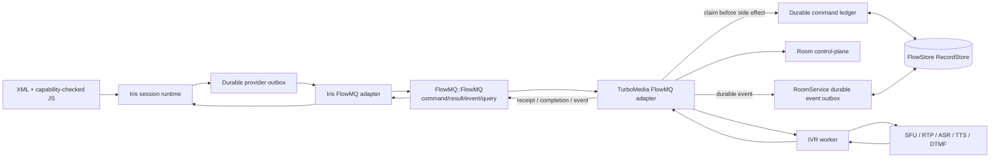
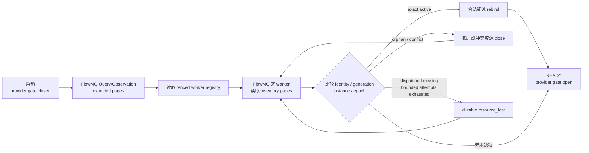
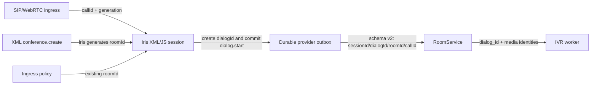
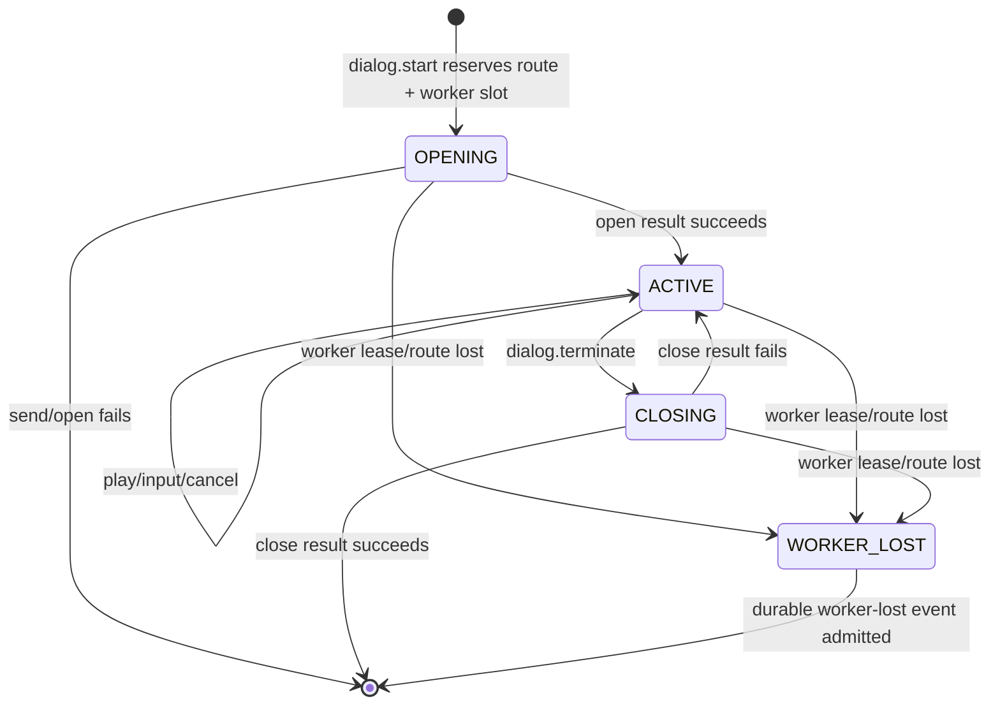
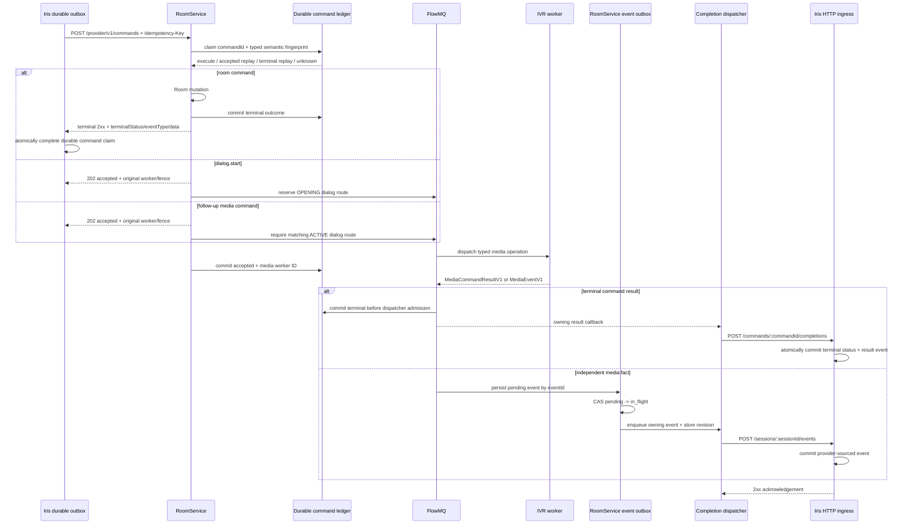
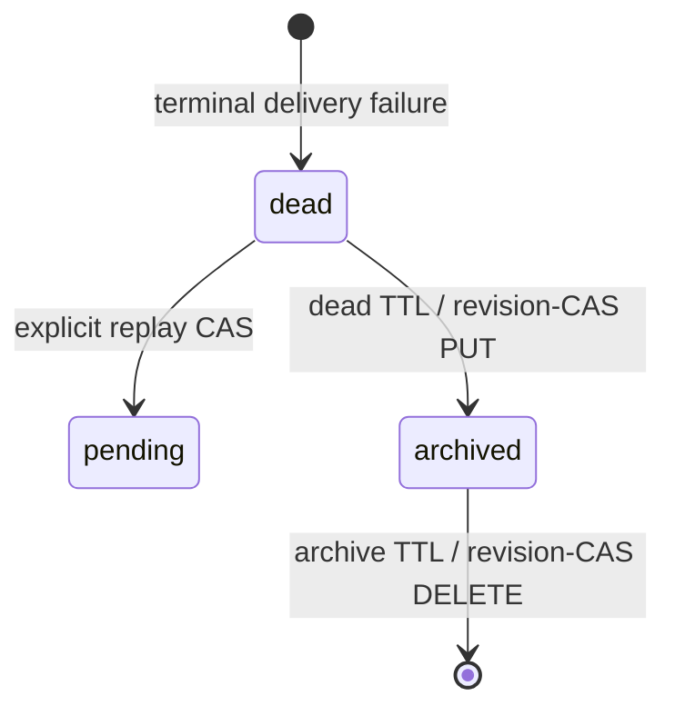
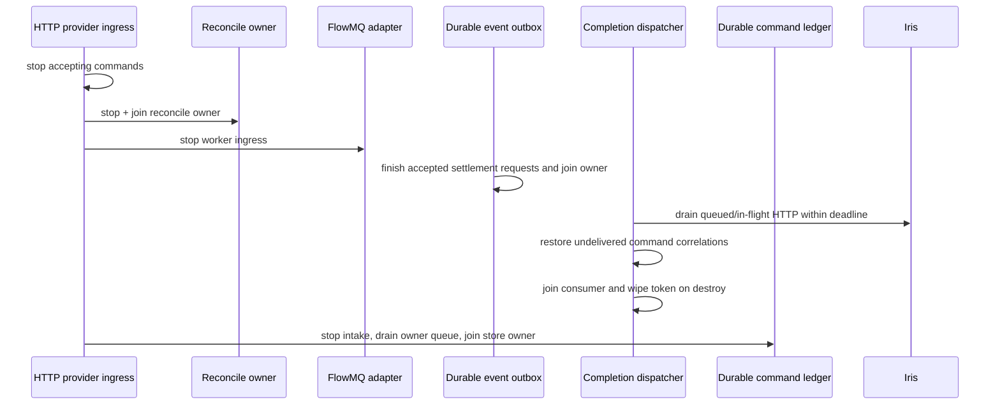

# IVR 媒体服务生产就绪设计

## 不变量

1. Iris 是 XML/JS、业务 session 和 provider outbox 的唯一事实源。
2. Room/IVR/SFU 只拥有媒体资源和必要的 generation/route/lease 派生状态。
3. media result/event 只回传事实，不能在 TurboMedia 内选择下一条业务 command。
4. FlowMQ 不承载 RTP/PCM，不承载 archive/XML/JS，不提供 exactly-once 声明。
5. 所有跨 callback/thread 数据先变成有界 owning copy。

FlowMQ 已是独立产品和故障域。TurboMedia 下游只允许
`find_package(FlowMQ CONFIG REQUIRED)` 并链接唯一公开 target `FlowMQ::FlowMQ`；不得继续解析
`TurboFlow::FMQ`，也不得绕过产品 target 直接链接 FlowMQ 内部 core/protocol target。该依赖边界同时
承载 Iris↔TurboMedia 的 provider command/result/event/query lane，以及 TurboMedia↔worker 的内部
media route/inventory lane；两类消息必须使用独立 schema、route namespace 和 ACL，不允许把
Iris/uscxml runtime 引入 TurboMedia。

Iris 与 TurboMedia 的目标 wire contract 由 TurboXML repository
`docs/architecture/iris-media-provider-flowmq-protocol.md` 定义：
`Iris <-- FlowMQ::FlowMQ --> TurboMedia`，command、durable receipt/completion、event/ack、
query/observation 和首次呼入 bootstrap 均使用分面的 typed FlowMQ message。TurboMedia 不包含 Iris，
其 provider/RoomService 控制面也不启动 HTTP server。WHIP/WHEP 等独立 media-edge 协议适配器不属于
provider contract，不能承载 Iris 或 RoomService command。旧 H2 文档已废止，不能作为 FlowMQ 不可用
时的 fallback。
下述“旧 HTTP 基线”只保留迁移证据，已不属于 RoomService provider 生产组合。

## 当前 FlowMQ 实现状态（2026-08-14）

- RoomService 已创建并管理 `iris_flowmq_provider_t` DEALER；配置只接受 Iris FlowMQ endpoint、
  provider instance、Iris peer identity、mTLS 或显式 loopback plaintext，以及 durable store 参数。
- command 经有界 owning ingress 解码为 canonical `ProviderCommandV1`，在 durable ledger claim 后回
  `ProviderReceiptV1`；completion/event 由有界 dispatcher 等待 `ProviderCompletionAckV1`/
  `ProviderEventAckV1`，transport send completion 不视为 durable ACK。
- `/provider/v1/commands` 已不再注册，expected-resource reconciler 使用 FlowMQ；FlowMQ 不可用时没有
  HTTP fallback。
- `ProviderQueryV1/ProviderObservationV1` 已实现单飞 request/response、身份/cursor/revision fence 和
  有界 payload；RoomService 启动时查询 Iris 受配置 tenant scope 限制的 provider-wide expected view，
  再与 worker inventory 收敛，READY 前拒绝 FlowMQ command。
- 确定性生产媒体核心进程 E2E 已串联真实 Iris process、RoomService process、独立 IVR worker、SQLite
  FlowStore 与双向 FlowMQ，验证 VoiceXML `dialog.start`、`dialog.terminate`、completion ACK 与 session 完成；
  真实 SIP/WebRTC/SFU/RTP 和远端 speech 仍属于独立 live-media gate。

## 已实现基线

- `IVR_WORKER_ABI_VERSION=7` 纯媒体 worker API；包含 tenant identity 与版本化、有界分页的媒体资源
  inventory 查询。
- `Media*CommandV1`、`MediaCommandResultV1`、`MediaEventV1` canonical schema；tenant 在 command、
  result、event、inventory 全路径传播，event 携带 source-local 非零 sequence。
- worker target、tenant/room/call scope、generation、TTL/deadline 校验。
- bounded media event queue 和明确的 full/shutdown 语义。
- media bot 只在显式 input window 内启动 ASR，`asr.final` 保留 `inputId`；TTS
  终态生成 `playback.finished`，cancel/close 会结束 ASR 与 DTMF input 状态。
- Room bridge 对 result/event 做 DataBind decode、live route fence 和 owner-thread callback。
- RoomService adapter 暴露显式 upstream media observer，不存在时 fail fast 并计数。
- `POST /provider/v1/commands` 使用 provider token 和 `Idempotency-Key`，将
  Iris `sessionId`、`workerId`、`dispatchEpoch` 与 media worker 路由保存在有界相关表中。
- 同一路由按 capability 分流：`room` 同步执行 `conference.create/destroy` 与
  `connection.join/unjoin`，返回显式 `terminalStatus/eventType/data`；`ivr` 保持 `202` 与
  后续 fenced completion。Room 与 IVR/media 命令都在副作用前 claim durable command ledger；
  跨新 dispatch fence 重试会重放 ACCEPTED/TERMINAL outcome，不重复媒体控制面副作用。
- command ledger 使用固定容量 owning MPSC request queue 与单一 FlowStore owner，记录
  `INTENT/ACCEPTED/TERMINAL/UNKNOWN`；启动把残留 INTENT 转 UNKNOWN，周期 retention 有批次硬上限。
  bridge correlation/tombstone 只保存进程内派生状态，存储 I/O 不在 bridge mutex 内执行。
- RoomService completion dispatcher 使用固定容量 owning MPSC queue 和单一
  TurboHTTP consumer，不在 bridge callback 或相关表锁内发 HTTP。
- terminal result 通过 provider-only completion route 回传；普通 media event
  通过 provider-scoped event route 回传。2xx、409 fence refresh、重试耗尽恢复
  correlation 和 shutdown deadline 均有确定语义。
- 普通 media event 在进入 HTTP queue 前写入 FlowStore `RecordStore`。SQLite 文件库用于
  开发，Redis/PostgreSQL 用于生产；`pending -> in_flight -> delete/dead` 使用 revision CAS，
  进程重启把 `in_flight` 恢复为 `pending`，不回退到内存事实源。
- dead event 可通过需要 `room.control.dangerous` scope 的 `replay_iris_event` 按稳定
  `eventId` 重放，或通过 `replay_iris_dead_letters` 最多批量重放 256 条；dispatcher 背压会
  立即停止批次。`list_iris_dead_letters` 提供有界、无 payload 的运维快照。Iris 对相同 ID、
  相同内容按幂等重复事件处理。
- IVR/Room/SFU/signaling 的 TurboXML/SCXML/CCXML 本地 workflow 路径已移除。

以下图表示当前 production composition；query/observation 已与 command/result 共用受身份约束的 typed lane。



## 旧 HTTP 基线已完成的能力

这些证据可用于 FlowMQ 迁移时复用状态与故障语义，但不能关闭 FlowMQ provider gate。

| 原级别 | Gate | 实现证据 |
| --- | --- | --- |
| HIGH | RoomService→Iris HTTP observer | 独立有界 queue/owner thread；TurboHTTP；provider auth；2xx terminal ACK；409 fence refresh；timeout/retry；shutdown drain；bridge callback 不发 HTTP |
| HIGH | Iris TurboMedia provider contract | `schemaVersion=2` command ingress；`provider_session_id=sessionId`；显式 `dialogId/roomId/callId`；provider-scoped completion/event ingress；terminal status + result event 原子提交 |
| HIGH | Unified external Room provider | 同一 provider ingress 已支持 `conference.create/destroy` 和 `connection.join/unjoin`；Room 同步终态与 IVR 异步 fence 明确分流；durable ledger 保证响应丢失/进程重启后的幂等重放；真实多进程 HTTP 测试覆盖 create/duplicate/join/unjoin/destroy 后继续 IVR FlowMQ 链路 |
| HIGH | Typed dialog worker-loss closure | RoomService 先把稳定 `provider.media.worker_lost` 写入 durable event outbox；Iris 仅允许 provider 身份提交该保留事件，并在接纳事件的同一存储事务中把相同 provider/dialog correlation 下所有非终态命令置为 failed；重复事件与容量失败均有原子语义 |
| MED | Component recovery | stable command/event ID；durable accepted/terminal replay；bounded correlation/tombstone；route/generation fence；retry exhaustion 后恢复 command correlation |
| HIGH | Media event retry exhaustion | FlowStore durable fact source；CAS 状态迁移；启动恢复；terminal dead letter；dangerous-scope 单条/有界批量重放；容量与拒绝指标；重复/冲突/背压/重启及真实 SQLite backend 测试 |
| HIGH | Dead-letter archive/retention | 同一 durable RecordStore 上的 `dead -> archived -> delete` revision-CAS；双 TTL；自动与手动有界 sweep；归档只读列表；删除审计日志/指标；CAS 失败保留；重启恢复测试 |
| MED | Observability | dispatcher/outbox queue 与 drain、HTTP retry/fence、backlog/capacity、retained payload 当前值/峰值、persist/conflict/recovery/replay、durable decode failure、stale settlement，以及 provider auth missing/invalid 分类均已导出 |
| MED | Deterministic media-core process E2E | 真实 RoomService 进程与独立 worker 进程串联生产 `ivr_worker_t`、media bot、RFC 4733 parser 和 typed FlowMQ；仅 TTS/ASR provider 与 audio transport 为确定性 fixture；SQLite outbox、provider auth、TurboHTTP TLS listener、start/play/input/cancel/close、completion 与 playback/ASR/DTMF event 均已验证 |
| MED | Live worker transport recovery slice | 真实 caller WHIP 与 worker WHIP/WHEP 通过 `sfu_node` 建立 ICE/DTLS/SRTP，按 caller 实际 SSRC 注册/订阅并发送 RTP；删除活动 WHEP participant 后，supervisor 各产生一次 `rtc.disconnected`/`rtc.reconnected`，generation 递增，Iris 只接收一次对应事件；Iris↔RoomService 连接级分区期间 event 先 durable 落盘、恢复后重投，dialog/caller 关闭后 SFU 资源归零 |

## 尚未完成的生产 gate

| 级别 | Gate | 验收条件 |
| --- | --- | --- |
| HIGH | First-call live ingress integration | `call_offer/session_bound` codec、独立 single-flight lane、Iris 原子 bootstrap 及 ACK 丢失/断线/capacity/shutdown 组件矩阵已完成；还需让真实 SIP/WebRTC request-table owner 调用该 API、持久化可重建派生 binding，并覆盖 CANCEL/BYE/DELETE 与 crash-point 进程测试 |
| HIGH | Live media-plane E2E | Iris XML/JS→FlowMQ→TurboMedia/worker→真实 SIP/WebRTC/SFU/RTP 与远端 speech provider→event→FlowMQ→Iris，覆盖网络失败、媒体重连、超时和资源 reconcile |

当前代码已经建立确定性的生产媒体核心多进程链路，并补上真实 caller、worker、SFU 与 Iris 串联的
transport recovery 子切片；这证明架构边界、组件协议、worker supervisor 以及局部真实 RTP 恢复成立，
不等于 SIP ingress、整个 SFU 的 expected/inventory reconcile 或远端 speech 生产 E2E 已完成。
在上述 HIGH gate 完成前，不应宣称
“XML+JS 已可完整管理生产 IVR/conference”。

### First-call 故障矩阵

| 故障 | `iris_flowmq_provider_send_call_offer()` | 状态语义 |
| --- | --- | --- |
| 正常 `session_bound` | `IVR_OK`，读取 `accepted/bound_session_id` | binding 是 Iris durable session 的派生视图 |
| ACK 丢失或 timeout | `IVR_EBUSY` | 结果未知；调用方必须保留并原样重发 owning offer |
| 连接未就绪/已停止 | `IVR_ECLOSED` | 没有本地成功声明；重连/新实例后以同一 ID 重发 |
| send admission 满 | `IVR_ENOSPC` | 消息未进入 transport；上游背压，不得生成新 ID |
| Iris 拒绝 | `IVR_OK` 且 `accepted=0` | `error_code` 区分 conflict/capacity/validation；不创建媒体资源 |
| shutdown 与在途请求竞争 | `IVR_ECLOSED` 或结果未知 | 允许 Iris 零次或一次原子提交；重试收敛到同一 session |

offer 是固定容量 owning struct，跨 worker callback 不借用 signaling buffer；first-call、query 和
completion/event 分别使用独立 mutex/等待代次，不互相覆盖 response fence。当前没有在 RoomService 内创建
第二份 workflow 状态或权威 call ledger；实际 SIP/WebRTC owner 才负责 transaction cache 和派生
call-to-session binding。真实 ROUTER/DEALER 测试覆盖 accepted、丢失响应后稳定重试、rejected
`capacity_exceeded` 与 stop 后拒绝；真实 transport send-queue 饱和仍是 live ingress gate。

## ID 与状态归属

| ID | 创建者 | 事实归属 |
| --- | --- | --- |
| `sessionId` / `provider_session_id` | Iris | 一个持久化 XML/JS workflow session |
| `callId` | SIP/WebRTC ingress | 一个呼叫 leg；由 `callGeneration` 防止 ID 重用串线 |
| `roomId` | Iris `conference.create`，或已有房间的 ingress policy | 一个媒体房间；与 IVR dialog 独立存在 |
| `dialogId` / `dialog_id` | Iris `dialog.start` | 一个 VoiceXML/IVR dialog；贯穿 open/play/input/cancel/close |
| `commandId` / `message_id` | Iris outbox | 一个幂等媒体操作及其 completion |

Iris 对 XML 发起的 `conference.create` 先生成并持久化 canonical `roomId`；原始 CCXML
`conferenceid` 只存在于解析层。`conference.join` 只提交 Room 成员关系，不选择 IVR worker，
也不创建 IVR session。
Iris 在提交 `dialog.start` 与 workflow 状态的同一事务中生成并保存 `dialogId`；命令必须同时引用
已存在的 `roomId/callId/callGeneration`。RoomService 只保存有界、可重建的派生 route，worker
不生成任何上述业务 ID。

### Worker 媒体资源 inventory

worker 固定容量 slot 数组是实际媒体资源观察值的事实源。`WorkerMediaInventoryQueryV1`
通过 FlowMQ 请求指定 worker 的资源页，`WorkerMediaInventoryPageV1` 返回 owning copy；每条记录包含
`providerSessionId/dialogId/roomId/callId/callGeneration/operationGeneration`、资源状态、是否可重绑，以及
`workerId/workerInstanceId/workerEpoch`。RoomService 不从进程内 dialog route 反推 worker 资源，
也不让 inventory 成为第二个可独立写入的业务事实源。

typed `dialog.start` 经内部 `ivr_worker_open_media_operation()` 打开资源；worker 在 slot 从 `OPENING`
发布为 `ACTIVE` 的同一锁内迁移中记录该 command 的非零 `operationGeneration`。完全相同的 opening
generation 重放缓存成功，较小 generation 返回 `IVR_ESTALE`，同一活动资源上更大的 opening generation
返回 `IVR_ESTATE`。公开 embedded `ivr_worker_open_media_call()` 的 ABI 与既有 generation=0 语义保持不变，
不会被误当成可参加 typed Provider 重启 reconcile 的 command。

inventory 协议版本当前为 `1`，单页上限为 32 条。首次查询携带
`expectedRevision=0,cursor=0`；后续页必须回显第一页的 `inventoryRevision`。查询期间资源发生迁移时，
worker 返回 `IVR_ESTALE`，调用方必须从第一页重新读取；未知版本返回 `IVR_EVERSION`，非法 cursor/limit
返回 `IVR_EINVAL`。`nextCursor=0` 且 `hasMore=false` 表示读完，容量始终受 worker slot 和页上限约束。

worker 在 mutex 内只复制固定大小记录并推进 cursor，不做 FlowMQ、HTTP 或 callback。FlowMQ gateway
负责 DataBind 编解码；Room bridge 在 owner thread 接收结果；RoomService adapter 在通知上游前验证
记录的 `workerId/workerInstanceId/workerEpoch` 与当前已注册 worker route 一致，旧实例或旧 epoch 的页
被计入 reject 而不会进入恢复逻辑。

```mermaid
sequenceDiagram
  participant R as RoomService reconcile owner
  participant B as IVR Room bridge
  participant F as FlowMQ
  participant W as IVR worker slot owner

  R->>B: query(worker, version=1, revision=0, cursor=0, limit<=32)
  B->>F: WorkerMediaInventoryQueryV1
  F->>W: owning decoded query
  W->>W: copy fixed page under worker mutex
  W-->>F: WorkerMediaInventoryPageV1
  F-->>B: version/revision/cursor + records
  B-->>R: authenticated owning page
  alt hasMore and revision unchanged
    R->>B: query(same revision, nextCursor)
  else revision changed
    W-->>R: IVR_ESTALE; restart at cursor 0
  end
```

该 inventory 查询与 epoch fence 已实现并有单元、schema、gateway、bridge 和 adapter 测试。
Iris 从 durable VoiceXML snapshot/outbox 原子派生 provider-scoped expected-resource view；FlowMQ
observation 使用内容 revision、cursor 和固定页上限，并携带 session revision、owner epoch 与 dispatch fence。

RoomService 现已实现独立 reconcile owner。provider 启用后，启动状态按
`NOT_READY -> FETCHING_EXPECTED -> FETCHING_INVENTORY -> APPLYING -> READY` 推进；`READY` 前的
Room/IVR provider command 返回 FlowMQ `NotReady` 和明确的 `MEDIA_PROVIDER_NOT_READY` retryable 错误。入口还会
即时检查 adapter 的 `requires_reconcile`，因此 worker 注册发生在一次 ready 判定之后时也不会穿过
门禁。



合法重绑要求 active、rebindable 和完整媒体 identity 相同。已 dispatch command 必须匹配相同
`operationGeneration`；尚未产生媒体副作用的 pending next command 可以匹配
`operationGeneration - 1`。其余记录通过 reconciliation-only 私有 route 关闭，close result 只更新媒体
bookkeeping，不冒充 Iris command completion。worker 的已重绑 route 数必须与其上报
`activeSessions` 精确相等，才能从 `RECONCILING` 晋升为可调度状态。

expected Query、worker inventory request 和 callback 均不在 reconciler/bridge mutex 内执行。FlowMQ owner callback
只把 owning page 复制进固定容量 MPSC queue；满额返回 `IVR_ENOSPC`，timeout/version/revision/cursor
错误结束当前 cycle，retry wait 可被 shutdown 唤醒。缺失的 dispatched 资源在有界尝试耗尽后生成稳定
`provider.media.resource_lost`：event ID 由资源 identity 与 generation 决定，时间戳由 committed lease
fence 决定。RoomService durable event outbox 与 Iris inbox 以同一 event ID 去重，所以 retry、进程重启
和重复 inventory observation 不产生第二个业务终态。

reconciler threaded lifecycle 是 one-shot：`stop()` 永久关闭 inventory intake、唤醒 retry wait 并 join
owner。stop 后的迟到 page、手工 reconcile cycle 和重复 start 都明确拒绝，不能把 page 留在已无 consumer
的有界队列里。

RoomService 自身重启时不接管 worker 的媒体事实。仍持有活动 slot 的 worker 在 control route 重建后重发
完整 `worker.sync.v2`；生产 worker 在 heartbeat/transport 失去注册后按有界间隔重新发送，进程测试 fixture
以固定一秒间隔发送完整 sync，且不缓存失败发送。新 RoomService 保持 provider gate 关闭，重新读取 Iris
expected observation pages 与 worker inventory，只有精确 rebind 后才进入 `READY`。该路径已通过同一
`dialogId/callId` 的后续递增 generation `media.play` 验证，没有创建替代 dialog。

```mermaid
sequenceDiagram
  participant I as Iris expected view
  participant R1 as RoomService old
  participant W as Active IVR worker
  participant R2 as RoomService restarted

  I->>R1: dialog.start operationGeneration=1
  R1->>W: SESSION_OPEN generation=1
  W->>W: publish ACTIVE + generation=1
  W-->>I: terminal completion
  R1--xR1: process terminated
  W->>R2: worker.sync.v2 + activeSessions
  R2->>I: ProviderQueryV1 expected-resource pages
  I-->>R2: ProviderObservationV1 + revision/cursor fence
  R2->>W: inventory query
  W-->>R2: same dialog/call + operationGeneration=1
  R2->>R2: exact rebind; READY
  I->>R2: media.play operationGeneration=2
  R2->>W: typed play on original slot
  W-->>I: one terminal completion
```

同一 `dialogId` 由 Iris 单独拥有迁移顺序：上一条 command completion 提交后，才提交下一条
play/input/cancel/close；其他 dialog/session 可并发推进。RoomService 的 `ACTIVE -> CLOSING`
route fence 只保护媒体资源，拒绝 close 之后到达的旧 result/event，不能替 Iris 决定下一条业务命令。

WHIP/WHEP transport 现在拥有完整的
`providerSessionId/dialogId/roomId/callId/callGeneration/expectedRoomVersion`。start 时从 worker call view 做
有界 owning copy；state/audio/RTP callback 在 transport mutex 内复制到固定大小栈对象，解锁后才调用
上游。play/stop 必须匹配完整 identity，不能让相同 room/call 下的另一 dialog 操作现有 transport。
callback 返回后栈 view 立即失效，接收方需要跨 callback 保存时必须自行复制。





公开媒体协议不包含 `media.stop`。`ivr_media_port_ops_t.stop_bot` 只由
`dialog.terminate`、open rollback、drain 和 worker destroy 调用，是父生命周期动作中的资源清理步骤；
它没有独立 command ID、generation、terminal event 或 query/reconcile 语义。prompt/input 中断走
`MediaCancelCommandV2`，并必须携带 exact `input_id/input_generation`。因此 stop 失败由父 command 或关闭
协议收敛，不能单独提交 provider terminal fact。

外部 HTTP 字段使用 `dialogId`，内部 FlowMQ/DataBind 字段使用 `dialog_id`。当前生成类型名仍保留
`Media*V1` 后缀，但其必填 identity 集合已经改变，属于不兼容的内部协议升级，不能与旧 worker
混部。`[fmq].dialog_capacity`（环境变量
`TURBO_ROOM_SERVICE_FMQ_DIALOG_CAPACITY`）限制 `OPENING + ACTIVE + CLOSING + WORKER_LOST`
route 总数；worker-lost event 使用稳定 ID，durable outbox 背压时保留 route 并重试，成功接收后才
释放 route/worker capacity。Iris 收到该保留事件后，以 `provider + dialogId` 为匹配键，在事件写入
同一事务中将该 dialog 的全部 pending/dispatched command 置为 failed；普通 tenant event 入口不能
提交该类型。范围为 1–65536，默认 256，满额返回明确容量错误。

## Command completion 与普通事件

Room 命令与 IVR 命令共享认证和 outbox claim，但不伪造相同执行模型：Room mutation 是
RoomService 本地、同步、可立即返回错误的控制面事务；IVR 跨 FlowMQ/worker/media 生命周期，必须异步。
同步 `2xx` 必须携带 `terminalStatus`、`eventType`、`data`，Iris 据此原子完成当前 claim；
`202` 只允许携带并回显原始 `workerId/dispatchEpoch`，随后走 completion route。

Room core 仍是房间/成员关系的领域事实源；durable command ledger 是 provider 幂等 outcome 的事实源。
HTTP handler 可并发提交固定大小 owning ledger request，单一 store owner 串行执行 FlowStore CAS；
bridge cache 只保存 `EXECUTING/ACCEPTED/COMPLETING/COMPLETED` 派生状态。执行副作用、FlowStore I/O
和 HTTP 均不持 cache mutex；queue/record 满额返回 429，重复执行中的命令返回 425。关闭 HTTP ingress
后不再产生新操作，依次停止 FlowMQ/outbox/dispatcher 后才 drain ledger，最后在 quiescent 状态销毁。
`commandId` 重放仅允许 Iris 租约重领产生的 `workerId/dispatchEpoch` 变化；业务 data、causation 与
deadline 必须保持不变。命令一旦进入 `EXECUTING`，即使内部结果构造失败，也会保存可重放的终态失败，
不会清除槽并重复 Room mutation。



completion 的 409 表示 Iris claim fence 已改变。dispatcher 从 correlation 刷新
`workerId/dispatchEpoch`，并重用 ledger 的同一 terminal outcome 后重试，不重新执行媒体 side effect。
2xx 后 correlation 转为有界 tombstone；迟到的 Iris command retry 由 durable terminal replay 吸收，
tombstone 只避免进程内迟到 result 重复入队。普通 media event 不占用 command correlation；它保留原
event ID/type/timestamp/payload。
普通事件收到 2xx 后按 revision 删除；terminal 失败写为 `dead`；dispatcher 关闭时未发送的事件
退回 `pending`。若 2xx 后删除失败，记录会再次投递，但 Iris 的相同 `eventId`/相同内容幂等契约
使该 at-least-once 恢复安全。

dead-letter retention 使用 FlowStore RecordStore 作为唯一事实源，三个终态动作均由 outbox owner
线程串行执行：



`archived` 保留完整 owning event、失败状态、`state_changed_at_ms` 和 `archived_at_ms`，但不再允许
重放。归档与删除使用相同的 SQLite/Redis/PostgreSQL RecordStore 契约；不在 backend 间做双写，
因此 crash 只能留下原 `dead` 或已提交的 `archived`，不会出现“先删后归档”的窗口。每个 sweep
最多处理 `retention_sweep_batch_size` 条；CAS/存储失败不改变原记录，计入 failure counter 后由下一
周期重试。sweep 在 archive 与 delete 阶段间轮换；当前阶段没有到期记录时把批次让给另一阶段，
避免稳定 key 顺序导致任一阶段饥饿。删除成功记录 event ID、archive timestamp、delete timestamp 和 revision 审计日志，不记录
payload 或 credential。outbox schema 为不兼容的 v3；旧 schema 在启动 scan 时明确失败，部署必须
在升级前清空或显式迁移旧开发数据，不做猜测式转换。

运维入口复用 `POST /api/v1/commands`：

```json
{"type":"list_iris_dead_letters","limit":100}
```

列表最多返回 256 条 provider-ordered metadata（不含 payload），同时返回完整 `total` 与
`truncated`；该精确 total 需要扫描后端的有界 `max_records`，只能作为低频控制面操作，常规告警
应使用 `/metrics` 的 dead backlog gauge。单条重放请求为：

```json
{"type":"replay_iris_event","event_id":"stable-event-id"}
```

有界批量重放请求为：

```json
{"type":"replay_iris_dead_letters","limit":100}
```

成功响应包含 `selected`、`replayed`、`remainingDead` 和 `backpressured`。批次按 FlowStore
稳定 snapshot 的 provider-defined 顺序逐条执行 `dead -> pending` CAS；dispatcher 拒绝接收时，
当前记录留在 `pending`，批次立即停止，尚未选择的记录保持 `dead`。列表要求 control write auth；
单条和批量重放要求全局 `room.control.dangerous`（不能用只限定某一 room 的 token）。非 dead
状态返回 conflict；不存在的 ID 返回 not-found，均不隐式改变其他记录。若某条已完成
`dead -> pending`、随后持久化调度状态失败，HTTP 返回 503、`ok=false` 和实际 partial counters；
重复执行只会重新选择仍为 dead 的记录。

归档列表与手动恢复演练分别使用：

```json
{"type":"list_iris_archived_events","limit":100}
```

```json
{"type":"run_iris_event_retention"}
```

列表同样只返回最多 256 条 metadata；归档列表与手动 sweep 都需要全局
`room.control.dangerous`，sweep 响应包含 `archived`、`deleted`、`remainingDead` 和
`remainingArchived`。自动 sweep 在启动恢复时执行一次，此后即使 request queue 持续有流量，也按
`retention_sweep_interval_ms` 周期优先执行一个有界批次。

## 容量与背压

每个可增长结构必须配置 item/byte/time 上限。容量预算至少覆盖峰值 command/event 速率、最坏
Iris stall、最大 payload、worker shutdown drain。满额返回明确错误；不得 drop-oldest、无界扩容
或把 publish 成功当成 Iris 已提交业务事实。

`[iris_provider]` 还必须配置 `event_store_config`、`event_store_channel` 和有界
`outbox_request_queue_capacity`。URL、token 与 store 配置必须作为完整单元启用，并同时启用
FlowMQ 和 control-plane auth；因此 dangerous-scope 重放不会在无认证控制面上暴露。生产 URL
必须使用 HTTPS，明文 HTTP 只允许显式 loopback 测试。`drain_timeout_ms` 必须不小于
`request_timeout_ms`。token 不输出到配置日志，destroy 时擦除 owned copy。
归档策略由 `dead_retention_seconds`、`archive_retention_seconds`、
`retention_sweep_interval_ms` 和 `retention_sweep_batch_size` 显式配置；默认分别为 1 天、30 天、
60 秒和 128 条；sweep 周期最小为 1 秒，所有值均在启动时校验硬上限。对应环境变量使用
`TURBO_ROOM_SERVICE_IRIS_*` 同名大写形式。

开发配置可使用 `room_service.flowstore.dev.yaml.example` 的文件型 SQLite。生产配置使用
`room_service.flowstore.redis.yaml.example` 或
`room_service.flowstore.postgresql.yaml.example`。Redis 示例要求本地 TLS proxy/service mesh；
PostgreSQL 示例通过 libpq service/credential file 注入 TLS 与密钥。后端无法连接、不是 durable +
atomic、容量不足或启动 scan/recovery 失败时，RoomService 启动失败，不做 memory fallback。
SQLite 还要求显式 `allow_development_sqlite=true`（或对应环境变量）；默认关闭，因此生产配置
不会因误填 SQLite YAML 而启动。

RoomService `/metrics` 导出 dispatcher 当前/容量/峰值水位、in-flight、enqueue/full/closed、
HTTP attempts/retries、409 fence conflict/refresh failure、completion/event 成功失败、shutdown
恢复 completion/丢弃 event，以及最近/最大 drain duration；同时导出 outbox request queue、
pending/in-flight/dead/archived 当前记录数、FlowStore `record_capacity`，以及
persist/duplicate/conflict/failure/capacity-rejection/recovery/replay/archive/delete/retention-failure
计数。outbox 还导出 durable
record 所保留 `payload_json` 字节的当前值与进程生命周期峰值，以及 durable record decode failure
和 stale settlement 计数，并分别统计缺失与无效 provider credential 的 ingress 拒绝。payload 当前值在
启动扫描时从 FlowStore 重建，仅在持久化提交成功后增加、
在 2xx settlement 的 CAS 删除成功后减少；指标读取不扫描存储。可用以下 PromQL 建立
非破坏性容量告警（阈值由部署容量预算决定）：

command ledger 另行导出 request queue 当前/容量/high-water、record capacity，以及
claim/replay/conflict/unknown/storage-failure/queue-rejection、启动恢复 UNKNOWN、retention sweep/delete/
failure 计数；指标不包含 token、command body 或 terminal payload。

reconcile 另行导出 numeric state、当前是否接受 command、inventory queue 当前值/容量，以及
cycle/failure/expected-fetch/inventory-page、rebind、orphan-close、resource-lost 和 queue-full 计数。

```promql
(
  turbo_room_service_iris_outbox_pending_records
  + turbo_room_service_iris_outbox_in_flight_records
  + turbo_room_service_iris_outbox_dead_records
  + turbo_room_service_iris_outbox_archived_records
)
/ clamp_min(turbo_room_service_iris_outbox_record_capacity, 1) >= 0.8
or increase(turbo_room_service_iris_outbox_capacity_rejection_total[5m]) > 0
```

统计是
队列锁下的只读快照，不作为
并发正确性或背压判定；不包含 provider token、URL、command body 或 event payload。

## 关闭协议



关闭顺序是 HTTP ingress、reconcile owner、FlowMQ、event outbox、dispatcher、command ledger、资源
destroy。先停止
reconciler，保证 FlowMQ drain 期间不再产生 inventory request；先停止 outbox、后停止 dispatcher，保证
所有已接收 delivery/settlement callback 的依赖仍存活。dispatcher 在重试间隔检查 deadline；已经进入
TurboHTTP 的请求由 `request_timeout_ms` 限界。deadline 到达时，尚未交付的 command completion 恢复
correlation，等待 worker 重发；尚未交付的普通 media event 保留为 durable pending，重启后从
FlowStore 恢复。dispatcher 关闭回调与 bridge restore 均在 dispatcher 锁外执行。

## 测试策略

- pure codec tests：type registry、TEXT/BIN round trip、必填 ID、长度、generation、TTL。
- core mock tests：media call lifecycle、idempotency、input window、deadline、drain。
- loopback integration：真实 FlowMQ/DataBind + mock upstream observer，验证 route spoof rejection。
- process E2E：真实 RoomService 进程与独立 worker 进程运行生产 `ivr_worker_t`、media bot、
  RFC 4733 parser 和固定容量 Disruptor reply queue；FlowMQ `on_reply` 只复制/发布，不重入
  FlowMQ。provider 场景串联真实 SQLite FlowStore、TurboHTTP client 和 Iris TLS listener，按
  completion 顺序验证 start/play/input/cancel/close，以及 `playback.finished`、`asr.final`、DTMF
  event 的 `inputId/inputValue`、provider auth、202 admission、指标和清理。测试先保持 Iris
  expected-resource endpoint 不可用，验证 provider ingress 为 503；再提供带 pending resource 的真实
  authenticated lease/page，验证 TurboHTTP 解析和 ready gate 后才允许 dispatch。
- process fault matrix（已完成子集）：通过真实 provider HTTP `dialog.start` 验证无 worker 时返回 503；
  dialog open result 前 worker 退出会先 durable 提交 `provider.media.worker_lost`，随后 replacement worker
  可接受新 dialog；result 后 worker 退出会关闭 IVR route，但不会删除由 Room 服务拥有的 call
  membership。另一个场景在 `dialog.start` 完成后只强杀 RoomService，保留原 worker/slot 与 FlowStore；
  新进程先返回 FlowMQ `NotReady/MEDIA_PROVIDER_NOT_READY`，重新读取 expected observation pages 和完整 worker inventory，
  断言 `rebound_total=1` 后，使用同一 dialog/call 与递增 generation 完成 `media.play`。旧的
  `conference.join -> IVR dispatch` 测试已删除，因为 Room membership 与 IVR dialog allocation 是两个
  独立媒体职责。
- live SFU/RTP restart slice：真实 `sfu_node` 与 WHIP/WHEP transport 先建立 ICE/DTLS/SRTP 双向音频并
  接收 RTP，随后强杀整个 SFU 进程，等待 publish/receive 两侧各自产生断开终态。使用同一完整 call
  identity 重启 SFU 和两个 transport 后，断言 attempt generation 递增、RTP 音频恢复、callback identity
  未丢失；显式 stop 后 SFU `session_count/participant_count` 均归零。该测试关闭 transport 层的
  SFU/RTP restart slice；它没有串联 Iris completion/resource-lost，因此不单独关闭 REC-05。
- live worker recovery process slice：`test_ivr_dispatch_processes` 使用真实 caller
  `ivr_whip_transport`，以 transport 实际 SSRC 注册 `caller-audio-42` 并向 worker WHEP 发送有界 RTP；
  worker 的 WHIP/WHEP connected 状态由无动态标签 gauge
  `turbo_ivr_worker_media_links_connected` 有界观测。测试删除活动 `call-42-rx` participant 后，断言
  supervisor 各产生一次 `rtc.disconnected`/`rtc.reconnected`、attempt generation 递增、没有
  `rtc.retry_exhausted`，且 RoomService 只向 Iris 提交一次对应业务事实。SFU 资源恢复到 3/3，
  `dialog.terminate` 后降为 caller 的 1/1，caller stop 后归零。恢复 deadline 以每个稳定连接后的新故障
  episode 起算；`IVR_MEDIA_INPUT_INACTIVITY_TIMEOUT_MS` 的 0 值沿用 transport 默认 5000 ms，非零值
  允许范围为 1..3600000 ms。该切片还在 active dialog 下强杀整个 SFU，随后以同一 caller identity
  重建发布端；worker 在新 SFU 上恢复两条 link，Iris 对该 outage 只收到一次 disconnected/reconnected，
  generation 递增且资源按 3/3→1/1→0/0 释放。reconnect state machine 对一次 recovery episode 只发布
  一次 disconnected，生产 worker 使用 8 次尝试、30 秒总 deadline 的有界预算；预算覆盖两个 10 秒
  transport connection window、7.1 秒退避总量和约 2.9 秒调度余量。同一场景通过固定 8 connection、
  单 owner TCP proxy 关闭活动 Iris connection 并拒绝新连接；`rtc.disconnected` 在分区期间先写入
  FlowStore，恢复 proxy 后再以稳定 event ID 投递。修复 deadline 后 focused 场景连续两次 67/67 assertions
  通过。该证据关闭 C2-1、whole-SFU supervisor recovery 和 Iris↔RoomService 分区子项，但没有触发
  RoomService expected/inventory reconciler，仍不关闭 REC-05/06。
- FlowMQ/worker partition slice：同一进程测试用固定容量 TCP proxy 将 worker front port 转发至
  RoomService backend port。分区关闭活动连接并持续超过 15 秒 lease，provider command 最终明确 503，
  不执行媒体副作用；恢复时使用 FlowMQ 既有 1/2/4/8/16/30 秒有界抖动重连。真实 worker 原先把
  connection generation/worker epoch 固定为 1，已改为首次连接后每次成功 reconnect 推进 epoch，并在
  worker lock 下同步推进 inventory revision。RoomService 因新世代进入 reconcile，精确重绑原 active
  slot 后才 READY。同一 command ID 重试及重复提交只产生一个 completion、一个 event 和一次 play；
  focused 1/1、38 assertions，worker epoch/inventory 单测 10/10、103 assertions 通过。
- whole-SFU expected/inventory terminal slice：上述双 link 恢复且 Iris 只收到一次 `rtc.reconnected` 后，
  同一场景强杀 RoomService；稳定前端 TCP proxy 将 worker 的真实 mTLS FlowMQ 连接透传至新 backend。
  worker 推进 connection epoch 与 inventory revision，新 RoomService 读取 Iris expected observation pages 和
  worker inventory，`rebound_total=1` 后 READY；最终资源仍按 3/3→1/1→0/0 释放。focused 1/1、
  69 assertions、约 86 秒通过。该证据关闭 whole-SFU expected/inventory rebind terminal-fact 分支。
- reconcile contract：deterministic/dummy ops 覆盖空集 ready、exact dispatched rebind、pending next
  operation rebind、孤儿 close 后重新 inventory、missing dispatched 延迟终态、pending/no-side-effect、
  restart-stable resource-lost event、stale generation fail-close、inventory queue full、Iris 暂不可用后
  恢复以及 retry-wait shutdown。RoomService 重启/rebind 已在确定性媒体核心进程测试中覆盖，但不包含
  live RTP。SFU/RTP transport restart、worker transport recovery 与 active-dialog whole-SFU supervisor
  recovery 与 whole-SFU expected/inventory rebind terminal fact 已有真实媒体层/控制面组合证据；
  live RTP shutdown deadline、SIP ingress 与远端 speech 仍属于 REC-05/06。orphan close reconcile
  action 已改用稳定资源/fence 事实的 SHA-256 派生 canonical UUIDv8；
  真实进程测试分别在副作用前、media destroy 后/result 前强杀 RoomService；同一 fence 使用相同 ID，
  FlowMQ reconnect 推进 worker epoch 后使用新 fence ID，或从空 inventory 收敛，最终 READY 且 destroy
  只发生一次。
- HTTP component integration：dispatcher 注入 transport 验证 stable retry body、5xx retry、409
  fence refresh、queue full、owning copy、shutdown drain；默认 TurboHTTP client 通过真实 Iris TLS
  listener 验证 CA/hostname、provider token、session event route 和 payload；Iris hosted tests 验证
  provider/tenant auth、source scope、completion fencing 与原子提交。
- live RTP shutdown drain：loopback-only management listener 提供 `POST /drain`，只向主线程提交停止请求
  并返回 202，不在 HTTP callback 内重入销毁。真实 active WHIP/WHEP 进程场景要求 30 秒内打印 drain
  标记并退出；Iris 只收到一个 worker-lost，SFU 资源 3/3→1/1→0/0。focused 1/1、70 assertions，
  management HTTP 3/3、69 assertions 通过。
- outbox component：CAS fake store 验证 persist-before-send、duplicate/conflict、单条/批量 replay、
  batch backpressure、record capacity rejection、queue rejection、in-flight restart 和 recovery
  fail-fast；真实 SQLite FlowStore 验证关闭后重开与重投。
- live media-plane E2E：真实 Iris HTTP API、SIP/WebRTC/SFU/RTP attachment 和远端 speech
  provider，覆盖网络失败与资源 reconcile；确定性 provider/loopback transport 不能替代该 gate。
