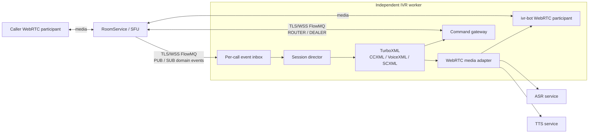
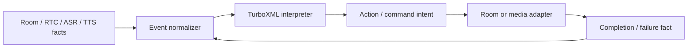
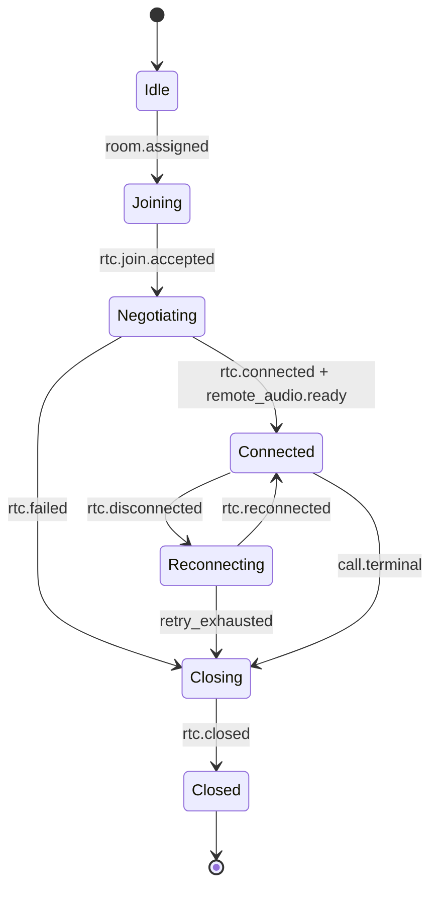
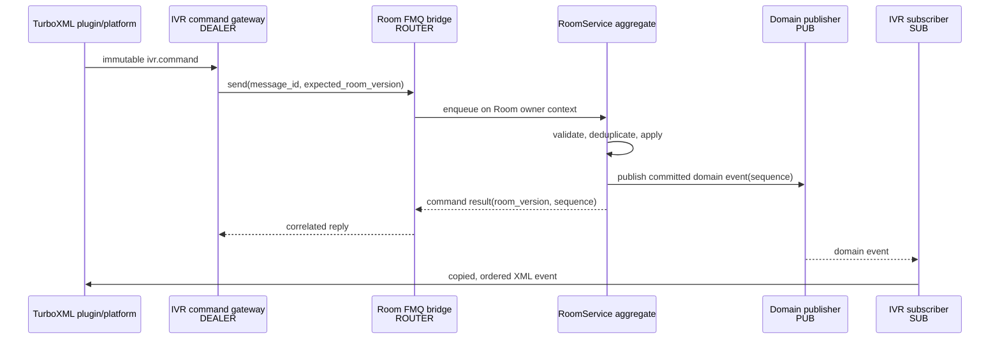
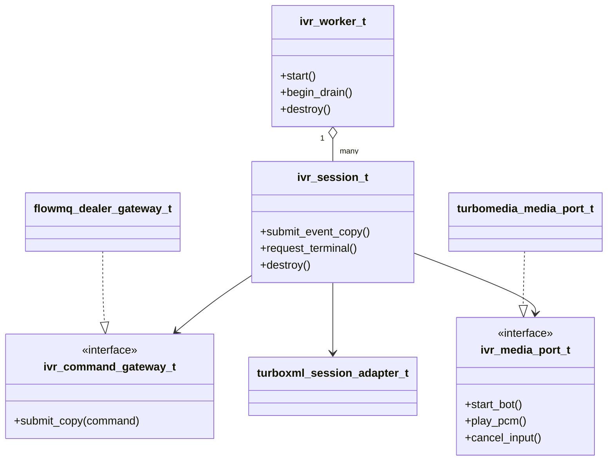
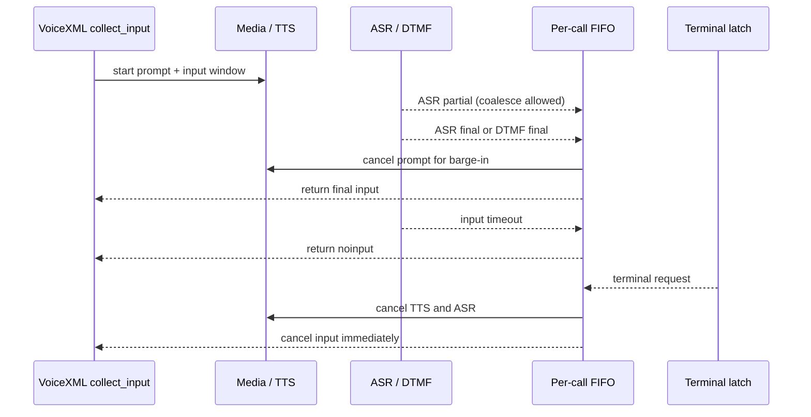

# 独立 IVR Worker 架构

**状态：基线架构已实现，生产验收未完成。** 本文定义 WebRTC 呼叫中心 IVR 的架构和
迁移边界。当前实现状态见 [IVR README](../ivr/README.md)，剩余 P0/P1 设计见
[IVR 生产化缺口解决方案](./ivr-production-readiness-design-zh.md)，执行进度以
[IVR 生产化 TODO Checklist](./ivr-production-readiness-checklist-zh.md) 为唯一事实源。

## 决策

采用独立部署的 IVR worker。每个 worker 使用 TurboXML 执行 CCXML、VoiceXML 与 SCXML；通过 TurboFlow FlowMQ 与 RoomService 通信；以 WebRTC `ivr-bot` participant 加入被分配的 Room。

RoomService 保持 room、participant、call-center queue、transfer 及其版本的唯一事实源。TurboXML 的解释器状态是工作流状态，不是 Room 状态副本。

FlowMQ 分为两条语义不同的通道：

- `DEALER -> ROUTER`：定向、可关联结果的命令通道。
- `PUB -> SUB`：RoomService 已提交事实的领域事件通道。

该边界不随部署拓扑改变：IVR/participant worker 与 RoomService 即使同机或同进程，也使用
FlowMQ command/result/event contract。FlowMQ callback 复制到有界 owner queue 后再推进状态；
owner queue 只解决线程所有权，不能作为绕过 FlowMQ 的本地 transport。

不能将命令放入 PUB/SUB，也不能把 PUB/SUB 当成唯一的恢复日志。`worker.sync` 和 `get_snapshot` 命令提供权威重同步。

## 依据与范围

**事实：** `webrtc/apps/signaling_server/src/ccxml_adapter.c` 使用的旧 `uscxml` 适配器带有 `@internal @incomplete` 标记，`start_dialog` 仅输出日志。因此它不是本方案的实现基础。

**事实：** RoomService 已拥有呼叫中心队列、转接与事件查询能力；其 HTTP 实现位于 `webrtc/apps/room_service/src/http_api.c`，核心服务由 `webrtc/apps/room_service/src/server.c` 持有。

**事实：** TurboXML 的 CCXML/SCXML 有 JSON event 注入 API；VoiceXML 的 `collect_input` 回调同步返回输入。因此 VoiceXML 不能在 FlowMQ、媒体或 RoomService 回调线程中执行。

**推论：** 每通活跃 call 需要独占且可阻塞的解释器执行槽。worker 必须配置 `max_sessions_per_worker` 并水平扩容，不能为无限通话量创建无界线程。

本文不改变浏览器信令、SFU 路由或原始 RTP/PCM 媒体路径。它只定义 IVR 控制面、工作流和 bot 媒体适配边界。

## 系统上下文



`ivr-bot` 的发送音轨承载 TTS PCM；接收音轨 frame callback 把 caller PCM 投给 ASR adapter。音频 frame、ASR partial 与 RTP 不经过 EBS 或 TurboXML。只有 `asr.final`、`dtmf.final`、`playback.finished`、媒体连接状态等离散事件进入工作流。

> **已实现（第一阶段）**：远程 TTS/ASR provider（`webrtc/ivr/src/ivr_openai_provider.c`）
> 作为 `turbo_speech` 的可插拔 provider 接入 `ivr_media_bot`。TTS 走 OpenAI-compatible
> `POST /audio/speech`（`response_format=pcm`，24 kHz 原生 → 重采样到 bot 采样率）；
> ASR 累积 caller PCM，`finish()` 包成 WAV 后 `multipart/form-data` POST
> `/audio/transcriptions`，解析 `{"text":...}` 为 final 结果。provider 常驻 worker 线程
> 执行阻塞 HTTP，`cancel()` 以回调屏障 quiesce；错误（非 2xx/传输/解析/空音频）fail
> fast 走 `on_error`。`ivr_worker` 通过环境变量 `IVR_OPENAI_BASE_URL` +
> `OPENAI_API_KEY` 启用，未配置时保持 NULL provider（`play_pcm` fail fast）。

## 状态机职责

TurboXML 是本方案的声明式 orchestration runtime：它消费外部事实事件，并通过 platform callback 或 plugin 输出动作意图。动作的投递、认证、重试和回执仍由适配器负责。



使用职责单一且状态归属不重叠的模型，而不是一个巨大的状态图：

| 模型 | 所有状态 | 输入 | 输出动作 |
|---|---|---|---|
| `rtc_session.scxml` | bot peer 的 join、negotiating、connected、reconnecting、closed | assignment、RTC state、track ready、transport error | join、set remote description、add ICE、publish audio、close |
| `call_control.ccxml` | alerting、accepted、dialog active、transfer、disconnect | Room call 事件、命令结果、dialog 结束 | accept、enqueue、transfer、disconnect、start dialog |
| `dialog.vxml` | prompt、input、grammar、submit | DTMF final、ASR final、timeout、barge-in | play/cancel prompt、start/stop input、submit business command |
| Room membership 转换表 | invited、joining、active、leaving、left | Room owner command、RTC committed fact | commit participant fact、outbox event |
| Agent lease 转换表 | offline、syncing、ready、draining、expired | sync、heartbeat、deadline、drain | admission/route fact |



此 SCXML 图只编排 WebRTC peer 的控制状态；实际 ICE、DTLS、SRTP 和媒体引擎仍由 TurboMedia 实现。
Room membership 与 agent lease 由各自 aggregate owner 内的纯 C 转换表推进，不使用
SCXML。per-participant RTC workflow 按 `session_id + generation` 创建；它只能消费 Room 的
版本化事实并输出 typed command，不能直接修改 membership。`RtcSessionWorkflow` 仅保留
纯 C opaque API 和 TurboXML C interpreter，不保留平行的 C++ workflow 实现。

## EBS 与命令总线

EBS 在这里是 Event Bus System，不等同于 event sourcing。RoomService 可以继续用现有持久化或内存实现维护事实；只要求它在状态成功提交后发布领域事件。



FlowMQ callback payload、TurboXML callback text 和 media frame 均视为 borrowed。跨 callback、线程、队列或重试边界之前必须复制为拥有型对象；不得保存借用指针。

### 命令契约

```json
{
  "version": 1,
  "type": "ivr.command",
  "message_id": "uuid",
  "worker_id": "ivr-worker-01",
  "call_id": "call-42",
  "call_generation": 3,
  "expected_room_version": 17,
  "command": "transfer",
  "args": { "queue_id": "sales" }
}
```

`message_id` 是幂等键。RoomService 必须对同一 call/generation 缓存首次命令的结果；网络超时后只能重传相同的 `message_id`，不能生成一个新的转接命令。版本不一致返回显式冲突，worker 随后查询快照并重新判定工作流。

### 领域事件契约

```json
{
  "version": 1,
  "event_id": "uuid",
  "type": "room.transfer.completed",
  "call_id": "call-42",
  "call_generation": 3,
  "room_id": "room-42",
  "room_version": 18,
  "sequence": 91,
  "causation_id": "command-message-id",
  "occurred_at_ms": 1786030000000,
  "data": {}
}
```

`sequence` 对每个 call 单调递增。worker 发现间隙或 generation 不匹配时停止推进该 call，发送 `get_snapshot`；快照确认后才恢复事件消费。DEALER 回执表达命令处理结果，PUB 事件表达已提交的领域事实，两者不相互替代。

## C 模块与设计模式



| 模式 | 采用方式 | 理由 |
|---|---|---|
| Adapter | `turboxml_session_adapter_t`、`flowmq_dealer_gateway_t`、`turbomedia_media_port_t` | 第三方 API、错误码和生命周期不泄漏到 IVR core |
| Adapter | `ivr_protocol` | TIVR framing 与 DataBind BIN/TEXT 选择集中在一个严格边界 |
| Command | immutable `ivr_command_t` + RoomService handler | 支持关联、去重、审计和明确结果；不设计本地 undo |
| Observer / EBS | SUB ingress -> per-call event inbox | 一对多事实通知，与命令分离 |
| Factory | `ivr_session_create()` 根据 content package 和 assignment 构造 session | 集中校验复杂会话依赖与清理路径 |
| Strategy | 可替换的 ASR、TTS、路由与 barge-in policy | 仅在确有多个实现时引入 |
| Decorator | command gateway 的 mTLS 身份、授权、指标和审计包装 | 横切能力不污染命令 handler |

禁止以 Singleton 或 service locator 隐藏 FlowMQ、RoomService 或媒体依赖。`ivr_worker_create()` 显式接收 config、gateway 和 media factory；公开 C API 使用 opaque struct、明确 `destroy()` 和错误码。

### C 接口草案

IVR core 的公开头文件建议命名为 `ivr_worker.h`。它定义项目自身的稳定 ABI；TurboXML、FlowMQ 和 TurboMedia 的具体 handle 只能出现在对应 adapter 的私有实现中。

```c
#ifndef TURBO_MEDIA_IVR_WORKER_H
#define TURBO_MEDIA_IVR_WORKER_H

#include <stddef.h>
#include <stdint.h>

#define IVR_WORKER_ABI_VERSION 1u

typedef struct ivr_worker_s ivr_worker_t;
typedef struct ivr_session_s ivr_session_t;

typedef enum {
    IVR_OK = 0,
    IVR_EINVAL = -1,
    IVR_ENOSPC = -2,
    IVR_ECLOSED = -3,
    IVR_ESTATE = -4,
    IVR_EAUTH = -5,
    IVR_EVERSION = -6
} ivr_status_t;

typedef struct {
    const char *data;
    size_t size;
} ivr_bytes_view_t; /* borrowed UTF-8 bytes; not NUL-terminated by contract */

typedef struct {
    ivr_bytes_view_t room_id;
    ivr_bytes_view_t call_id;
    uint64_t call_generation;
    uint64_t expected_room_version;
} ivr_call_ref_t;

typedef struct {
    ivr_bytes_view_t event_id;
    ivr_bytes_view_t event_type;
    ivr_call_ref_t call;
    uint64_t sequence;
    ivr_bytes_view_t payload_json;
} ivr_event_view_t; /* borrowed for this function call only */

typedef struct {
    ivr_bytes_view_t message_id;
    ivr_bytes_view_t command_type;
    ivr_call_ref_t call;
    ivr_bytes_view_t args_json;
} ivr_command_view_t; /* gateway must copy before asynchronous use */

typedef struct {
    uint32_t abi_version;
    void *context;
    ivr_status_t (*submit_copy)(void *context,
                                const ivr_command_view_t *command);
} ivr_command_gateway_ops_t;

typedef struct {
    uint32_t abi_version;
    void *context;
    ivr_status_t (*start_bot)(void *context, const ivr_call_ref_t *call);
    ivr_status_t (*cancel_input)(void *context, const ivr_call_ref_t *call);
    ivr_status_t (*stop_bot)(void *context, const ivr_call_ref_t *call);
} ivr_media_port_ops_t;

ivr_status_t ivr_session_submit_event_copy(
    ivr_session_t *session, const ivr_event_view_t *event);
void ivr_session_request_terminal(ivr_session_t *session);
void ivr_session_destroy(ivr_session_t *session);

#endif
```

所有 `*_view_t` 都是借用 view。`ivr_session_submit_event_copy()` 和 `submit_copy()` 在返回成功后拥有独立副本；失败时调用方仍拥有来源数据。实现可以把复制后的 JSON 保存在 `mem_buffer_t`，但 `mem_buffer_t` 不进入这个稳定 ABI。

`ivr_session_t` 只能由其 session control thread 调用；`ivr_session_submit_event_copy()` 是唯一允许从 FlowMQ/ASR/DTMF callback 线程调用的公开入口。`ivr_session_request_terminal()` 只能设置 terminal latch 和唤醒等待，不得在调用线程内执行 TurboXML 或媒体销毁。

### FlowMQ Frame 与 DataBind 契约

FlowMQ 只负责传输有边界的 message bytes；IVR wire schema 由 TurboUtils DataBind 维护。
TEXT（compact UTF-8 JSON）和 BIN 是同一个 schema object 的两种表示，不得分别维护两套
结构或字段名。

```mermaid
flowchart LR
    Plugin[TurboXML action JSON] --> Validate[DataBind parse + validate]
    Validate --> Object[Schema-bound object]
    Object --> Encode[TEXT JSON / BIN serializer]
    Encode --> Dealer[FlowMQ DEALER]
    Dealer --> Router[FlowMQ ROUTER]
    Router --> Decode[Frame check + DataBind parse]
    Decode --> Typed[Generated owning C struct]
    Typed --> Handler[Room command handler]
    Handler --> Domain[Generated domain event]
    Domain --> Publish[DataBind encode + PUB]
    Publish --> Normalize[SUB decode + canonical JSON]
    Normalize --> XML[TurboXML receive event]
```



生产路径默认使用 BIN；TEXT 用于测试、诊断和异构客户端。XML 只用于 TurboXML 内容与
离线工具，不是 TIVR wire payload；不能将 DataBind XML envelope 当作可执行工作流。

每个 FlowMQ message 由固定的 12-byte frame header 和一个 DataBind payload 组成：

```text
offset  size  field
0       4     magic = "TIVR"
4       1     frame_version = 1
5       1     format: 1=BIN, 2=TEXT（compact UTF-8 JSON）
6       1     kind: 1=command, 2=result, 3=event, 4=snapshot
7       1     flags; v1 must be zero
8       2     schema_type_id, little-endian
10      1     schema_major
11      1     schema_minor
12      N     DataBind payload
```

该 header 只解决“用哪个 codec/type 解码”的自描述问题。实现必须逐字段编码/解码，禁止把网络字节直接 cast 成 C struct，也不使用 `#pragma pack`。FlowMQ 已提供 message boundary，因此 header 不重复保存 payload length；接收方先检查 FMQ message byte 上限和 `size >= 12`，再读取 header。

未知 magic、frame version、format、kind、type id、schema major/minor 或非零保留 flags 都立即拒绝。禁止把 BIN 解析失败后再猜测 TEXT。TLS/WSS 提供传输完整性，v1 frame 不重复增加 checksum。

协议解析不使用 re2c/Lemon。DataBind 是 schema、JSON grammar、binary layout、校验和
ownership 的唯一事实源；再维护 lexer/parser 会形成不可接受的双重语义。re2c 继续用于 SDP
等现有专用 grammar，Lemon 只在未来明确需要 AST 的自定义 DSL 中评估。

#### Schema 与生成结构

建议建立一个 canonical schema，例如 `webrtc/ivr/schema/turbomedia_ivr_v1.schema`：

```text
schema TurboMediaIvrV1 [id(21001), byte_order(little)];

message ConferenceJoinCommandV1 {
  string message_id;
  string worker_id;
  string room_id;
  string call_id;
  uint64 call_generation;
  uint64 expected_room_version;
  string participant_role;
}

message TransferCommandV1 {
  string message_id;
  string worker_id;
  string room_id;
  string call_id;
  uint64 call_generation;
  uint64 expected_room_version;
  string queue_id;
}

message IvrCommandResultV1 {
  string message_id;
  string worker_id;
  string room_id;
  string call_id;
  uint64 call_generation;
  int32 status_code;
  uint64 room_version;
  uint64 sequence;
  optional string error_code;
  optional string error_message;
}

message ConferenceParticipantJoinedEventV1 {
  string event_id;
  string causation_id;
  string worker_id;
  string room_id;
  string call_id;
  uint64 call_generation;
  uint64 room_version;
  uint64 sequence;
  uint64 occurred_at_ms;
  string participant_id;
  string participant_role;
}
```

每个 command/event 类型使用独立 message，而不是一个包含大量 optional 字段的万能 envelope。DataBind `composite` 仅允许定长字段，不能用它封装包含 `string` 的 command/event metadata，因此 v1 schema 显式重复共同 wire fields；生成代码和校验 helper 负责统一处理这些字段，不能另建第二份手写 wire struct。

`schema_type_id` 到 DataBind type name 的映射是版本化常量表，例如 `ConferenceJoinCommandV1=1001`、`TransferCommandV1=1002`、`IvrCommandResultV1=2001`、`ConferenceParticipantJoinedEventV1=3001`。ID 发布后不可重用。

使用 `tbe_compiler --source-output` 在 build/CI 生成 owning `.h/.c`，编译为 `turbo_media_ivr_schema` 并链接 `TurboUtils::DataBind`。worker、Room FMQ bridge 和协议测试使用同一生成库；生产进程不得运行 C compiler 或即时生成本地代码。

`TBE_TYPED_DEFINE_STRUCT` 只在确需绑定现有 owning C struct 时使用。前述 `ivr_event_view_t`、`ivr_command_view_t` 是 borrowed view，不是 DataBind parse target；强行绑定会产生生命周期歧义。动态 `DataBindObject` 可用于 plugin JSON 的 schema 校验、格式转换和诊断工具，它不是第三套 typed contract。

#### Codec 处理协议

| 阶段 | API/产物 | 所有权与失败语义 |
|---|---|---|
| Plugin command 校验 | `data_bind_object_from_json()` | 成功返回 owned `DataBindObject`；失败不发送 FMQ message |
| Wire decode | `ivr_protocol_decode()` -> `data_bind_object_from_bin/json()` | 先按 frame header 选择唯一 API；解析错误立即回复 schema error |
| Wire encode | `ivr_protocol_encode()` -> DataBind BIN/JSON serializer | caller-owned bounded frame；不得跨 DLL 使用 consumer CRT `free()` |
| Native handler | generated `Type_from_*` 或 generated descriptor | owning struct 在 handler 完成后执行生成的 `Type_clear()` |
| TurboXML ingress | DataBind object -> compact canonical JSON | JSON 被复制到 per-call inbox，再调用 CCXML/SCXML event API |

Accessor 返回的 child/value 都是 borrowed；跨 FlowMQ callback、队列或协程挂起必须
clone、copy 或转成拥有型生成 struct。BIN layout 不受当前 codec 支持、buffer 太短或
schema/type 不匹配时必须返回明确错误，不能切换格式作为 fallback。

同一 semantic object 在 TEXT 和 BIN round trip 后比较 typed field，不比较 JSON 文本字节。
BIN 是唯一需要 byte-for-byte golden vector 的格式。测试至少覆盖精确 64-bit
version/sequence、UTF-8 ID、最大 frame、短 frame、未知 type id、错误 schema version、
malformed TEXT、短输出 buffer 以及所有释放路径。

### IVR 内容包和 XML Profile

一个内容包对应一个已版本化的 IVR 行为，建议布局如下：

```text
examples/ivr/content/conference-greeting/
  manifest.json
  rtc_session.scxml
  call_control.ccxml
  conference_menu.vxml
  traces/
    happy-path.jsonl
    barge-in.jsonl
    reconnect.jsonl
```

`manifest.json` 固定 content package 版本、允许的 command/event 名、最大 XML/JSON 大小、默认 timeout 与可用 grammar。worker 在创建 session 前校验 manifest 和 XML；不接受任意 XML 运行时指向的网络 URI。

以下 profile 约定使用标准 SCXML `<send>`：`target="ivr.command"` 表示将动作意图交给 IVR command adapter。它不是私有 XML 元素；在实现前必须用 TurboXML 集成测试确认该 `<send>` 执行点可由 plugin/platform bridge 捕获。若当前 TurboXML 版本不支持所需 `<send>` 语义，应在 adapter 层转换，不增加未版本化的 XML 标签作为隐式 fallback。

#### 场景一：Conference 欢迎与 DTMF 菜单

`rtc_session.scxml` 负责 bot 进入 Room，不处理音频帧：

```xml
<?xml version="1.0" encoding="UTF-8"?>
<scxml xmlns="http://www.w3.org/2005/07/scxml" version="1.0" initial="idle">
  <state id="idle">
    <transition event="room.assigned" target="joining">
      <send target="ivr.command" event="rtc.join">
        <param name="role" expr="'ivr-bot'"/>
      </send>
    </transition>
  </state>
  <state id="joining">
    <transition event="rtc.connected" target="active"/>
    <transition event="rtc.failed" target="closing"/>
  </state>
  <state id="active">
    <transition event="call.terminal" target="closing"/>
  </state>
  <state id="closing">
    <onentry><send target="ivr.command" event="rtc.close"/></onentry>
    <transition event="rtc.closed" target="final"/>
  </state>
  <final id="final"/>
</scxml>
```

`call_control.ccxml` 接受已分派连接并启动对话：

```xml
<?xml version="1.0" encoding="UTF-8"?>
<ccxml xmlns="http://www.w3.org/2005/02/ccxml" version="1.0">
  <eventprocessor>
    <transition event="connection.alerting">
      <accept/>
      <dialogstart src="conference_menu.vxml"/>
    </transition>
    <transition event="room.call.terminal">
      <disconnect/>
    </transition>
  </eventprocessor>
</ccxml>
```

`conference_menu.vxml` 的 `collect_input` 由 session control thread 同步等待 DTMF final 或 ASR final；其间媒体线程继续运行：

```xml
<?xml version="1.0" encoding="UTF-8"?>
<vxml xmlns="http://www.w3.org/2001/vxml" version="2.1">
  <form id="conference_menu">
    <field name="choice">
      <prompt bargein="true">Press 1 to join the conference. Press 2 to leave.</prompt>
      <grammar mode="dtmf" root="menu" version="1.0">
        <rule id="menu" scope="public">
          <one-of><item>1</item><item>2</item></one-of>
        </rule>
      </grammar>
      <filled>
        <if cond="choice == '1'">
          <submit next="ivr://command/conference.join" namelist="choice"/>
          <else/>
          <submit next="ivr://command/conference.leave" namelist="choice"/>
        </if>
      </filled>
    </field>
  </form>
</vxml>
```

`ivr://command/...` 是 content resolver 的受限逻辑 URI，不是网络请求。resolver 只把 manifest allowlist 中的 URI 转换为 `ivr_command_view_t`；未声明 URI 或参数失败即结束该 dialog。

预期 trace：`room.assigned -> rtc.connected -> connection.alerting -> dtmf.final(1) -> conference.join command -> room.participant.joined`。

#### 场景二：Barge-in、超时和终止抢占

该场景复用上述 VoiceXML field，不为 ASR partial 添加 XML transition。adapter 的 `collect_input` 策略如下：



| 竞争输入 | 结果 |
|---|---|
| DTMF final 先到 | 返回 DTMF；忽略同一 input window 之后的 ASR final |
| ASR final 先到 | 返回 ASR；忽略同一 input window 之后的 DTMF final |
| deadline 先到 | 返回 VoiceXML `noinput`；停止 ASR window |
| terminal latch | 取消 TTS/ASR，结束 dialog 和 RTC session；不等待普通 FIFO |

每个 input window 有单调 `input_id`。过期或不匹配 `input_id` 的 final 结果必须丢弃并计数，不能被下一轮 menu 消费。

#### 场景三：Conference 重连与快照恢复

`rtc_session.scxml` 增加可配置次数的重连状态；实际 retry/backoff 由 media adapter 执行，SCXML 只接收结果：

```xml
<state id="active">
  <transition event="rtc.disconnected" target="reconnecting"/>
  <transition event="call.terminal" target="closing"/>
</state>
<state id="reconnecting">
  <onentry><send target="ivr.command" event="rtc.reconnect"/></onentry>
  <transition event="rtc.reconnected" target="active"/>
  <transition event="rtc.retry_exhausted" target="closing"/>
</state>
```

FlowMQ PUB sequence 出现缺口时，worker 不把它伪装成 `rtc.disconnected`。它先发 `get_snapshot`，将 RoomService 的权威快照归一化为 `room.snapshot.loaded`，再决定继续 `active`、重新 `joining` 或 `closing`。这避免网络消息丢失错误地触发媒体重连。

#### 场景四：咨询转接（第二阶段）

该场景不在 conference 基线阶段启用。CCXML/SCXML 仅发布以下命令意图：`queue.claim`、`transfer.prepare`、`transfer.complete`、`transfer.rollback`。RoomService 负责队列 claim、坐席竞争、版本校验和补偿；XML 只在收到 `transfer.prepared`、`transfer.completed`、`transfer.rejected` 或 `transfer.rolled_back` 事件后迁移状态。

建议 trace：`menu.transfer -> queue.claim command -> transfer.prepared -> agent.accepted -> transfer.complete command -> room.transfer.completed`。任何 command timeout 都必须用相同 `message_id` 查询或重传，不能由 XML 自行假定转接成功。

## 线程、队列与关闭协议

| 路径 | 生产者 -> 消费者 | 传递语义 | 顺序与满队列语义 |
|---|---|---|---|
| FlowMQ SUB -> call inbox | FlowMQ callback -> 单一 session control thread | copy | 每 call FIFO；状态性事件满时触发可观察的 session overload 失败 |
| TurboXML -> command gateway | session control thread -> FlowMQ I/O | copy | 不阻塞 `step()`；满时注入 `ivr.communication.queue_full` |
| remote audio -> ASR | media callback -> ASR adapter | adapter-owned bounded frame protocol | 不进入 XML；partial 可合并或丢弃 |
| ASR/DTMF final -> call inbox | ASR/DTMF callback -> session control thread | copy | final 结果不可静默丢弃 |

不使用通用 priority queue。`disconnect`、shutdown 和不可恢复的认证失败走每 call 的 atomic terminal latch，并唤醒 `collect_input()`；其余状态事件保持 FIFO。这样既能抢占阻塞输入，也不重排 call 状态。

容量必须配置并按以下预算压测校准：

```text
event_entries = ceil(peak_state_events_per_second * worst_control_stall_seconds)
                + maximum_in_flight_batch
payload_budget = event_entries * max_event_bytes + retained_command_bytes
```

所有队列和 FlowMQ async send 队列均设 item 与 byte 上限。禁止 `DROP_OLDEST` 用于命令和状态事件；ASR partial 是唯一允许显式合并/丢弃的类别。

关闭顺序为：停止接收新 assignment，声明 `draining`，在 deadline 内完成 active session，设置 terminal latch 取消 ASR/TTS/input 等待，停止 FlowMQ 生产，drain 或显式释放已拥有 payload，最后销毁 TurboXML、bot peer 和队列。任何资源销毁前必须等待所属 session control thread 退出。

## 安全与部署

- active worker 的 FlowMQ 端点以 `tls://` / `wss://` scheme 前缀为准（例如
  `tls://192.168.2.1:5000`）：FMQ facade 从前缀推断 transport，并可从 host 内嵌端口；
  TLS/WSS 仍需提供对象级 TLS 材料（ca/cert/key/server_name），前缀与显式
  transport/port 冲突时 fail fast。plaintext 仅允许显式 shadow mode + loopback，
  且 RoomService 端也必须显式开启 `allow_insecure_loopback`。
- mTLS/WSS 身份映射到 `worker_id`、允许的 call/room 范围和 PUB topic ACL。
- DEALER 与 SUB 必须设置相同的 CONNECT identity；secure subscriber 缺少 identity 时
  在创建阶段失败，不能以匿名 event channel 绕过证书映射。
- RoomService 重新校验所有命令；worker 身份不能绕过 queue、transfer 或 participant 权限。
- content package、plugin action 名与命令参数使用 allowlist/schema 校验；XML 或事件输入超过长度、深度、容量限制时 fail fast。
- 现有 RoomService 配置已经区分兼容静态 token 和 scoped token；IVR FlowMQ 凭据应采用独立的最小权限身份，不复用控制面兼容 token。

## 迁移与回滚

1. 定义并测试版本化 command/event schema、worker registration、`worker.sync` 和 `get_snapshot`，但不改变现有 HTTP 行为。
2. 为 RoomService 加入 `room_fmq_bridge_t`：ROUTER command handler、去重缓存、版本检查和提交后 PUB publisher。
3. 新建独立 `ivr_worker` 可执行文件，接入 TurboXML、FlowMQ 和 TurboMedia bot peer；先以 shadow mode 订阅事件并记录但不发 mutation command。
4. 仅将指定 tenant/queue 的新 calls 分派给 worker；participant/worker mutation 固定走
   FlowMQ，HTTP 只保留管理与查询职责，不作为第二条状态迁移路径。
5. 当回归和故障演练通过后扩大分派范围。

回滚只需停止分派新的 IVR session，并让 RoomService 继续使用现有 HTTP/RoomService 控制路径。不得在回滚中删除 Room 的既有状态或修改已有队列格式。

现有 `ENABLE_RTC_SCXML_WORKFLOW` 路径使用 `TurboRTC::RtcSessionWorkflow`，与本方案的 TurboXML worker 是不同实现。迁移期不得同时让两套 workflow 对同一个 Room/call 发出 mutation command，以免形成双重控制源。

## 验收与测试

以下各 gate 均为必过项。结果必须包含可复现命令、测试输出和环境配置；“人工观察正常”不能替代自动化断言。

### Gate A：构建与协议

| 验收项 | 通过标准 | 证据 |
|---|---|---|
| Schema generation | `tbe_compiler --source-output` 可从 clean tree 生成 `.h/.c`；生成代码以 C 和 C++ consumer 编译 | CMake/CTest 输出 |
| TEXT/BIN | 所有已发布 message type 在两种 wire 格式完成 semantic round trip | `test_ivr_protocol` + DataBind parameterized tests |
| BIN stability | 每个已发布 type 有 byte-for-byte golden vector；同一 schema/build 重复生成一致 | golden fixture diff |
| Frame validation | short frame、未知 magic/version/format/kind/type、非零 reserved flags、超限 payload 全部明确失败 | table-driven tests |
| Ownership | callback borrowed payload 跨线程前复制；所有 DataBind/TurboXML allocation 使用匹配 release API | ASan/泄漏检查 |

任何请求格式失败都不得自动改用另一格式。Schema/type mismatch 不能产生 FMQ message、部分 C struct 或 Room mutation。

### Gate B：命令与状态一致性

| 验收项 | 通过标准 |
|---|---|
| 幂等 | 同一 mutation `message_id` 连续和并发重传至少 100 次，只产生一次 Room 状态迁移、一个新版本和一个 causation event |
| 版本检查 | stale `expected_room_version` 返回 `IVR_EVERSION` 等价错误；Room 状态和 version 不改变 |
| Generation | 旧 `call_generation` 的 command/event 全部拒绝，不能进入新 session |
| 延迟回包 | Room 已提交但 DEALER 回包前断线；重连后用相同 `message_id` 获得相同结果，不重复 mutation |
| 顺序 | 每 call 发布的 `sequence` 严格递增；duplicate 被去重，gap 使 XML 停止推进 |
| 快照恢复 | gap、worker 重启或 SUB 重连后执行 `worker.sync/get_snapshot`；恢复状态与 RoomService snapshot 逐字段一致后才继续 XML |

RoomService snapshot、version 和 event sequence 是一致性验收的比较基准；不能用 worker 本地状态证明自身正确。

### Gate C：TurboXML 场景

每个 content package 必须提供输入 event trace、预期 command trace 和最终 TurboXML snapshot。以下场景逐项通过：

- Conference greeting：bot connected 后才 accept/start dialog，DTMF `1` 只产生一次 `conference.join`。
- DTMF/ASR：同一 `input_id` 只有第一个 final 获胜；迟到 final 不进入下一轮 input。
- Barge-in：final input 取消当前 TTS，并使 VoiceXML `collect_input` 返回匹配结果。
- Noinput：deadline 关闭 ASR window，并进入 VoiceXML `noinput` 路径。
- Terminal：disconnect/shutdown 唤醒同步 input 等待，不等待普通 FIFO drain。
- RTC reconnect：成功回到 `active`；重试耗尽进入 `closing -> closed`。
- Snapshot recovery：丢失一个 PUB event 后 XML 不执行后续 mutation，直到快照恢复。
- Invalid content：未授权 command、未知 `ivr://` URI、超限 XML/JSON 和非法 grammar 在 session 启动或动作边界 fail fast。

### Gate D：WebRTC 与语音

| 验收项 | 通过标准 |
|---|---|
| Bot lifecycle | `ivr-bot` join、publish audio、subscribe caller audio、leave 均能从 RoomService snapshot 验证 |
| TTS | 发送音轨收到有效 PCM；播放完成产生一次 `playback.finished` |
| ASR | 远端 caller PCM 进入 ASR adapter，本地 bot TTS 不被误送入同一 caller ASR session |
| DTMF | 合法 digit 与 `input_id` 关联；重复、迟到、非法 digit 被拒绝并计数 |
| Barge-in | 输入命中后停止 TTS，且不会在取消后继续发送旧 prompt frame |
| Media failure | track/peer 失败转成离散 RTC event；不在 media callback 内调用 TurboXML 或销毁 session |

### Gate E：背压、容量与性能

部署前必须确定 `C_target`（单 worker 目标并发 call）、事件峰值、最大 ASR stall 和 frame/payload byte 上限。没有这些输入，不得签署容量验收。

| 验收项 | 通过标准 |
|---|---|
| 边界 | 队列容量为 `N` 时，前 `N` 个 item 成功，第 `N+1` 个返回可区分的 `ENOSPC`；失败后发送方仍拥有 payload |
| 无静默丢失 | command、result、domain event、ASR/DTMF final 的 drop count 始终为 0；仅 ASR partial 可按配置合并/丢弃 |
| 目标负载 | `C_target` 下持续至少 60 分钟，无 admission failure、状态性 queue full、死锁、crash 或 session 泄漏 |
| 过载 | `120% * C_target` burst 下显式拒绝新 session 或 command，不破坏已接纳 call 的顺序和事实状态 |
| 内存 | queue items、queue bytes、retained payload 和 active sessions 均不超过配置上限；测试结束后 active session/lease/borrow 归零 |
| 指标 | 输出 P50/P95/P99 control latency、queue high-water、rejection、sequence gap、snapshot recovery 和 retained bytes |

建议初始延迟门槛如下，实施前应结合部署网络和目标硬件确认：DTMF final 到 TTS cancel 的 P95 不高于 150 ms；ASR final 到下一 command submit 的 P95 不高于 250 ms（不含 ASR provider 推理时间）；本地 FMQ callback 到 per-call inbox publish 的 P99 不高于 50 ms。调整门槛必须记录测量环境与理由。

### Gate F：故障恢复与关闭

- RoomService 重启：worker 暂停 mutation，重新认证和 sync；恢复后无重复命令或错误 generation。
- Worker 重启：RoomService 保持 Room/call 事实；新 worker 仅恢复仍分配给自己的 active calls。
- DEALER/SUB 断线：重连期间无 silent success；sequence gap 通过 snapshot 修复。
- ASR/TTS 故障：仅影响对应 dialog/session，错误被转换一次且无重复日志风暴。
- Graceful drain：readiness 先变为 false，停止新 assignment，在 deadline 内完成或终止 active sessions，随后所有线程、queue、TurboXML 和 peer 资源归零。
- Hard termination 演练：RoomService 能识别 worker lease 失效，并使其 calls 进入已定义的可恢复或终止状态。

### Gate G：安全与可观测性

- 无证书、错误 CA、过期证书、worker ID/certificate 不匹配时连接失败。
- 未授权 call/room command、topic subscription 和 content command 均被拒绝，Room version 不改变。
- 重放已过 retention window 的 `message_id`、超限 frame/XML/JSON 和 malformed BIN 被拒绝。
- 日志不包含音频、完整识别文本、token、证书私钥或未脱敏 caller 数据。
- 每条 command 可通过 `message_id`、`call_id`、`causation_id` 关联回执与领域事件。
- readiness 只有在 FlowMQ 已认证、schema 已加载且 `worker.sync` 完成后才为 true。

### Gate H：迁移与回滚

- Shadow mode 不发送任何 mutation command；与现有 RoomService 事件结果比较无状态副作用。
- Canary 仅接收明确 allowlist tenant/queue 的新 calls；已有 calls 不迁移 owner。
- 停止新 IVR assignment 后，现有 HTTP control path 不需数据转换即可继续工作。
- 回滚演练不删除 Room、queue、participant 或 event 数据，并在预定 drain deadline 内完成。
- 同一个 Room/call 不允许 TurboXML worker 与 `ENABLE_RTC_SCXML_WORKFLOW` 同时发 mutation command。

### 完成定义

发布候选必须满足：Gate A-H 全部 PASS、没有未关闭的 HIGH 问题、所有 MED 问题有责任人和显式接受/修复结论，并保存 CTest/TinyTest、DataBind round-trip、ASan、故障演练和负载测试证据。未达到 `C_target` 或延迟门槛只能标记为未验收，不能用扩大队列或启用 fallback 掩盖。

## 已知风险

| 等级 | 证据类型 | 风险与处置 |
|---|---|---|
| HIGH | 事实 | VoiceXML input 同步等待。必须隔离到有界的 session control slot，禁止阻塞 RoomService、FlowMQ 和媒体线程。 |
| HIGH | 推论 | PUB/SUB 不能单独保证断线期间的状态恢复。以 sequence gap、`worker.sync` 和快照作为恢复协议。 |
| HIGH | 事实 | 旧 CCXML adapter 未实现 dialog 或外部副作用。不得将其扩展为生产路径；改用独立 TurboXML adapter。 |
| MED | 推论 | participant/worker mutation 收敛到 FlowMQ 会改变部署和依赖。先以 shadow worker、按租户切换和 DRAINING 回滚控制风险，但不保留可同时写同一 aggregate 的 HTTP mutation 路径。 |
| MED | 常用做法 | mTLS/WSS 身份、topic ACL 与命令授权应独立于客户端控制 token，避免 worker 权限过宽。 |
