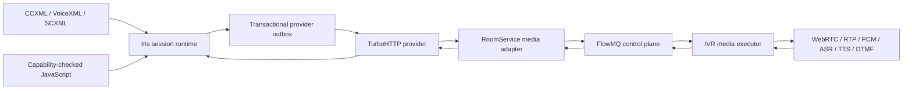
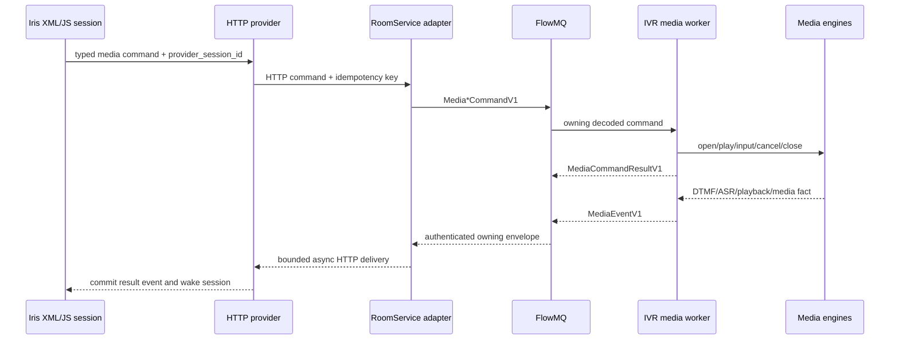

# IVR 纯媒体服务架构

## 决策

Iris/TurboXML 是唯一业务与工作流平台。CCXML、VoiceXML、SCXML、JavaScript、session
状态以及 IVR/conference/transfer/call-center 策略全部在 Iris 执行。TurboMedia 的
RoomService、SFU、signaling 与 IVR worker 是媒体服务，不解释 XML/JS。

## 状态归属

| 状态 | 唯一 owner | TurboMedia 可保存的派生状态 |
| --- | --- | --- |
| XML/JS workflow、业务 session | Iris | `provider_session_id` correlation only |
| provider command/outbox terminal status | Iris | 当前 command 的媒体执行结果 |
| Room membership/version | RoomService aggregate | worker assignment/route/lease |
| PeerConnection、track、RTP/PCM | SFU/IVR media owner | 媒体连接与资源状态 |
| playback/input window/ASR/TTS | IVR worker call slot | 当前 operation/input generation |

媒体 result/event 是事实，不是状态迁移指令。RoomService 收到后只能验证、复制、转发给
Iris；只有 Iris 可以根据 XML/JS 决定下一条 media command。

## 命令与回传

FlowMQ 是 control plane：传输 command/result/event 和 worker health/lease，不传 RTP、PCM、
archive 或脚本。wire frame 在解码前校验 kind、format、schema type/version 和长度。

## 并发与关闭协议

- worker media callback 是多 producer；只复制到容量 64 的 owning event queue。
- application owner loop 是唯一 FlowMQ event sender。
- Room bridge broker callback 只 clone/enqueue；bridge owner thread 解码、route fence、回调。
- upstream HTTP observer 必须拥有独立有界队列和线程，不能阻塞 bridge owner。
- queue 满、未知 schema、错误 route、stale generation、deadline 到期均 fail fast。
- 关闭顺序：停止接收 command/event，drain media call，释放 queue entry，销毁媒体 transport，
  再销毁 FlowMQ/HTTP owner。

## Mock 与验证边界

Core mock 仅替代 media port，loopback bridge 测试仍使用真实 FlowMQ/DataBind。dry-run logging
transport 仅用于 smoke，不参与 active readiness。测试必须分别覆盖正常、重复、stale、错误
route、队列满和 shutdown drain；mock 成功不能替代真实 SFU/speech 集成验证。

## 兼容性

本重构不兼容旧的 worker content package、per-call TurboXML session、Room/SFU local workflow
adapter 或 business PUB subscriber。旧接口与文件已删除，避免出现两个 workflow owner。
