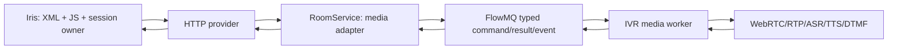

# TurboMedia IVR media service

本目录实现 Iris/TurboXML 的媒体执行端，不实现 IVR 业务流程。

## 边界

- Iris 唯一拥有 XML/JavaScript、session、IVR/conference/transfer/call-center
  业务状态和下一步动作选择。
- RoomService 只负责媒体资源寻址、worker route/lease 和 typed command 转发。
- IVR worker 只负责 WebRTC/RTP/PCM、TTS/ASR、DTMF、播放和 input window。
- FlowMQ 只传有界的 typed command/result/event；RTP、PCM 和脚本不经过 FlowMQ。
- 本模块不加载 XML/JS/content archive，不创建 TurboXML interpreter，也不消费业务事件。



## Wire contract

Canonical schema: `schema/turbomedia_ivr_v1.schema`.

- media commands: type IDs `1011..1016`
- media result: `MediaCommandResultV1`, type ID `2007`
- media event: `MediaEventV1`, type ID `3007`
- `provider_session_id` correlates every media fact with an Iris session.
- `call_generation` fences call reuse; `operation_generation` makes media operations
  idempotent; input commands additionally use `input_generation`.

Legacy dispatch/content workflow messages are not the IVR execution contract. The worker
rejects them and requires the typed media protocol.

## Ownership and concurrency

`ivr_worker_t` owns a bounded array of media-call slots. Its explicit operations are
open, play, begin/end/cancel input and close. The worker owns no business state.

Media callbacks copy events into a bounded MPSC-to-single-consumer queue. The application
owner loop serializes those events to FlowMQ. Queue full returns `IVR_ENOSPC`; shutdown
stops producers, drains owned entries, closes all media calls, then destroys transports.

Room bridge callbacks receive owning `ivr_media_command_result_t` and
`ivr_media_event_t` values on the bridge owner thread after the authenticated route is
matched. These callbacks may forward facts upstream, but must not decide a workflow action.

## Test doubles

- `tests/test_ivr_worker.c` uses a mock media factory/port/event sink to test lifecycle,
  idempotency, deadlines, input windows, capacity and drain.
- `tests/test_ivr_room_bridge.c` uses real loopback FlowMQ and DataBind wire frames, while
  mocking only the upstream observer. It verifies route fencing and that media facts do not
  call the Room business handler.
- `ivr_worker --dry-run` uses a logging media transport for application smoke tests.

These substitutes are test-only. Active non-shadow mode requires configured speech and
SFU dependencies and does not silently fall back to logging media.

## Build and focused verification

```powershell
cmake --preset win-dev-user
cmake --build --preset win-dev-user --target test_ivr_worker
cmake --build --preset win-dev-user --target test_ivr_room_bridge
cmake --build --preset win-dev-user --target ivr_worker room_service
ctest --preset win-dev-user -R "test_ivr_worker|test_ivr_room_bridge|test_ivr_flowmq" --output-on-failure
```

## Remaining integration gate

RoomService exposes an explicit media observer dependency. The production observer must
use an independent bounded queue/owner thread to POST facts to Iris; network I/O must not
run in the FlowMQ bridge callback. Until configured, media facts are rejected and counted,
not silently acknowledged.
